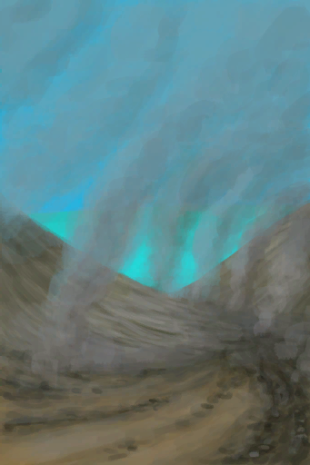
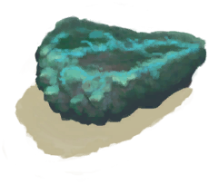
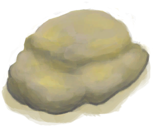

# Acid Lake  
> "A lake of acid water  
  

<a href="AcidLake.md" style="color:black">Acid Lake</a>

<a href="Volcano.md" style="color:black">Volcano</a>

<a href="AcidLakePuddle.md" style="color:black">Dry Acid Lake</a>

  
  
<table class="table table-bordered" data-toggle="table"  data-show-header="false"><thead style="display:none"><tr ><th  style="width:50%;text-align:left;vertical-align:top;"  >title</th><th  style="width:50%;text-align:left;vertical-align:top;"  ></th></tr></thead><tr ><td  style="width:50%;text-align:left;vertical-align:top;"  >** Unique On Board **  **Environment：**[Volcano(Environment)](Env_AcidLake.md)  **Tag：**	[“Trees for Snare Traps”](tag_SnareCompatible.md)  ** EnvironmentEffect: ** [

[Temperature](TemperaturePerceived.md)](TemperaturePerceived.md)<b>+10</b> [

[Rain Exposure](RainExposure.md)](RainExposure.md) [

[Heat Insulation](InsulationHeat.md)](InsulationHeat.md) [

[Air Toxicity](AirToxicity.md)](AirToxicity.md)<b>+6</b>  ** Improvements: ** [Path](Imp_Path.md)</td><td  style="width:50%;text-align:left;vertical-align:top;"  >A lake of acid water in the <b>Volcanic region</b> of the island. The air is quite toxic there but there are multiple brimstone vents as well as large amounts of <b>Vitriol</b>. Make sure you come equipped with a gas mask if you decide to visit the place.</td></tr></tbody></table>  
  
## Exploration  
<table class="table table-bordered" data-toggle="table"  ><thead style=""><tr ><th  style="text-align:left;vertical-align:top;"  >Progress</th><th  style="text-align:left;vertical-align:top;"  >Target</th></tr></thead><tr ><td  style="text-align:left;vertical-align:top;"  >33%</td><td  style="text-align:left;vertical-align:top;"  >[Brimstone Vent(Volcano)](VentBrimstone.md)</td></tr><tr ><td  style="text-align:left;vertical-align:top;"  >66%</td><td  style="text-align:left;vertical-align:top;"  >[Brimstone Vent(Volcano)](VentBrimstone.md)</td></tr><tr ><td  style="text-align:left;vertical-align:top;"  >100%</td><td  style="text-align:left;vertical-align:top;"  >[Brimstone Vent(Volcano)](VentBrimstone.md)</td></tr></tbody></table>  
  
## Action  

<table><tr><td rowspan="2" style="width:200px;text-align:center;font-size:1.3em;font-weight:bold">

Explore

15m

</td><td>[“LegAction(Group)”](LegAction.md)</td></tr><tr><td></td></tr><tr><td colspan="2"><b>Require：</b>[

[Light](Light.md)](Light.md): <b>10-100</b></td></tr><tr><td colspan="2"><b>StatChange：</b>[

[Foot Damage](FootDamage.md)](FootDamage.md)<b>+20</b>, [

[Stamina](Stamina.md)](Stamina.md)<b>-4</b>, [

[Stress](Stress.md)](Stress.md)<b>-10</b>, [

[Filth](Filth.md)](Filth.md)<b>+1</b>, [TV Highlands - Explore](TV_HighlandsExplore.md)<b>+1</b></td></tr><tr><td colspan="2">

<table style="margin-bottom:3px;"><tr><td rowspan=2 style="text-align:center" width="80px">
Base Weight

0
</td><td style="font-size:0.6em;line-height:0.6em;font-weight:bold">Copper❗1 limit</td></tr><tr><td>[

[Copper Ore](CopperOre.md)](CopperOre.md)(<b>+1</b>)</td></tr></table>

<table style="margin-bottom:3px;"><tr><td rowspan=2 style="text-align:center" width="80px">
Base Weight

800
</td><td style="font-size:0.6em;line-height:0.6em;font-weight:bold">Stones</td></tr><tr><td>[

[Stone](Stone.md)](Stone.md)(<b>+1</b>)</td></tr></table>

<table style="margin-bottom:3px;"><tr><td rowspan=2 style="text-align:center" width="80px">
Base Weight

0
</td><td style="font-size:0.6em;line-height:0.6em;font-weight:bold">Supply Crate</td></tr><tr><td>[

[Supply Capsule](TV_SupplyCapsule.md)](TV_SupplyCapsule.md)(<b>+1</b>)</td></tr><tr><td colspan=2><li>[

[TV Highlands](TV_Highlands.md)](TV_Highlands.md) in <b>1</b>, weight<b>+100</b></li><li>[TV Highlands - Explore](TV_HighlandsExplore.md) in <b>0～9</b>, weight<b>-999</b></li></td></tr></table>

<table style="margin-bottom:3px;"><tr><td rowspan=2 style="text-align:center" width="80px">
Base Weight

75
</td><td style="font-size:0.6em;line-height:0.6em;font-weight:bold">Heavy Stone</td></tr><tr><td>[

[Heavy Stone](StoneHeavy.md)](StoneHeavy.md)(<b>+1</b>)</td></tr></table>

<table style="margin-bottom:3px;"><tr><td rowspan=2 style="text-align:center" width="80px">
Base Weight

200
</td><td style="font-size:0.6em;line-height:0.6em;font-weight:bold">Brimstone Rich Stone</td></tr><tr><td>[

[Sulphurous Stone](StoneHeavyBrimstone.md)](StoneHeavyBrimstone.md)(<b>+1</b>)</td></tr></table>

<table style="margin-bottom:3px;"><tr><td rowspan=2 style="text-align:center" width="80px">
Base Weight

75
</td><td style="font-size:0.6em;line-height:0.6em;font-weight:bold">Geode❗3 limit</td></tr><tr><td>[

[Geode](Geode.md)](Geode.md)(<b>+1</b>)</td></tr></table>

<table style="margin-bottom:3px;"><tr><td rowspan=2 style="text-align:center" width="80px">
Base Weight

0
</td><td style="font-size:0.6em;line-height:0.6em;font-weight:bold">Drone Encounter</td></tr><tr><td>[

[Attack Drone!(Event)](Event_DroneFight.md)](Event_DroneFight.md)(<b>+1</b>)</td></tr><tr><td colspan=2><li>[Island Drones](Pop_Drone.md) in <b>1000～4000</b>, weight<b>+25～+100</b></li><li>[

[Eyesight](Myopia.md)](Myopia.md) in <b>1～3</b>, weight<b>+0</b></li><li>[“Fight Event”](tag_FightEvent.md) On *Hand/Board*，Weight<b>-999999</b>(Stackable),</li></td></tr></table>
<button class="btn btn-secondary btn-sm" style="" data-toggle="modal" onclick="setCollectionDataBase64('eyJ0aXRsZSI6IlNpbXVsYXRvcjogRXhwbG9yZSAoQWNpZCBMYWtlKSIsImNvbGxlY3Rpb25zIjpbeyJkcm9wIjoiPGRpdiBzdHlsZT1cIndpZHRoOjI1cHg7ZGlzcGxheTppbmxpbmUtYmxvY2s7dGV4dC1hbGlnbjpjZW50ZXJcIj48aW1nIGRlY29kaW5nPVwiYXN5bmNcIiBzcmM9XCJTcHJpdGUvU3RvbmUucG5nXCIgaHJlZj1cImEubWRcIiBzdHlsZT1cIm1heC13aWR0aDoyNXB4O21heC1oZWlnaHQ6MjVweDtcIj48L2Rpdj5TdG9uZSIsImJhc2UiOjgwMCwiY29uZGl0aW9uIjpbXX0seyJkcm9wIjoiPGRpdiBzdHlsZT1cIndpZHRoOjI1cHg7ZGlzcGxheTppbmxpbmUtYmxvY2s7dGV4dC1hbGlnbjpjZW50ZXJcIj48aW1nIGRlY29kaW5nPVwiYXN5bmNcIiBzcmM9XCJTcHJpdGUvVFZDcmF0ZS5wbmdcIiBocmVmPVwiYS5tZFwiIHN0eWxlPVwibWF4LXdpZHRoOjI1cHg7bWF4LWhlaWdodDoyNXB4O1wiPjwvZGl2PlN1cHBseSBDYXBzdWxlIiwiYmFzZSI6MCwiY29uZGl0aW9uIjpbeyJrZXkiOiJUVl9IaWdobGFuZHMiLCJ0aXRsZSI6IlRWIEhpZ2hsYW5kcyIsInR5cGUiOiJyYW5nZSIsIm1heCI6WzAsMV0sInJhbmdlIjpbMSwxXSwid2VpZ2h0IjpbMTAwLDEwMF0sImRlZmF1bHRWYWx1ZSI6MCwid2hlbk91dE9mUmFuZ2UiOjB9LHsia2V5IjoiVFZfSGlnaGxhbmRzRXhwbG9yZSIsInRpdGxlIjoiVFYgSGlnaGxhbmRzIC0gRXhwbG9yZSIsInR5cGUiOiJyYW5nZSIsIm1heCI6WzAsMjBdLCJyYW5nZSI6WzAsOV0sIndlaWdodCI6Wy05OTksLTk5OV0sImRlZmF1bHRWYWx1ZSI6MCwid2hlbk91dE9mUmFuZ2UiOjB9XX0seyJkcm9wIjoiPGRpdiBzdHlsZT1cIndpZHRoOjI1cHg7ZGlzcGxheTppbmxpbmUtYmxvY2s7dGV4dC1hbGlnbjpjZW50ZXJcIj48aW1nIGRlY29kaW5nPVwiYXN5bmNcIiBzcmM9XCJTcHJpdGUvU2FuZHN0b25lLnBuZ1wiIGhyZWY9XCJhLm1kXCIgc3R5bGU9XCJtYXgtd2lkdGg6MjVweDttYXgtaGVpZ2h0OjI1cHg7XCI+PC9kaXY+SGVhdnkgU3RvbmUiLCJiYXNlIjo3NSwiY29uZGl0aW9uIjpbXX0seyJkcm9wIjoiPGRpdiBzdHlsZT1cIndpZHRoOjI1cHg7ZGlzcGxheTppbmxpbmUtYmxvY2s7dGV4dC1hbGlnbjpjZW50ZXJcIj48aW1nIGRlY29kaW5nPVwiYXN5bmNcIiBzcmM9XCJTcHJpdGUvQnJpbXN0b25lSGVhdnlTdG9uZS5wbmdcIiBocmVmPVwiYS5tZFwiIHN0eWxlPVwibWF4LXdpZHRoOjI1cHg7bWF4LWhlaWdodDoyNXB4O1wiPjwvZGl2PlN1bHBodXJvdXMgU3RvbmUiLCJiYXNlIjoyMDAsImNvbmRpdGlvbiI6W119LHsiZHJvcCI6IjxkaXYgc3R5bGU9XCJ3aWR0aDoyNXB4O2Rpc3BsYXk6aW5saW5lLWJsb2NrO3RleHQtYWxpZ246Y2VudGVyXCI+PGltZyBkZWNvZGluZz1cImFzeW5jXCIgc3JjPVwiU3ByaXRlL0Ryb25lLnBuZ1wiIGhyZWY9XCJhLm1kXCIgc3R5bGU9XCJtYXgtd2lkdGg6MjVweDttYXgtaGVpZ2h0OjI1cHg7XCI+PC9kaXY+QXR0YWNrIERyb25lIShFdmVudCkiLCJiYXNlIjowLCJjb25kaXRpb24iOlt7ImtleSI6IlBvcF9Ecm9uZSIsInRpdGxlIjoiSXNsYW5kIERyb25lcyIsInR5cGUiOiJyYW5nZSIsIm1heCI6WzAsNDAwMF0sInJhbmdlIjpbMTAwMCw0MDAwXSwid2VpZ2h0IjpbMjUsMTAwXSwiZGVmYXVsdFZhbHVlIjowLCJ3aGVuT3V0T2ZSYW5nZSI6MH0seyJrZXkiOiJNeW9waWEiLCJ0aXRsZSI6IkV5ZXNpZ2h0IiwidHlwZSI6InJhbmdlIiwibWF4IjpbMCwzXSwicmFuZ2UiOlsxLDNdLCJ3ZWlnaHQiOlswLDBdLCJkZWZhdWx0VmFsdWUiOjAsIndoZW5PdXRPZlJhbmdlIjowfSx7ImtleSI6InRhZ19GaWdodEV2ZW50X2Ftb3VudCIsInRpdGxlIjoi4oCcRmlnaHQgRXZlbnTigJ0iLCJ0eXBlIjoicmFuZ2UiLCJyYW5nZSI6WzAsMjBdLCJtYXgiOlswLDIwXSwid2VpZ2h0IjpbMCwtMTk5OTk5ODBdLCJkZWZhdWx0VmFsdWUiOjAsIndoZW5PdXRPZlJhbmdlIjowLCJtYXhTdGFja0dyb3VwIjoiIn1dfSx7ImRyb3AiOiI8ZGl2IHN0eWxlPVwid2lkdGg6MjVweDtkaXNwbGF5OmlubGluZS1ibG9jazt0ZXh0LWFsaWduOmNlbnRlclwiPjxpbWcgZGVjb2Rpbmc9XCJhc3luY1wiIHNyYz1cIlNwcml0ZS9Db3BwZXJPcmUucG5nXCIgaHJlZj1cImEubWRcIiBzdHlsZT1cIm1heC13aWR0aDoyNXB4O21heC1oZWlnaHQ6MjVweDtcIj48L2Rpdj5Db3BwZXIgT3JlIiwiYmFzZSI6MCwiY29uZGl0aW9uIjpbXSwiaXNMaW1pdCI6dHJ1ZX0seyJkcm9wIjoiPGRpdiBzdHlsZT1cIndpZHRoOjI1cHg7ZGlzcGxheTppbmxpbmUtYmxvY2s7dGV4dC1hbGlnbjpjZW50ZXJcIj48aW1nIGRlY29kaW5nPVwiYXN5bmNcIiBzcmM9XCJTcHJpdGUvR2VvZGUucG5nXCIgaHJlZj1cImEubWRcIiBzdHlsZT1cIm1heC13aWR0aDoyNXB4O21heC1oZWlnaHQ6MjVweDtcIj48L2Rpdj5HZW9kZSIsImJhc2UiOjc1LCJjb25kaXRpb24iOltdLCJpc0xpbWl0Ijp0cnVlfV19')" data-target="#modelCollectionSimulator">Simulator</button>
</td></tr></table>
  
  
  

