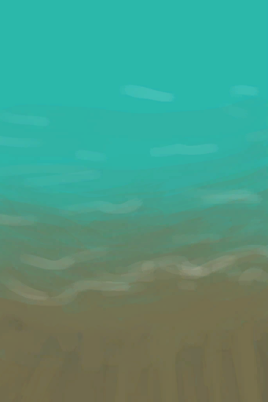

# Dry Acid Lake  
> I should wait for it to refill.  
  
<table class="table table-bordered" data-toggle="table"  data-show-header="false"><thead style="display:none"><tr ><th  style="width:50%;text-align:left;vertical-align:top;"  >title</th><th  style="width:50%;text-align:left;vertical-align:top;"  ></th></tr></thead><tr ><td  style="width:50%;text-align:left;vertical-align:top;"  >**Environment：**[Volcano(Environment)](Env_AcidLake.md)  **Tag：**	[“Container Open”](tag_ContainerDirty.md), [“Glazed”](tag_Glazed.md)  **LiquidCapacity：**60000</td><td  style="width:50%;text-align:left;vertical-align:top;"  >

<a href="AcidLakePuddle.md" style="color:black">Dry Acid Lake</a>

A lake of acid water in the <b>Volcanic region</b> of the island. The air is quite toxic there but there are multiple brimstone vents as well as large amounts of <b>Vitriol</b>. Make sure you come equipped with a gas mask if you decide to visit the place.</td></tr></tbody></table>  
  
## Passive Effects  
<table class="table table-bordered" data-toggle="table"  ><thead style=""><tr ><th  style="text-align:left;vertical-align:top;"  >Name</th><th  style="text-align:left;vertical-align:top;"  >Condition</th><th  style="text-align:left;vertical-align:top;"  >Change(Each TP)</th><th  style="text-align:left;vertical-align:top;"  data-sortable="true"  >Status</th></tr></thead><tr ><td  style="text-align:left;vertical-align:top;"  >Fill</td><td  style="text-align:left;vertical-align:top;"  ></td><td  style="text-align:left;vertical-align:top;"  >[Vitriol](LQ_Vitriol.md)<b>+100</b> LiquidQuantity+100</td><td  style="text-align:left;vertical-align:top;"  ></td></tr><tr ><td  style="text-align:left;vertical-align:top;"  >Rain</td><td  style="text-align:left;vertical-align:top;"  >** Require Stat：** [

[Rain Value](RainValue.md)](RainValue.md): <b>1-5</b></td><td  style="text-align:left;vertical-align:top;"  >[Vitriol](LQ_Vitriol.md)<b>+50</b></td><td  style="text-align:left;vertical-align:top;"  ></td></tr></tbody></table>  
  

