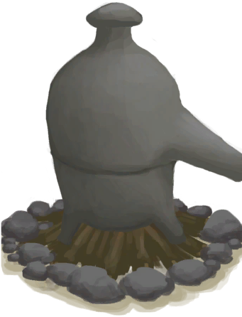
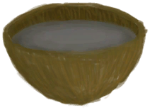

# Alembic  
> Turns seawater into fresh water.  
  
<table class="table table-bordered" data-toggle="table"  data-show-header="false"><thead style="display:none"><tr ><th  style="width:50%;text-align:left;vertical-align:top;"  >title</th><th  style="width:50%;text-align:left;vertical-align:top;"  ></th></tr></thead><tr ><td  style="width:50%;text-align:left;vertical-align:top;"  >** Cannot Be Trashed **  **Weight：**1000  **Tag：**	[“Fire”](tag_Fire.md)  **Slots：**1  **过滤器：**[“Water Container”](tag_WaterContainer.md)  **Usage：**0  ** Effect: ** [

[Cold Insulation](InsulationCold.md)](InsulationCold.md)<b>+15</b> [

[Wetness](Wetness.md)](Wetness.md)addition<b>-2</b> [

[Light](Light.md)](Light.md)<b>+25</b></td><td  style="width:50%;text-align:left;vertical-align:top;"  >

<a href="AlembicOn.md" style="color:black">Alembic</a>

"A useful device for extracting different substances via the controlled application of heat through the process of distilling.  Turns any water <b>Drinkable</b> (including seawater) and can make <b>Aqua Fortis</b>: an essential ingredient for Dynamite. To use it place an empty container inside</td></tr></tbody></table>  
  
## Got From  

** With：**[Lit Tinder](TinderLit.md)Light Fire

[Alembic(Off)](AlembicOff.md)

** With：**[Alembic](AlembicUndeployed.md)Place Alembic

[Campfire](Campfire.md)

  
  
## Action  

<table><tr><td rowspan="2" style="width:200px;text-align:center;font-size:1.3em;font-weight:bold">

Take Embers

15m

</td><td></td></tr><tr><td><b>Self：</b>Fuel  <b>-16(-16.67%)</b>, 

  <b>-16(-100%)</b></td></tr><tr><td colspan="2"><b>Require：</b>

: <b>16(100%)</b></td></tr><tr><td colspan="2">[

[Embers](Embers.md)](Embers.md)(<b>+1</b>)</td></tr></table>
  

<table><tr><td rowspan="2" style="width:200px;text-align:center;font-size:1.3em;font-weight:bold">

Extinguish Fire

</td><td></td></tr><tr><td><b>Self：</b>→ [

[Alembic(Off)](AlembicOff.md)](AlembicOff.md)</td></tr></table>
  

<table><tr><td rowspan="2" style="width:200px;text-align:center;font-size:1.3em;font-weight:bold">

Pick Up

</td><td></td></tr><tr><td><b>Self：</b>→ [

[Campfire](Campfire.md)](Campfire.md)</td></tr><tr><td colspan="2">[

[Alembic](AlembicUndeployed.md)](AlembicUndeployed.md)(<b>+1</b>)</td></tr></table>
  
  
  
## Drag With  

<table style="margin-bottom:0px;"><tr><td style="width:40%;text-align:left; background-color:#FEFEFE"><b>With：</b>[

[Coconut Shell](CoconutShell.md)](CoconutShell.md)</td><td style="width:40%;font-size:1em;font-weight:bold;background-color:#FEFEFE">Feed Coconut  </td></tr><tr style="background-color:#FFFFFF"><td style=""><b>Receiving：</b>→Dismiss</td><td style=""><b>Self：</b>Fuel  <b>+3(3.13%)</b></td></tr></table>
  

<table style="margin-bottom:0px;"><tr><td style="width:40%;text-align:left; background-color:#FEFEFE"><b>With：</b>[

[Wood](Wood.md)](Wood.md)</td><td style="width:40%;font-size:1em;font-weight:bold;background-color:#FEFEFE">Feed Firewood  </td></tr><tr style="background-color:#FFFFFF"><td style=""><b>Receiving：</b>→Dismiss</td><td style=""><b>Self：</b>Fuel  <b>+28(29.17%)</b></td></tr></table>
  

<table style="margin-bottom:0px;"><tr><td style="width:40%;text-align:left; background-color:#FEFEFE"><b>With：</b>[“Fuel”](tag_Fuel.md)</td><td style="width:40%;font-size:1em;font-weight:bold;background-color:#FEFEFE">Feed Fuel  </td></tr><tr style="background-color:#FFFFFF"><td style=""><b>Receiving：</b>→Dismiss</td><td style=""><b>Self：</b>Fuel  <b>+7(7.29%)</b></td></tr></table>
  

<table style="margin-bottom:0px;"><tr><td style="width:40%;text-align:left; background-color:#FEFEFE"><b>With：</b>[

[Charcoal](Charcoal.md)](Charcoal.md) | [

[Embers](Embers.md)](Embers.md)</td><td style="width:40%;font-size:1em;font-weight:bold;background-color:#FEFEFE">Feed Charcoal  </td></tr><tr style="background-color:#FFFFFF"><td style=""><b>Receiving：</b>→Dismiss</td><td style=""><b>Self：</b>Fuel  <b>+7(7.29%)</b>, 

  <b>+7(43.75%)</b></td></tr></table>
  

<table style="margin-bottom:0px;"><tr><td style="width:40%;text-align:left; background-color:#FEFEFE"><b>With：</b>[“Tinder”](tag_Tinder.md)</td><td style="width:40%;font-size:1em;font-weight:bold;background-color:#FEFEFE">Light Tinder  </td></tr><tr style="background-color:#FFFFFF"><td style=""><b>Receiving：</b>→ [

[Lit Tinder](TinderLit.md)](TinderLit.md)</td><td style=""><b>Self：</b></td></tr></table>
  

<table style="margin-bottom:0px;"><tr><td style="width:40%;text-align:left; background-color:#FEFEFE"><b>With：</b>[“Leaves”](tag_Leaves.md)</td><td style="width:40%;font-size:1em;font-weight:bold;background-color:#FEFEFE">Feed Leaves  </td></tr><tr style="background-color:#FFFFFF"><td style=""><b>Receiving：</b>→Dismiss</td><td style=""><b>Self：</b>Fuel  <b>+2(2.08%)</b></td></tr></table>
  

<table style="margin-bottom:0px;"><tr><td style="width:40%;text-align:left; background-color:#FEFEFE"><b>With：</b>[

[Salt Water](LQ_WaterSalt.md)](LQ_WaterSalt.md) | [

[Toxic Water](LQ_WaterToxic.md)](LQ_WaterToxic.md) | [

[Unsafe Water](LQ_WaterUnsafe.md)](LQ_WaterUnsafe.md) | [

[Ash Water](LQ_AshWater.md)](LQ_AshWater.md)</td><td style="width:40%;font-size:1em;font-weight:bold;background-color:#FEFEFE">Fill  </td></tr><tr style="background-color:#FFFFFF"><td style=""><b>Receiving：</b></td><td style=""><b>Self：</b>Water

  <b>+1200(100%)</b></td></tr></table>
  

<table style="margin-bottom:0px;"><tr><td style="width:40%;text-align:left; background-color:#FEFEFE"><b>With：</b>[

[Dissolved Niter](LQ_DissolvedNiter.md)](LQ_DissolvedNiter.md)</td><td style="width:40%;font-size:1em;font-weight:bold;background-color:#FEFEFE">Fill  </td></tr><tr style="background-color:#FFFFFF"><td style=""><b>Receiving：</b></td><td style=""><b>Self：</b>Dissolved Niter

  <b>+300(25%)</b></td></tr></table>
  
  
## Drag To  

[Fuel Jerrycan](JerrycanFuel.md)

  
  
## Transform  

<table style="margin-bottom:0px;"><tr><td  colspan=2 style="font-size:1em;font-weight:bold;background-color:#FEFEFE">Continue Water</td><td style="text-align:right; background-color:#FEFEFE"></td></tr><tr style="background-color:#FFFFFF"><td style="width:30%;font-size:1em;text-align:right;vertical-align:middle;">[“Water for Crops”](tag_WaterFresh.md)</td><td style="text-align:center;width:20%;vertical-align:middle;">
15m

Continue Water
</td><td style="text-align:left;vertical-align:middle;">LiquidQuantity  <b>+19</b></td></tr><tr style="text-align:left;background-color:#FEFEFE"><td colspan="3"><b></b>** Require Durability：** Water

: <b>1～1200(0.08%～100%)</b></td></tr></table>
  

<table style="margin-bottom:0px;"><tr><td  colspan=2 style="font-size:1em;font-weight:bold;background-color:#FEFEFE">Start Water</td><td style="text-align:right; background-color:#FEFEFE"></td></tr><tr style="background-color:#FFFFFF"><td style="width:30%;font-size:1em;text-align:right;vertical-align:middle;">[“Water Container”](tag_WaterContainer.md)</td><td style="text-align:center;width:20%;vertical-align:middle;">
15m

Start Water
</td><td style="text-align:left;vertical-align:middle;"></td></tr><tr style="text-align:left;background-color:#FEFEFE"><td colspan="3"><b></b>** Require Durability：** Water

: <b>1～1200(0.08%～100%)</b></td></tr><tr><td colspan="3">[Water](LQ_Water.md)(<b>+1</b>)</td></tr></table>
  

<table style="margin-bottom:0px;"><tr><td  colspan=2 style="font-size:1em;font-weight:bold;background-color:#FEFEFE">Start Aqua Fortis</td><td style="text-align:right; background-color:#FEFEFE"></td></tr><tr style="background-color:#FFFFFF"><td style="width:30%;font-size:1em;text-align:right;vertical-align:middle;">[“Water Container”](tag_WaterContainer.md)</td><td style="text-align:center;width:20%;vertical-align:middle;">
15m

Start Aqua Fortis
</td><td style="text-align:left;vertical-align:middle;"></td></tr><tr style="text-align:left;background-color:#FEFEFE"><td colspan="3"><b></b>** Require Durability：** Dissolved Niter

: <b>1～1200(0.08%～100%)</b></td></tr><tr><td colspan="3">[Aqua Fortis](LQ_AquaFortis.md)(<b>+1</b>)</td></tr></table>
  

<table style="margin-bottom:0px;"><tr><td  colspan=2 style="font-size:1em;font-weight:bold;background-color:#FEFEFE">Continue Aqua Fortis</td><td style="text-align:right; background-color:#FEFEFE"></td></tr><tr style="background-color:#FFFFFF"><td style="width:30%;font-size:1em;text-align:right;vertical-align:middle;">[

[Aqua Fortis](LQ_AquaFortis.md)](LQ_AquaFortis.md)</td><td style="text-align:center;width:20%;vertical-align:middle;">
15m

Continue Aqua Fortis
</td><td style="text-align:left;vertical-align:middle;">LiquidQuantity  <b>+19</b></td></tr><tr style="text-align:left;background-color:#FEFEFE"><td colspan="3"><b></b>** Require Durability：** Dissolved Niter

: <b>1～1200(0.08%～100%)</b></td></tr></table>
  
## Durability   

<table style="margin-bottom:0px;"><tr><td style="width:30%;text-align:left; background-color:#FEFEFE;font-size:1.3em;font-weight:bold;">

Water</td><td style="font-size:1em;background-color:#FEFEFE">Starting：0 , Max：1200 -38/TP , Duration ：7h54m</td></tr><tr style="background-color:#FFFFFF"><td colspan=2></td></tr></table>
  

<table style="margin-bottom:0px;"><tr><td style="width:30%;text-align:left; background-color:#FEFEFE;font-size:1.3em;font-weight:bold;">Fuel</td><td style="font-size:1em;background-color:#FEFEFE">Starting：32 , Max：96 -1/TP , Duration ：1d</td></tr><tr style="background-color:#FFFFFF"><td colspan=2>** On Zero： ** Self: → [

[Alembic(Off)](AlembicOff.md)](AlembicOff.md)</td></tr></table>
  

<table style="margin-bottom:0px;"><tr><td style="width:30%;text-align:left; background-color:#FEFEFE;font-size:1.3em;font-weight:bold;">

</td><td style="font-size:1em;background-color:#FEFEFE">Starting：0 , Max：16 +1/TP , Duration ：4h</td></tr><tr style="background-color:#FFFFFF"><td colspan=2></td></tr></table>
  

<table style="margin-bottom:0px;"><tr><td style="width:30%;text-align:left; background-color:#FEFEFE;font-size:1.3em;font-weight:bold;">

Dissolved Niter</td><td style="font-size:1em;background-color:#FEFEFE">Starting：0 , Max：1200 -38/TP , Duration ：7h54m</td></tr><tr style="background-color:#FFFFFF"><td colspan=2></td></tr></table>
  
## Passive Effects  
<table class="table table-bordered" data-toggle="table"  ><thead style=""><tr ><th  style="text-align:left;vertical-align:top;"  >Name</th><th  style="text-align:left;vertical-align:top;"  >Condition</th><th  style="text-align:left;vertical-align:top;"  data-sortable="true"  >Change(Each TP)</th><th  style="text-align:left;vertical-align:top;"  >Status</th></tr></thead><tr ><td  style="text-align:left;vertical-align:top;"  >Hot</td><td  style="text-align:left;vertical-align:top;"  >** Require Stat：** [

[Sheltered](Sheltered.md)](Sheltered.md): <b>1-1</b></td><td  style="text-align:left;vertical-align:top;"  ></td><td  style="text-align:left;vertical-align:top;"  >[

[Temperature](TemperaturePerceived.md)](TemperaturePerceived.md)<b>+10</b></td></tr></tbody></table>  
  

