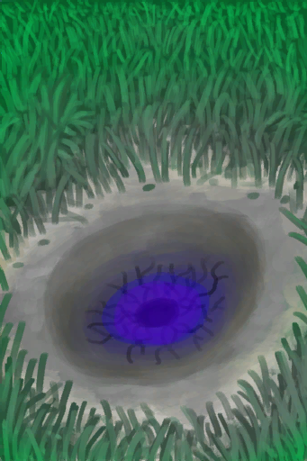

# Crater  
> "It fell from the sky  
  
<table class="table table-bordered" data-toggle="table"  data-show-header="false"><thead style="display:none"><tr ><th  style="width:50%;text-align:left;vertical-align:top;"  data-sortable="true"  >title</th><th  style="width:50%;text-align:left;vertical-align:top;"  ></th></tr></thead><tr ><td  style="width:50%;text-align:left;vertical-align:top;"  ></td><td  style="width:50%;text-align:left;vertical-align:top;"  >

<a href="AlienCrater.md" style="color:black">Crater</a>

</td></tr></tbody></table>  
  
## Got From  

Continue

[Asteroid Impact!(Event)](Event_AlienCrater.md)

  
  
## Durability   

<table style="margin-bottom:0px;"><tr><td style="width:30%;text-align:left; background-color:#FEFEFE;font-size:1.3em;font-weight:bold;">

Growth</td><td style="font-size:1em;background-color:#FEFEFE">Starting：288 , Max：576 +1/TP , Duration ：6d</td></tr><tr style="background-color:#FFFFFF"><td colspan=2>** On Full： ** Self: Growth

  <b>-576(-100%)</b> [

[Alien Growth](AlienGrowthCleared.md)](AlienGrowthCleared.md)(<b>+1</b>)</td></tr></table>
  

