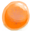
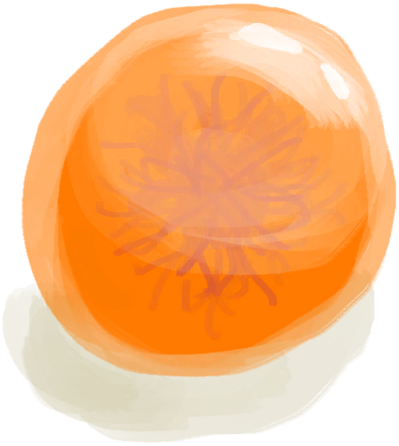

# Alien Cravings  
> Shows how much you want to eat Alien Nodules. Lowers your morale and stresses you out if it gets too high.  
  

<b>Base Value: </b> 0 
  

<b>Value Range: </b> 0 ~ 288 
  

<b>Base Rate: </b> - 
  
## Statuses  

<table><tr style="height:2em;"><td style="background-color:#F0F0F0;text-align:center;width:180px;font-size:1.4em;font-weight:bold;vertical-align:middle;">
96 ～ 142

33% ～ 49%
</td><td colspan=2 style="font-size:1.1em;vertical-align:middle;background-color:#F9F9F9;">
<b>

Alien Cravings</b>

&nbsp;&nbsp;I could eat some of that Alien stuff...
</td></tr><tr><td colspan=2><b>Effect：</b>[

[Stress](Stress.md)](Stress.md)addition<b>+0.5</b></td></tr><tr><td colspan=2></td></tr><tr style="height:2em;"><td style="background-color:#F0F0F0;text-align:center;width:180px;font-size:1.4em;font-weight:bold;vertical-align:middle;">
143 ～ 239

49% ～ 82%
</td><td colspan=2 style="font-size:1.1em;vertical-align:middle;background-color:#F9F9F9;">
<b>

Alien Cravings</b>

&nbsp;&nbsp;I would like to eat some of that Alien stuff...
</td></tr><tr><td colspan=2><b>Effect：</b>[

[Morale](Morale.md)](Morale.md)addition<b>-0.5</b>, [

[Stress](Stress.md)](Stress.md)addition<b>+1.5</b></td></tr><tr><td colspan=2></td></tr><tr style="height:2em;"><td style="background-color:#F0F0F0;text-align:center;width:180px;font-size:1.4em;font-weight:bold;vertical-align:middle;">
240 ～ 288

83% ～ 100%
</td><td colspan=2 style="font-size:1.1em;vertical-align:middle;background-color:#F9F9F9;">
<b>

Alien Cravings</b>

&nbsp;&nbsp;I really need to eat some of that Alien stuff...
</td></tr><tr><td colspan=2><b>Effect：</b>[

[Nausea](Nausea.md)](Nausea.md)addition<b>+1.25</b>, [

[Morale](Morale.md)](Morale.md)addition<b>-1</b>, [

[Stress](Stress.md)](Stress.md)addition<b>+3</b></td></tr><tr><td colspan=2></td></tr></table>
  
## Related Cards  
[Alien Spots](AlienSpots.md)  
## Addition Change By  
<table class="table table-bordered" data-toggle="table"  ><thead style=""><tr ><th  style="text-align:left;vertical-align:top;"  >From</th><th  style="text-align:left;vertical-align:top;"  >Operation</th><th  style="text-align:left;vertical-align:top;"  >Value</th></tr></thead><tr ><td  style="text-align:left;vertical-align:top;"  >[Blooming Alien Growth](AlienGrowth.md)</td><td  style="text-align:left;vertical-align:top;"  >Passive Effects</td><td  style="text-align:left;vertical-align:top;"  >addition+0.2</td></tr><tr ><td  style="text-align:left;vertical-align:top;"  >[Alien Growth](AlienGrowthCleared.md)</td><td  style="text-align:left;vertical-align:top;"  >Passive Effects</td><td  style="text-align:left;vertical-align:top;"  >addition+0.1</td></tr></tbody></table>  
  
## Change By  
<table class="table table-bordered" data-toggle="table"  ><thead style=""><tr ><th  style="text-align:left;vertical-align:top;"  >From</th><th  style="text-align:left;vertical-align:top;"  >Operation</th><th  style="text-align:left;vertical-align:top;"  data-sortable="true"  >Value</th></tr></thead><tr ><td  style="text-align:left;vertical-align:top;"  >[

[Alien Nodule](AlienNodule.md)](AlienNodule.md)</td><td  style="text-align:left;vertical-align:top;"  >Eat</td><td  style="text-align:left;vertical-align:top;"  >-48</td></tr></tbody></table>  
  

