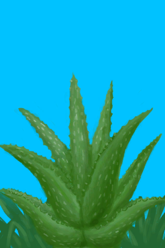
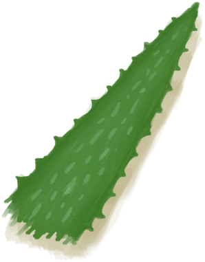

# Aloe Vera  
> I could harvest its leaves and make a gel out of it that can help me treat and prevent sunburns. It's also good for back pain and bug bites.  
  
<table class="table table-bordered" data-toggle="table"  data-show-header="false"><thead style="display:none"><tr ><th  style="width:50%;text-align:left;vertical-align:top;"  >title</th><th  style="width:50%;text-align:left;vertical-align:top;"  ></th></tr></thead><tr ><td  style="width:50%;text-align:left;vertical-align:top;"  >**Usage：**6</td><td  style="width:50%;text-align:left;vertical-align:top;"  >

<a href="AloeVera.md" style="color:black">Aloe Vera</a>

"The gel-filled leaves of this succulent can be used to alleviate muscle and back pain</td></tr></tbody></table>  
  
## Got From  

Transform

[Aloe Vera Crop Plot](CropPlotAloeVera.md)

Go for a Walk

[Bay](Bay.md)

Go for a Walk

[Beach](Beach.md)

Explore

[Desolate Beach](DesolateBeach.md)

Explore

[Eastern Grasslands](GrasslandsE.md)

Explore

[Eastern Highlands](HighlandsEastern.md)

Explore

[Western Highlands](HighlandsWestern.md)

Explore

[Jungle Outskirts(Outskirts)](Outskirts.md)

  
  
## Action  

<table><tr><td rowspan="2" style="width:200px;text-align:center;font-size:1.3em;font-weight:bold">

Harvest Leaves

15m

</td><td></td></tr><tr><td><b>Self：</b>Usage  <b>-1</b></td></tr><tr><td colspan="2"><b>StatChange：</b>[

[Herbology(Skill)](Skill_Herbology.md)](Skill_Herbology.md)<b>+1</b></td></tr><tr><td colspan="2">[

[Aloe Vera Leaf](AloeVeraLeaf.md)](AloeVeraLeaf.md)(<b>+1</b>)</td></tr></table>
  
  
  
## Durability   

<table style="margin-bottom:0px;"><tr><td style="width:30%;text-align:left; background-color:#FEFEFE;font-size:1.3em;font-weight:bold;">Usage</td><td style="font-size:1em;background-color:#FEFEFE">Starting：6 -</td></tr><tr style="background-color:#FFFFFF"><td colspan=2>** On Zero： ** Self: →Dismiss</td></tr></table>
  

