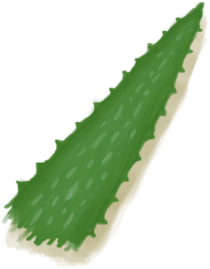
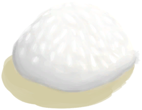
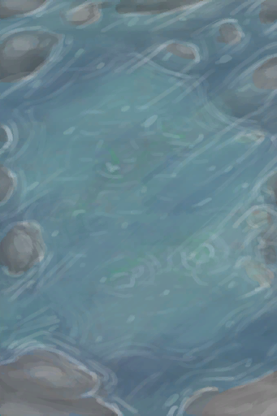

# Aloe Gel Protection  
> "Helps treat and prevent backpain  
> "The gel extracted from Aloe Vera's leaves cannot only be used to alleviate muscle and back pain  
  

<b>Base Value: </b> 0 
  

<b>Value Range: </b> 0 ~ 100 
  

<b>Base Rate: </b> -1 / /TP 
  
## Statuses  

<table><tr style="height:2em;"><td style="background-color:#F0F0F0;text-align:center;width:180px;font-size:1.4em;font-weight:bold;vertical-align:middle;">
1 ～ 100

1% ～ 100%
</td><td colspan=2 style="font-size:1.1em;vertical-align:middle;background-color:#F9F9F9;">
<b>

Aloe Vera Applied</b>

</td></tr><tr><td colspan=2><b>Effect：</b>[

[Sunburn](Sunburn.md)](Sunburn.md)addition<b>-16</b>, [

[Back Pain](BackPain.md)](BackPain.md)addition<b>-1</b>, [

[Bug Bites](BugBites.md)](BugBites.md)addition<b>-2</b>, [

[Bee Stings](BeeStings.md)](BeeStings.md)addition<b>-1</b>, [

[Burns](Burns.md)](Burns.md)addition<b>-1</b>, [

[Bruising](Bruising.md)](Bruising.md)addition<b>-1</b>, [

[Hand Damage](HandDamage.md)](HandDamage.md)addition<b>-0.5</b>, [

[Foot Damage](FootDamage.md)](FootDamage.md)addition<b>-0.5</b>, [

[Skin Humidity](SkinHumidity.md)](SkinHumidity.md)addition<b>+0.75</b></td></tr><tr><td colspan=2></td></tr></table>
  
## Change By  
<table class="table table-bordered" data-toggle="table"  ><thead style=""><tr ><th  style="text-align:left;vertical-align:top;"  >From</th><th  style="text-align:left;vertical-align:top;"  >Operation</th><th  style="text-align:left;vertical-align:top;"  data-sortable="true"  >Value</th></tr></thead><tr ><td  style="text-align:left;vertical-align:top;"  >[

[Aloe Vera Gel](AloeVeraGel.md)](AloeVeraGel.md)</td><td  style="text-align:left;vertical-align:top;"  >Apply</td><td  style="text-align:left;vertical-align:top;"  >48</td></tr><tr ><td  style="text-align:left;vertical-align:top;"  >[

[Aloe Vera Leaf](AloeVeraLeaf.md)](AloeVeraLeaf.md)</td><td  style="text-align:left;vertical-align:top;"  >Apply</td><td  style="text-align:left;vertical-align:top;"  >8</td></tr><tr ><td  style="text-align:left;vertical-align:top;"  >[

[Wet Soap](SoapWet.md)](SoapWet.md)</td><td  style="text-align:left;vertical-align:top;"  >Wash yourself</td><td  style="text-align:left;vertical-align:top;"  >-50</td></tr><tr ><td  style="text-align:left;vertical-align:top;"  >[

[Tide Pool(Rocks)](TidePool.md)](TidePool.md)</td><td  style="text-align:left;vertical-align:top;"  >Wash yourself</td><td  style="text-align:left;vertical-align:top;"  >-50</td></tr><tr ><td  style="text-align:left;vertical-align:top;"  >[

[Flooded Tide Pool(Rocks)](TidePoolFlooded.md)](TidePoolFlooded.md)</td><td  style="text-align:left;vertical-align:top;"  >Wash yourself</td><td  style="text-align:left;vertical-align:top;"  >-50</td></tr><tr ><td  style="text-align:left;vertical-align:top;"  >[

[Water](LQ_Water.md)](LQ_Water.md)</td><td  style="text-align:left;vertical-align:top;"  >Wash Yourself</td><td  style="text-align:left;vertical-align:top;"  >-50</td></tr><tr ><td  style="text-align:left;vertical-align:top;"  >[

[Salt Water](LQ_WaterSalt.md)](LQ_WaterSalt.md)</td><td  style="text-align:left;vertical-align:top;"  >Wash Yourself</td><td  style="text-align:left;vertical-align:top;"  >-50</td></tr><tr ><td  style="text-align:left;vertical-align:top;"  >[

[Toxic Water](LQ_WaterToxic.md)](LQ_WaterToxic.md)</td><td  style="text-align:left;vertical-align:top;"  >Wash Yourself</td><td  style="text-align:left;vertical-align:top;"  >-50</td></tr><tr ><td  style="text-align:left;vertical-align:top;"  >[

[Unsafe Water](LQ_WaterUnsafe.md)](LQ_WaterUnsafe.md)</td><td  style="text-align:left;vertical-align:top;"  >Wash Yourself</td><td  style="text-align:left;vertical-align:top;"  >-50</td></tr><tr ><td  style="text-align:left;vertical-align:top;"  >[

[Seawater(Flooded Chamber)](Sea_Cave.md)](Sea_Cave.md)</td><td  style="text-align:left;vertical-align:top;"  >Dive</td><td  style="text-align:left;vertical-align:top;"  >-50</td></tr><tr ><td  style="text-align:left;vertical-align:top;"  >[

[Seawater(Flooded Chamber)](Sea_Cave.md)](Sea_Cave.md)</td><td  style="text-align:left;vertical-align:top;"  >Wash yourself</td><td  style="text-align:left;vertical-align:top;"  >-50</td></tr><tr ><td  style="text-align:left;vertical-align:top;"  >[

[Sea(Atoll)](Sea_Atoll.md)](Sea_Atoll.md)</td><td  style="text-align:left;vertical-align:top;"  >Dive</td><td  style="text-align:left;vertical-align:top;"  >-50</td></tr><tr ><td  style="text-align:left;vertical-align:top;"  >[

[Sea(Atoll)](Sea_Atoll.md)](Sea_Atoll.md)</td><td  style="text-align:left;vertical-align:top;"  >Wash yourself</td><td  style="text-align:left;vertical-align:top;"  >-50</td></tr><tr ><td  style="text-align:left;vertical-align:top;"  >[

[Sea(Bay)](Sea_Bay.md)](Sea_Bay.md)</td><td  style="text-align:left;vertical-align:top;"  >Dive</td><td  style="text-align:left;vertical-align:top;"  >-50</td></tr><tr ><td  style="text-align:left;vertical-align:top;"  >[

[Sea(Bay)](Sea_Bay.md)](Sea_Bay.md)</td><td  style="text-align:left;vertical-align:top;"  >Wash yourself</td><td  style="text-align:left;vertical-align:top;"  >-50</td></tr><tr ><td  style="text-align:left;vertical-align:top;"  >[

[Sea(Beach)](Sea_Beach.md)](Sea_Beach.md)</td><td  style="text-align:left;vertical-align:top;"  >Dive</td><td  style="text-align:left;vertical-align:top;"  >-50</td></tr><tr ><td  style="text-align:left;vertical-align:top;"  >[

[Sea(Beach)](Sea_Beach.md)](Sea_Beach.md)</td><td  style="text-align:left;vertical-align:top;"  >Wash yourself</td><td  style="text-align:left;vertical-align:top;"  >-50</td></tr><tr ><td  style="text-align:left;vertical-align:top;"  >[

[Sea(Secret Cove)](Sea_Cove.md)](Sea_Cove.md)</td><td  style="text-align:left;vertical-align:top;"  >Dive</td><td  style="text-align:left;vertical-align:top;"  >-50</td></tr><tr ><td  style="text-align:left;vertical-align:top;"  >[

[Sea(Secret Cove)](Sea_Cove.md)](Sea_Cove.md)</td><td  style="text-align:left;vertical-align:top;"  >Wash yourself</td><td  style="text-align:left;vertical-align:top;"  >-50</td></tr><tr ><td  style="text-align:left;vertical-align:top;"  >[

[Sea(Desolate Beach)](Sea_DesolateBeach.md)](Sea_DesolateBeach.md)</td><td  style="text-align:left;vertical-align:top;"  >Dive</td><td  style="text-align:left;vertical-align:top;"  >-50</td></tr><tr ><td  style="text-align:left;vertical-align:top;"  >[

[Sea(Desolate Beach)](Sea_DesolateBeach.md)](Sea_DesolateBeach.md)</td><td  style="text-align:left;vertical-align:top;"  >Wash yourself</td><td  style="text-align:left;vertical-align:top;"  >-50</td></tr><tr ><td  style="text-align:left;vertical-align:top;"  >[

[Sea(Mangrove Forest)](Sea_Mangroves.md)](Sea_Mangroves.md)</td><td  style="text-align:left;vertical-align:top;"  >Dive</td><td  style="text-align:left;vertical-align:top;"  >-50</td></tr><tr ><td  style="text-align:left;vertical-align:top;"  >[

[Sea(Mangrove Forest)](Sea_Mangroves.md)](Sea_Mangroves.md)</td><td  style="text-align:left;vertical-align:top;"  >Wash yourself</td><td  style="text-align:left;vertical-align:top;"  >-50</td></tr><tr ><td  style="text-align:left;vertical-align:top;"  >[

[Sea](Sea_Raft.md)](Sea_Raft.md)</td><td  style="text-align:left;vertical-align:top;"  >Dive</td><td  style="text-align:left;vertical-align:top;"  >-50</td></tr><tr ><td  style="text-align:left;vertical-align:top;"  >[

[Sea](Sea_Raft.md)](Sea_Raft.md)</td><td  style="text-align:left;vertical-align:top;"  >Wash yourself</td><td  style="text-align:left;vertical-align:top;"  >-50</td></tr><tr ><td  style="text-align:left;vertical-align:top;"  >[

[Sea(Bird Rock)](Sea_Rocks.md)](Sea_Rocks.md)</td><td  style="text-align:left;vertical-align:top;"  >Dive</td><td  style="text-align:left;vertical-align:top;"  >-50</td></tr><tr ><td  style="text-align:left;vertical-align:top;"  >[

[Sea(Bird Rock)](Sea_Rocks.md)](Sea_Rocks.md)</td><td  style="text-align:left;vertical-align:top;"  >Wash yourself</td><td  style="text-align:left;vertical-align:top;"  >-50</td></tr><tr ><td  style="text-align:left;vertical-align:top;"  >[

[Shower](Shower.md)](Shower.md)</td><td  style="text-align:left;vertical-align:top;"  >Take a Shower</td><td  style="text-align:left;vertical-align:top;"  >-50</td></tr></tbody></table>  
  

