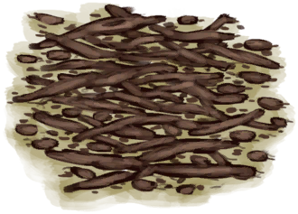

# Analgesia  
> "Lowers pain  
> Some plants like <b>Kava</b> have analgesic properties that can relieve your pain and lower your fever.   Their sedative effects can also reduce <b>Stress</b> and increase <b>Morale</b>.  
  

<b>Base Value: </b> 0 
  

<b>Value Range: </b> 0 ~ 400 
  

<b>Base Rate: </b> -1 / /TP 
  
## Statuses  

<table><tr style="height:2em;"><td style="background-color:#F0F0F0;text-align:center;width:180px;font-size:1.4em;font-weight:bold;vertical-align:middle;">
1 ～ 100

0% ～ 25%
</td><td colspan=2 style="font-size:1.1em;vertical-align:middle;background-color:#F9F9F9;">
<b>

Minor Analgesic Dose</b>

</td></tr><tr><td colspan=2><b>Effect：</b>[

[Pain](Pain.md)](Pain.md)<b>-200</b>, [

[Fever](Fever.md)](Fever.md)addition<b>-10</b>, [

[Courage](Courage.md)](Courage.md)<b>+200</b>, [

[Stress](Stress.md)](Stress.md)addition<b>-2</b></td></tr><tr><td colspan=2></td></tr><tr style="height:2em;"><td style="background-color:#F0F0F0;text-align:center;width:180px;font-size:1.4em;font-weight:bold;vertical-align:middle;">
101 ～ 200

25% ～ 50%
</td><td colspan=2 style="font-size:1.1em;vertical-align:middle;background-color:#F9F9F9;">
<b>

Moderate Analgesic Dose</b>

</td></tr><tr><td colspan=2><b>Effect：</b>[

[Pain](Pain.md)](Pain.md)<b>-300</b>, [

[Fever](Fever.md)](Fever.md)addition<b>-20</b>, [

[Analgesia](Analgesia.md)](Analgesia.md)addition<b>-1</b>, [

[Courage](Courage.md)](Courage.md)<b>+400</b>, [

[Stress](Stress.md)](Stress.md)addition<b>-4</b>, [

[Mental Structure](Structure.md)](Structure.md)addition<b>-1</b></td></tr><tr><td colspan=2></td></tr><tr style="height:2em;"><td style="background-color:#F0F0F0;text-align:center;width:180px;font-size:1.4em;font-weight:bold;vertical-align:middle;">
201 ～ 300

50% ～ 75%
</td><td colspan=2 style="font-size:1.1em;vertical-align:middle;background-color:#F9F9F9;">
<b>

High Analgesic Dose</b>

</td></tr><tr><td colspan=2><b>Effect：</b>[

[Pain](Pain.md)](Pain.md)<b>-400</b>, [

[Fever](Fever.md)](Fever.md)addition<b>-40</b>, [

[Analgesia](Analgesia.md)](Analgesia.md)addition<b>-3</b>, [

[Courage](Courage.md)](Courage.md)<b>+800</b>, [

[Stress](Stress.md)](Stress.md)addition<b>-6</b>, [

[Mental Structure](Structure.md)](Structure.md)addition<b>-2</b></td></tr><tr><td colspan=2></td></tr><tr style="height:2em;"><td style="background-color:#F0F0F0;text-align:center;width:180px;font-size:1.4em;font-weight:bold;vertical-align:middle;">
301 ～ 400

75% ～ 100%
</td><td colspan=2 style="font-size:1.1em;vertical-align:middle;background-color:#F9F9F9;">
<b>

Very High Analgesic Dose</b>

</td></tr><tr><td colspan=2><b>Effect：</b>[

[Pain](Pain.md)](Pain.md)<b>-500</b>, [

[Fever](Fever.md)](Fever.md)addition<b>-80</b>, [

[Analgesia](Analgesia.md)](Analgesia.md)addition<b>-5</b>, [

[Courage](Courage.md)](Courage.md)<b>+1600</b>, [

[Stress](Stress.md)](Stress.md)addition<b>-8</b>, [

[Mental Structure](Structure.md)](Structure.md)addition<b>-4</b></td></tr><tr><td colspan=2></td></tr></table>
  
## Change By  
<table class="table table-bordered" data-toggle="table"  ><thead style=""><tr ><th  style="text-align:left;vertical-align:top;"  >From</th><th  style="text-align:left;vertical-align:top;"  >Operation</th><th  style="text-align:left;vertical-align:top;"  data-sortable="true"  >Value</th></tr></thead><tr ><td  style="text-align:left;vertical-align:top;"  >[

[Painkillers](Painkillers.md)](Painkillers.md)</td><td  style="text-align:left;vertical-align:top;"  >Take</td><td  style="text-align:left;vertical-align:top;"  >200</td></tr><tr ><td  style="text-align:left;vertical-align:top;"  >[

[Kava](LQ_Kava.md)](LQ_Kava.md)</td><td  style="text-align:left;vertical-align:top;"  >Drink</td><td  style="text-align:left;vertical-align:top;"  >75</td></tr><tr ><td  style="text-align:left;vertical-align:top;"  >[

[Ground Kava Root](KavaRootGround.md)](KavaRootGround.md)</td><td  style="text-align:left;vertical-align:top;"  >Eat Ground Root</td><td  style="text-align:left;vertical-align:top;"  >50</td></tr><tr ><td  style="text-align:left;vertical-align:top;"  >[

[Kava Root](KavaRoot.md)](KavaRoot.md)</td><td  style="text-align:left;vertical-align:top;"  >Eat Root</td><td  style="text-align:left;vertical-align:top;"  >25</td></tr><tr ><td  style="text-align:left;vertical-align:top;"  >[

[Dried Kava Root](KavaRootDried.md)](KavaRootDried.md)</td><td  style="text-align:left;vertical-align:top;"  >Eat Root</td><td  style="text-align:left;vertical-align:top;"  >25</td></tr></tbody></table>  
  

