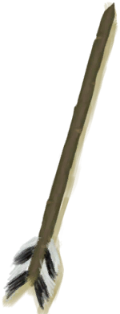

# Simple Arrow  
> Could shoot it with a bow.  
  
<table class="table table-bordered" data-toggle="table"  data-show-header="false"><thead style="display:none"><tr ><th  style="width:50%;text-align:left;vertical-align:top;"  >title</th><th  style="width:50%;text-align:left;vertical-align:top;"  ></th></tr></thead><tr ><td  style="width:50%;text-align:left;vertical-align:top;"  >**Weight：**25  **Tag：**	[“Fuel”](tag_Fuel.md), [“Arrows”](tag_Arrow.md), [“Valuable”](tag_Valuable.md)  **Usage：**10</td><td  style="width:50%;text-align:left;vertical-align:top;"  >

<a href="ArrowSimple.md" style="color:black">Simple Arrow</a>

"Basic</td></tr></tbody></table>  
  
## Got From  

Craft BluePrint

[Arrows(BluePrint)](Bp_Arrow.md)

Craft Arrow

[Arrow Shaft](ArrowShaft.md)(未实装)

Transform

[Loaded Rustic Bow](BowRustic_Simple.md)(未实装)

  
  
## Drag With  
  
## Drag To  

[Alembic(Off)](AlembicOff.md)

[Alembic(On)](AlembicOn.md)

[Campfire](Campfire.md)

[Campfire(Off)](CampfireExtinguished.md)

[Clay Fire Pit](ClayFirePit.md)

[Clay Fire Pit(Off)](ClayFirePitExtinguished.md)

[Fire](Fire.md)

[Fire(Off)](FireExtinguished.md)

[Forge](Forge.md)

[Forge(Off)](ForgeExtinguished.md)

[Kiln](Kiln.md)

[Advanced Kiln](KilnAdvanced.md)

[Advanced Kiln(Off)](KilnAdvancedExtinguished.md)

[Kiln(Off)](KilnExtinguished.md)

[Stove](Stove.md)

[Stove(Off)](StoveExtinguished.md)

  
  
## Use In BluePrint  

<a href="Bp_Bow.md" style="color:black">Bow</a>

  
  
  
## Durability   

<table style="margin-bottom:0px;"><tr><td style="width:30%;text-align:left; background-color:#FEFEFE;font-size:1.3em;font-weight:bold;">Usage</td><td style="font-size:1em;background-color:#FEFEFE">Starting：10 , Max：10 -</td></tr><tr style="background-color:#FFFFFF"><td colspan=2>** On Zero： ** Self: →Dismiss</td></tr></table>
  

