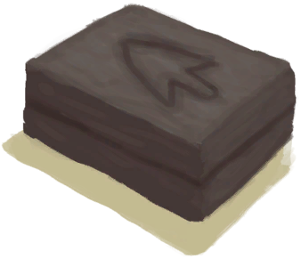

# Ash  
> Could use it to temper clay or mud.  
  
<table class="table table-bordered" data-toggle="table"  data-show-header="false"><thead style="display:none"><tr ><th  style="width:50%;text-align:left;vertical-align:top;"  >title</th><th  style="width:50%;text-align:left;vertical-align:top;"  ></th></tr></thead><tr ><td  style="width:50%;text-align:left;vertical-align:top;"  >**Weight：**10  **Tag：**	[“Temper”](tag_Temper.md)</td><td  style="width:50%;text-align:left;vertical-align:top;"  >

<a href="Ash.md" style="color:black">Ash</a>

"Ash can be used as temper for clay or mud</td></tr></tbody></table>  
  
## Got From  

Take Charcoal and Ash

[Alembic(Off)](AlembicOff.md)

Take Charcoal and Ash

[Campfire(Off)](CampfireExtinguished.md)

Dismantle

[Campfire(Off)](CampfireExtinguished.md)

Take Charcoal and Ash

[Clay Fire Pit(Off)](ClayFirePitExtinguished.md)

Transform

[Fire](Fire.md)

Take Charcoal and Ash

[Fire(Off)](FireExtinguished.md)

Transform

[Forge](Forge.md)

Transform

[Kiln](Kiln.md)

Transform

[Advanced Kiln](KilnAdvanced.md)

Take Charcoal and Ash

[Stove(Off)](StoveExtinguished.md)

Transform

[Smoker](Smoker.md)

** With：**[“Hammer”](tag_Hammer.md)Crush

[Charcoal](Charcoal.md)

  
  
## Drag With  

<table style="margin-bottom:0px;"><tr><td style="width:40%;text-align:left; background-color:#FEFEFE"><b>With：</b>[“Water for Crops”](tag_WaterFresh.md)</td><td style="width:40%;font-size:1em;font-weight:bold;background-color:#FEFEFE">Soak  </td></tr><tr style="background-color:#FFFFFF"><td style=""><b>Receiving：</b>→ [

[Ash Water](LQ_AshWater.md)](LQ_AshWater.md)</td><td style=""><b>Self：</b>→Dismiss</td></tr></table>
  
  
## Drag To  

[Mud Pile](MudPile.md)

[Clay](Clay.md)

[Small Cloth](ClothSmall.md)

  
  
## Use In BluePrint  

<a href="Bp_AshDressing.md" style="color:black">Ash Dressing</a>

<a href="Bp_CropPlot.md" style="color:black">Crop Plot</a>

<a href="Bp_MoldAxe.md" style="color:black">Axe Mold</a>

<a href="Bp_MoldKnife.md" style="color:black">Knife Mold</a>

<a href="Bp_MoldShovel.md" style="color:black">Shovel Mold</a>

<a href="Bp_MoldSpear.md" style="color:black">Spear Mold</a>

<a href="Bp_RicePaddy.md" style="color:black">Rice Paddy</a>

<a href="Bp_Weston.md" style="color:black">Weston</a>

<a href="Bp_Alembic.md" style="color:black">Alembic</a>

<a href="Bp_ClayBowl.md" style="color:black">Clay Bowl</a>

<a href="Bp_ClayFirePit.md" style="color:black">Clay Fire Pit</a>

<a href="Bp_ClayJar.md" style="color:black">Clay Jar</a>

<a href="Bp_ClayPotCooler.md" style="color:black">Clay Pot Cooler</a>

<a href="Bp_ClayVase.md" style="color:black">Clay Vase</a>

<a href="Bp_CookingPot.md" style="color:black">Cooking Pot</a>

<a href="Bp_GlazedVase.md" style="color:black">Glazed Vase</a>

  
  
  

