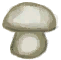
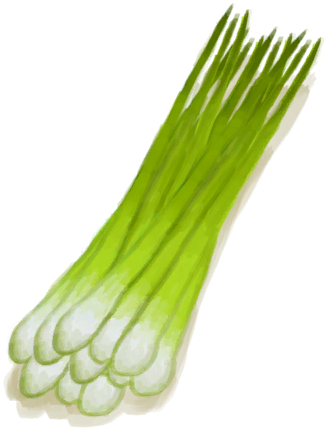

# Assorted Mushrooms  
> "Edible  
  
<table class="table table-bordered" data-toggle="table"  data-show-header="false"><thead style="display:none"><tr ><th  style="width:50%;text-align:left;vertical-align:top;"  >title</th><th  style="width:50%;text-align:left;vertical-align:top;"  ></th></tr></thead><tr ><td  style="width:50%;text-align:left;vertical-align:top;"  >**Weight：**75  **Tag：**	[“Feed Omnivorous”](tag_FeedOmnivorous.md), [“Feed Herbivore”](tag_FeedHerb.md), [“Feed”](tag_Feed.md), [“Cookable”](tag_Cookable.md), [“Poor Sugars”](tag_SugarsPoor.md)</td><td  style="width:50%;text-align:left;vertical-align:top;"  >

<a href="AssortedMushrooms.md" style="color:black">Assorted Mushrooms</a>

"An assortment of different mushrooms. Some good</td></tr></tbody></table>  
  
## Got From  

Harvest

[Assorted Mushrooms](AssortedMushroomsPlant.md)

  
  
## Action  

<table><tr><td rowspan="2" style="width:200px;text-align:center;font-size:1.3em;font-weight:bold">

Eat

3m

</td><td>[“VegetarianAction(Group)”](VegetarianAction.md), [“EatingAction(Group)”](EatingAction.md)</td></tr><tr><td><b>Self：</b>→Dismiss</td></tr><tr><td colspan="2"><b>StatChange：</b>[

[Satiation](Satiation.md)](Satiation.md)<b>+5</b>, [

[Stomach](Stomach.md)](Stomach.md)<b>+2</b>, [

[Hydration ](Hydration.md)](Hydration.md)<b>+1</b>, [

[Morale](Morale.md)](Morale.md)<b>-1</b>, [

[Saturation Mushrooms](SaturationMushrooms.md)](SaturationMushrooms.md)<b>+20</b></td></tr><tr><td colspan="2">

<table style="margin-bottom:3px;"><tr><td rowspan=2 style="text-align:center" width="80px">
Base Weight

100
</td><td style="font-size:0.6em;line-height:0.6em;font-weight:bold"></td></tr><tr><td>[

[Food Poisoning](FoodPoisoning.md)](FoodPoisoning.md)<b>+24～+48</b></td></tr><tr><td colspan=2><li>[

[Herbology(Skill)](Skill_Herbology.md)](Skill_Herbology.md) in <b>0～150(0%～100%)</b>, weight<b>+0～-100</b></li></td></tr></table>

<table style="margin-bottom:3px;"><tr><td rowspan=2 style="text-align:center" width="80px">
Base Weight

0
</td><td style="font-size:0.6em;line-height:0.6em;font-weight:bold"></td></tr><tr><td></td></tr><tr><td colspan=2><li>[

[Herbology(Skill)](Skill_Herbology.md)](Skill_Herbology.md) in <b>0～150(0%～100%)</b>, weight<b>+0～+100</b></li></td></tr></table>
<button class="btn btn-secondary btn-sm" style="" data-toggle="modal" onclick="setCollectionDataBase64('eyJ0aXRsZSI6IlNpbXVsYXRvcjogRWF0IChBc3NvcnRlZCBNdXNocm9vbXMpIiwiY29sbGVjdGlvbnMiOlt7ImRyb3AiOiItIiwiYmFzZSI6MTAwLCJjb25kaXRpb24iOlt7ImtleSI6IlNraWxsX0hlcmJvbG9neSIsInRpdGxlIjoiSGVyYm9sb2d5KFNraWxsKSIsInR5cGUiOiJyYW5nZSIsIm1heCI6WzAsMTUwXSwicmFuZ2UiOlswLDE1MF0sIndlaWdodCI6WzAsLTEwMF0sImRlZmF1bHRWYWx1ZSI6MCwid2hlbk91dE9mUmFuZ2UiOjB9XX0seyJkcm9wIjoiLSIsImJhc2UiOjAsImNvbmRpdGlvbiI6W3sia2V5IjoiU2tpbGxfSGVyYm9sb2d5IiwidGl0bGUiOiJIZXJib2xvZ3koU2tpbGwpIiwidHlwZSI6InJhbmdlIiwibWF4IjpbMCwxNTBdLCJyYW5nZSI6WzAsMTUwXSwid2VpZ2h0IjpbMCwxMDBdLCJkZWZhdWx0VmFsdWUiOjAsIndoZW5PdXRPZlJhbmdlIjowfV19XX0=')" data-target="#modelCollectionSimulator">Simulator</button>
</td></tr></table>
  
  
  
## Drag To  

[Boar Feeder](BoarFeeder.md)

[Boar Feeder(Empty)](BoarFeederEmpty.md)

[Compost Bin](CompostBin.md)

[Empty Mushroom Bed(Empty)](MushroomBedEmpty.md)

[Goat Feeder](GoatFeeder.md)

[Goat Feeder(Empty)](GoatFeederEmpty.md)

[Partridge Feeder](PartridgeFeeder.md)

[Partridge Feeder(Empty)](PartridgeFeederEmpty.md)

[Trapped Macaque](CageTrapMacaque.md)

[Sow](BoarEnclosureFemale.md)

[Boar](BoarEnclosureMale.md)

[Piglet](BoarEnclosurePiglet.md)

[Sow](BoarTiedFemale.md)

[Boar](BoarTiedMale.md)

[Piglet](BoarTiedPiglet.md)

[Goat](GoatEnclosureFemale.md)

[Juvenile Goat](GoatEnclosureKid.md)

[Lactating Goat](GoatEnclosureLactating.md)

[Male Goat](GoatEnclosureMale.md)

[Goat](GoatTiedFemale.md)

[Lactating Goat](GoatTiedFemaleLactating.md)

[Juvenile Goat](GoatTiedKid.md)

[Male Goat](GoatTiedMale.md)

[Macaque Friend](MacaqueFriend.md)

[Wounded Macaque](MacaqueWounded.md)

[Chick](PartridgeChick.md)

[Partridge](PartridgeFemaleEnclosure.md)

[Partridge](PartridgeFemaleLive.md)

[Male Partridge](PartridgeMaleEnclosure.md)

[Male Partridge](PartridgeMaleLive.md)

  
  
## Durability   

<table style="margin-bottom:0px;"><tr><td style="width:30%;text-align:left; background-color:#FEFEFE;font-size:1.3em;font-weight:bold;">Spoilage</td><td style="font-size:1em;background-color:#FEFEFE">Starting：384 -1/TP , Duration ：4d</td></tr><tr style="background-color:#FFFFFF"><td colspan=2>** On Zero： ** Self: →Dismiss</td></tr></table>
  

