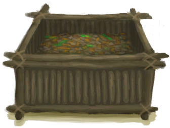
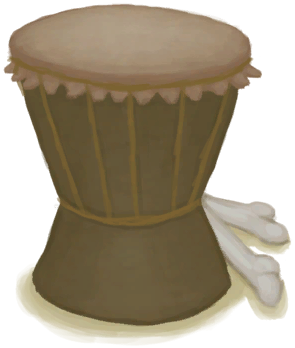

# Flint Axe  
> I can cut down trees with this.  
  
<table class="table table-bordered" data-toggle="table"  data-show-header="false"><thead style="display:none"><tr ><th  style="width:50%;text-align:left;vertical-align:top;"  >title</th><th  style="width:50%;text-align:left;vertical-align:top;"  ></th></tr></thead><tr ><td  style="width:50%;text-align:left;vertical-align:top;"  >**Weight：**250  **Tag：**	[“Hammer”](tag_Hammer.md), [“Axe”](tag_Axe.md), [“Hammer”](tag_AxeAdv.md), [“Heavy”](tag_Heavy.md)  **Usage：**25</td><td  style="width:50%;text-align:left;vertical-align:top;"  >

<a href="AxeFlint.md" style="color:black">Flint Axe</a>

"As sharp as a copper one</td></tr></tbody></table>  
  
## Got From  

Craft BluePrint

[Flint Axe(BluePrint)](Bp_FlintAxe.md)

  
  
## Drag To  

[Copper Vein(High Chamber)](CopperVein.md)

[Dirt Pile](DirtPile.md)

[Stove(Off)](StoveExtinguished.md)

[Half Log](HalfLog.md)

[Log](Log.md)

[Mud Pile](MudPile.md)

[Seat](Seat.md)

[Seat](SeatPlaced.md)

[Watering Trough](WateringTrough.md)

[Bone Splinters](BoneSplinters.md)

[Bones](Bones.md)

[Charcoal](Charcoal.md)

[Coconut](Coconut.md)

[Husked Coconut](CoconutHusked.md)

[Perforated Coconut](CoconutPerforated.md)

[Rotten Coconut](CoconutRotten.md)

[Conch](Conch.md)

[Copper Decoration](CopperDecoration_Mold.md)

[Feathers](Feathers.md)

[Dried Chilies](ChiliesDried.md)

[Conch Meat](ConchMeat.md)

[Ginger](Ginger.md)

[Dried Ginger](GingerDried.md)

[Jasmine Flowers](JasmineFlowers.md)

[Kava Root](KavaRoot.md)

[Dried Kava Root](KavaRootDried.md)

[Sow](BoarEnclosureFemale.md)

[Boar](BoarEnclosureMale.md)

[Piglet](BoarEnclosurePiglet.md)

[Sow](BoarTiedFemale.md)

[Boar](BoarTiedMale.md)

[Piglet](BoarTiedPiglet.md)

[Goat](GoatEnclosureFemale.md)

[Juvenile Goat](GoatEnclosureKid.md)

[Lactating Goat](GoatEnclosureLactating.md)

[Male Goat](GoatEnclosureMale.md)

[Goat](GoatTiedFemale.md)

[Lactating Goat](GoatTiedFemaleLactating.md)

[Juvenile Goat](GoatTiedKid.md)

[Male Goat](GoatTiedMale.md)

[Lemongrass](LemongrassStalks.md)

[Snake Grass](SnakeGrass.md)

[Spider Lily Leaves](SpiderLilyLeaves.md)

[Dried Spider Lily Leaves](SpiderLilyLeavesDried.md)

[Geode](Geode.md)

[Giant Conch](GiantConch.md)

[Burnt Mortar](MortarBurnt.md)

[Mud Brick](MudBrick.md)

[Nipa Fruit](NipaFruit.md)

[Niter Crystals](NiterCrystals.md)

[Oyster](Oyster.md)

[Burnt Stone](StoneBurnt.md)

[Burnt Heavy Stone](StoneHeavyBurnt.md)

[Tropical Almonds](TropicalAlmonds.md)

[Urchin](Urchin.md)

[Brimstone Vent(Volcano)](VentBrimstone.md)

[Weston](Weston.md)

[Blooming Alien Growth](AlienGrowth.md)

[Alien Growth](AlienGrowthCleared.md)

[Cinchona Tree](CinchonaTree.md)

[Cleared Cinchona Tree](CinchonaTreeCleared.md)

[Narrow Passage(High Chamber)](CrystalChamberEntranceClosed.md)

[Narrow Passage(Damp Chamber)](DarkCaveCaveEntranceClosed.md)

[Narrow Passage(High Chamber)](DarkChamberCaveEntranceClosed.md)

[Narrow Passage(High Chamber)](FloodedChamberEntranceClosed.md)

[Narrow Passage(Tunnel)](HighChamberEntranceClosed.md)

[Young Mango Tree](MangoTreeYoung.md)

[Deep Jungle(Jungle)](DeepJungle.md)

[Eastern Highlands](HighlandsEastern.md)

[Western Highlands](HighlandsWestern.md)

[Jungle](Jungle.md)

[Jungle Highlands](JungleHighlands.md)

[Mangrove Forest](Mangroves.md)

[Jungle Outskirts(Outskirts)](Outskirts.md)

[Wetland Jungle(Wetlands)](Wetlands.md)

[Young palm Tree](PalmTreeYoung.md)

[Cleared Banana Tree](BananaTreeCleared.md)

[Large Tree](LargeTree.md)

[Felled Large Tree](LargeTreeFelled.md)

[Cleared Mango Tree](MangoTreeCleared.md)

[Nipa Palm](NipaPalm.md)

[Cleared Palm Tree](PalmTreeCleared.md)

[Felled Palm Tree](PalmTreeFelled.md)

[Palm Tree](PalmTreeNew.md)

[Palm Tree](PalmTreeNewMultiEventOld.md)

[Palm Tree](PalmTreeOld.md)

[Sap Station](PalmTreeSapStation.md)

[Empty Sap Station(Empty)](PalmTreeSapStationEmpty.md)

[Sago Palm](SagoPalm.md)

[Felled Sago Palm](SagoPalmFelled.md)

[Split Log](SagoSplitLog.md)

[Cleared Tropical Almond Tree](TropicalAlmondTreeCleared.md)

[Felled Tropical Almond Tree](TropicalAlmondTreeFelled.md)

[Small Palm](SmallPalm.md)

[Small Tree](SmallTree.md)

[Young Almond Tree](TropicalAlmondTreeYoung.md)

[Water Filter](WaterFilter.md)

[Wild Jujube](WildJujube.md)

[Cleared Wild Jujube](WildJujubeCleared.md)

  
  
## Use In BluePrint  

<a href="Bp_BedRustic.md" style="color:black">Rustic Bed</a>

<a href="Bp_BedWooden.md" style="color:black">Wooden Bed</a>

<a href="Bp_BoarFeeder.md" style="color:black">Boar Feeder</a>

<a href="Bp_Bookshelf.md" style="color:black">Bookshelf</a>

<a href="Bp_Chair.md" style="color:black">Chair</a>

<a href="Bp_Chest.md" style="color:black">Chest</a>

<a href="Bp_CompostBin.md" style="color:black">Compost Bin</a>

<a href="Bp_Drum.md" style="color:black">Drum</a>

<a href="Bp_EatingUtensilsWooden.md" style="color:black">Wooden Eating Utensils</a>

<a href="Bp_Enclosure.md" style="color:black">Enclosure</a>

<a href="Bp_GoatFeeder.md" style="color:black">Goat Feeder</a>

<a href="Bp_LizardDrum.md" style="color:black">Lizard Drum</a>

<a href="Bp_Planks.md" style="color:black">Wooden Planks</a>

<a href="Bp_PotteryWheel.md" style="color:black">Pottery Wheel</a>

<a href="Bp_Raft.md" style="color:black">Raft</a>

<a href="Bp_Shelf.md" style="color:black">Shelf</a>

<a href="Bp_Shield.md" style="color:black">Shield</a>

<a href="Bp_SupplyChest.md" style="color:black">Supply Chest</a>

<a href="Bp_Table.md" style="color:black">Table</a>

<a href="Bp_WoodenShovel.md" style="color:black">Wooden Shovel</a>

  
  
  
## Durability   

<table style="margin-bottom:0px;"><tr><td style="width:30%;text-align:left; background-color:#FEFEFE;font-size:1.3em;font-weight:bold;">Usage</td><td style="font-size:1em;background-color:#FEFEFE">Starting：25 , Max：25 -</td></tr><tr style="background-color:#FFFFFF"><td colspan=2>** On Zero： ** Self: →Dismiss [

[Flint](Flint.md)](Flint.md)(<b>+1～+2</b>), [

[Fiber Cord](CordFiber.md)](CordFiber.md)(<b>+1</b>), [

[Sticks](Sticks.md)](Sticks.md)(<b>+1</b>)</td></tr></table>
  

