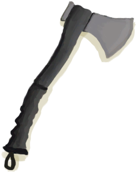
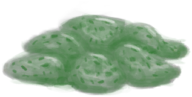
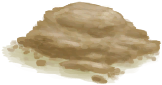
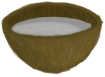

# Blunt Survival Axe  
> Needs to be sharpened with a stone before it can be used again.  
  
<table class="table table-bordered" data-toggle="table"  data-show-header="false"><thead style="display:none"><tr ><th  style="width:50%;text-align:left;vertical-align:top;"  >title</th><th  style="width:50%;text-align:left;vertical-align:top;"  ></th></tr></thead><tr ><td  style="width:50%;text-align:left;vertical-align:top;"  >**Weight：**250  **Tag：**	[“Hammer”](tag_Hammer.md), [“Heavy”](tag_Heavy.md)</td><td  style="width:50%;text-align:left;vertical-align:top;"  >

<a href="AxeSurvivalBlunt.md" style="color:black">Blunt Survival Axe</a>

</td></tr></tbody></table>  
  
## Got From  

Transform

[Survival Axe](AxeSurvival.md)

  
  
## Drag With  

<table style="margin-bottom:0px;"><tr><td style="width:40%;text-align:left; background-color:#FEFEFE"><b>With：</b>[

[Stone](Stone.md)](Stone.md) | [

[Heavy Stone](StoneHeavy.md)](StoneHeavy.md)</td><td style="width:40%;font-size:1em;font-weight:bold;background-color:#FEFEFE">Sharpen (30m) </td></tr><tr style="background-color:#FFFFFF"><td style=""><b>Receiving：</b></td><td style=""><b>Self：</b>→ [

[Survival Axe](AxeSurvival.md)](AxeSurvival.md)</td></tr><tr><td colspan="2"><b>StatChange：</b>[

[Hand Damage](HandDamage.md)](HandDamage.md)<b>+10</b>, [

[Stress](Stress.md)](Stress.md)<b>-5</b>, [

[Metalworking(Skill)](Skill_Metalworking.md)](Skill_Metalworking.md)<b>+0.25</b></td></tr></table>
  
  
## Drag To  

[Copper Vein(High Chamber)](CopperVein.md)

[Dirt Pile](DirtPile.md)

[Stove(Off)](StoveExtinguished.md)

[Mud Pile](MudPile.md)

[Watering Trough](WateringTrough.md)

[Bone Splinters](BoneSplinters.md)

[Bones](Bones.md)

[Charcoal](Charcoal.md)

[Coconut](Coconut.md)

[Husked Coconut](CoconutHusked.md)

[Perforated Coconut](CoconutPerforated.md)

[Rotten Coconut](CoconutRotten.md)

[Conch](Conch.md)

[Copper Decoration](CopperDecoration_Mold.md)

[Feathers](Feathers.md)

[Dried Chilies](ChiliesDried.md)

[Conch Meat](ConchMeat.md)

[Ginger](Ginger.md)

[Dried Ginger](GingerDried.md)

[Jasmine Flowers](JasmineFlowers.md)

[Kava Root](KavaRoot.md)

[Dried Kava Root](KavaRootDried.md)

[Lemongrass](LemongrassStalks.md)

[Snake Grass](SnakeGrass.md)

[Spider Lily Leaves](SpiderLilyLeaves.md)

[Dried Spider Lily Leaves](SpiderLilyLeavesDried.md)

[Geode](Geode.md)

[Giant Conch](GiantConch.md)

[Burnt Mortar](MortarBurnt.md)

[Mud Brick](MudBrick.md)

[Niter Crystals](NiterCrystals.md)

[Oyster](Oyster.md)

[Burnt Stone](StoneBurnt.md)

[Burnt Heavy Stone](StoneHeavyBurnt.md)

[Tropical Almonds](TropicalAlmonds.md)

[Urchin](Urchin.md)

[Brimstone Vent(Volcano)](VentBrimstone.md)

[Weston](Weston.md)

[Narrow Passage(High Chamber)](CrystalChamberEntranceClosed.md)

[Narrow Passage(Damp Chamber)](DarkCaveCaveEntranceClosed.md)

[Narrow Passage(High Chamber)](DarkChamberCaveEntranceClosed.md)

[Narrow Passage(High Chamber)](FloodedChamberEntranceClosed.md)

[Narrow Passage(Tunnel)](HighChamberEntranceClosed.md)

[Water Filter](WaterFilter.md)

  
  
## Use In BluePrint  

<a href="Bp_BrimstoneGel.md" style="color:black">Brimstone Gel</a>

<a href="Bp_BugRepellent.md" style="color:black">Bug Repellant</a>

<a href="Bp_CeremonialDagger.md" style="color:black">Ceremonial Dagger</a>

<a href="Bp_CopperSheet.md" style="color:black">Copper Sheet</a>

<a href="Bp_Honey.md" style="color:black">Honey</a>

<a href="Bp_Mortar.md" style="color:black">Mortar</a>

<a href="Bp_PesticideBrimstone.md" style="color:black">Brimstone Pesticide</a>

<a href="Bp_PotteryWheel.md" style="color:black">Pottery Wheel</a>

<a href="Bp_Quinine.md" style="color:black">Cinchona Powder</a>

<a href="Bp_ScrapAxe.md" style="color:black">Scrap Axe</a>

<a href="Bp_ScrapKnife.md" style="color:black">Scrap Knife</a>

<a href="Bp_ScrapShovel.md" style="color:black">Scrap Shovel</a>

<a href="Bp_Table.md" style="color:black">Table</a>

<a href="Bp_Vitriol.md" style="color:black">Vitriol</a>

<a href="Bp_CoconutMilk.md" style="color:black">Coconut Milk</a>

<a href="Bp_CopperBottle.md" style="color:black">Copper Bottle</a>

<a href="Bp_CopperJar.md" style="color:black">Copper Jar</a>

  
  
  

