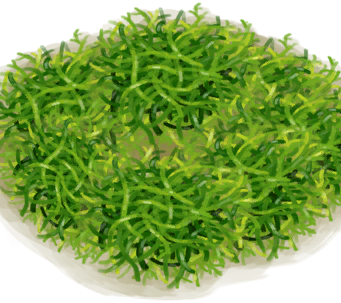
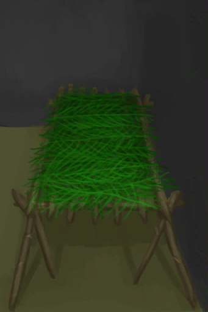

# Back Pain  
> A painful ailment caused by sleeping on bad beds or on the floor.   
> A painful ailment caused by sleeping on <b>Bad Beds or on the Floor</b>. Build better <b>Beds</b> in order to prevent it.  <b>Aloe Vera</b> can alleviate the pain and help your back heal faster.  
  

<b>Base Value: </b> 0 
  

<b>Value Range: </b> 0 ~ 225 
  

<b>Base Rate: </b> -1 / /TP 
  
## Statuses  

<table><tr style="height:2em;"><td style="background-color:#F0F0F0;text-align:center;width:180px;font-size:1.4em;font-weight:bold;vertical-align:middle;">
75 ～ 150

33% ～ 66%
</td><td colspan=2 style="font-size:1.1em;vertical-align:middle;background-color:#F9F9F9;">
<b>

Back Pain</b>

</td></tr><tr><td colspan=2><b>Effect：</b>[

[Pain](Pain.md)](Pain.md)<b>+50</b></td></tr><tr><td colspan=2></td></tr><tr style="height:2em;"><td style="background-color:#F0F0F0;text-align:center;width:180px;font-size:1.4em;font-weight:bold;vertical-align:middle;">
151 ～ 225

67% ～ 100%
</td><td colspan=2 style="font-size:1.1em;vertical-align:middle;background-color:#F9F9F9;">
<b>

Serious Back Pain</b>

&nbsp;&nbsp;Hurts...
</td></tr><tr><td colspan=2><b>Effect：</b>[

[Pain](Pain.md)](Pain.md)<b>+100</b></td></tr><tr><td colspan=2></td></tr></table>
  
## Related Cards  
[Aloe Gel Protection](AloeVeraGelProtection.md)  |  [Brimstone Gel Protection](BrimstoneGelProtection.md)  
## Addition Change By  
<table class="table table-bordered" data-toggle="table"  ><thead style=""><tr ><th  style="text-align:left;vertical-align:top;"  >From</th><th  style="text-align:left;vertical-align:top;"  >Operation</th><th  style="text-align:left;vertical-align:top;"  >Value</th></tr></thead><tr ><td  style="text-align:left;vertical-align:top;"  >

[Rough Sleeper](Pk_4_RoughSleeper.md)</td><td  style="text-align:left;vertical-align:top;"  >Perk Effect</td><td  style="text-align:left;vertical-align:top;"  >addition-50</td></tr></tbody></table>  
  
## Change By  
<table class="table table-bordered" data-toggle="table"  ><thead style=""><tr ><th  style="text-align:left;vertical-align:top;"  >From</th><th  style="text-align:left;vertical-align:top;"  >Operation</th><th  style="text-align:left;vertical-align:top;"  >Value</th></tr></thead><tr ><td  style="text-align:left;vertical-align:top;"  >[

[You Pass Out(Event)](Event_FaintDizzy.md)](Event_FaintDizzy.md)</td><td  style="text-align:left;vertical-align:top;"  >Continue</td><td  style="text-align:left;vertical-align:top;"  >50</td></tr><tr ><td  style="text-align:left;vertical-align:top;"  >[

[You Pass Out(Event)](Event_FaintExhaustion.md)](Event_FaintExhaustion.md)</td><td  style="text-align:left;vertical-align:top;"  >Continue</td><td  style="text-align:left;vertical-align:top;"  >25</td></tr><tr ><td  style="text-align:left;vertical-align:top;"  >[

[You fell asleep!(Event)](Event_FallingAsleep.md)](Event_FallingAsleep.md)</td><td  style="text-align:left;vertical-align:top;"  >Zzz...</td><td  style="text-align:left;vertical-align:top;"  >6 / /TP</td></tr><tr ><td  style="text-align:left;vertical-align:top;"  >[

[Shelter](Shelter.md)](Shelter.md)</td><td  style="text-align:left;vertical-align:top;"  >Nap</td><td  style="text-align:left;vertical-align:top;"  >5 / /TP</td></tr><tr ><td  style="text-align:left;vertical-align:top;"  >[

[Shelter](Shelter.md)](Shelter.md)</td><td  style="text-align:left;vertical-align:top;"  >Sleep</td><td  style="text-align:left;vertical-align:top;"  >5 / /TP</td></tr><tr ><td  style="text-align:left;vertical-align:top;"  >[

[Raft Shelter](RaftShelter.md)](RaftShelter.md)</td><td  style="text-align:left;vertical-align:top;"  >Nap</td><td  style="text-align:left;vertical-align:top;"  >5 / /TP</td></tr><tr ><td  style="text-align:left;vertical-align:top;"  >[

[Raft Shelter](RaftShelter.md)](RaftShelter.md)</td><td  style="text-align:left;vertical-align:top;"  >Sleep</td><td  style="text-align:left;vertical-align:top;"  >5 / /TP</td></tr><tr ><td  style="text-align:left;vertical-align:top;"  >[

[Leaf Bed](LeafBed.md)](LeafBed.md)</td><td  style="text-align:left;vertical-align:top;"  >Nap</td><td  style="text-align:left;vertical-align:top;"  >4.5 / /TP</td></tr><tr ><td  style="text-align:left;vertical-align:top;"  >[

[Leaf Bed](LeafBed.md)](LeafBed.md)</td><td  style="text-align:left;vertical-align:top;"  >Sleep</td><td  style="text-align:left;vertical-align:top;"  >4.5 / /TP</td></tr><tr ><td  style="text-align:left;vertical-align:top;"  >[

[Mermaid nest](MermaidNest.md)](MermaidNest.md)</td><td  style="text-align:left;vertical-align:top;"  >Nap</td><td  style="text-align:left;vertical-align:top;"  >4.5 / /TP</td></tr><tr ><td  style="text-align:left;vertical-align:top;"  >[

[Mermaid nest](MermaidNest.md)](MermaidNest.md)</td><td  style="text-align:left;vertical-align:top;"  >Sleep</td><td  style="text-align:left;vertical-align:top;"  >4.5 / /TP</td></tr><tr ><td  style="text-align:left;vertical-align:top;"  >[

[Sheltered Leaf Bed](ShelteredLeafBed.md)](ShelteredLeafBed.md)</td><td  style="text-align:left;vertical-align:top;"  >Nap</td><td  style="text-align:left;vertical-align:top;"  >4.5</td></tr><tr ><td  style="text-align:left;vertical-align:top;"  >[

[Sheltered Leaf Bed](ShelteredLeafBed.md)](ShelteredLeafBed.md)</td><td  style="text-align:left;vertical-align:top;"  >Sleep</td><td  style="text-align:left;vertical-align:top;"  >4.5 / /TP</td></tr><tr ><td  style="text-align:left;vertical-align:top;"  >[

[Bedroll](BedRoll.md)](BedRoll.md)</td><td  style="text-align:left;vertical-align:top;"  >Nap</td><td  style="text-align:left;vertical-align:top;"  >4 / /TP</td></tr><tr ><td  style="text-align:left;vertical-align:top;"  >[

[Bedroll](BedRoll.md)](BedRoll.md)</td><td  style="text-align:left;vertical-align:top;"  >Sleep</td><td  style="text-align:left;vertical-align:top;"  >4 / /TP</td></tr><tr ><td  style="text-align:left;vertical-align:top;"  >[

[Tent](TentDeployed.md)](TentDeployed.md)</td><td  style="text-align:left;vertical-align:top;"  >Nap</td><td  style="text-align:left;vertical-align:top;"  >4 / /TP</td></tr><tr ><td  style="text-align:left;vertical-align:top;"  >[

[Tent](TentDeployed.md)](TentDeployed.md)</td><td  style="text-align:left;vertical-align:top;"  >Sleep</td><td  style="text-align:left;vertical-align:top;"  >4 / /TP</td></tr><tr ><td  style="text-align:left;vertical-align:top;"  >[

[Rustic Bed](BedRustic.md)](BedRustic.md)</td><td  style="text-align:left;vertical-align:top;"  >Nap</td><td  style="text-align:left;vertical-align:top;"  >3 / /TP</td></tr><tr ><td  style="text-align:left;vertical-align:top;"  >[

[Rustic Bed](BedRustic.md)](BedRustic.md)</td><td  style="text-align:left;vertical-align:top;"  >Sleep</td><td  style="text-align:left;vertical-align:top;"  >3 / /TP</td></tr><tr ><td  style="text-align:left;vertical-align:top;"  >[

[Hammock](Hammock.md)](Hammock.md)</td><td  style="text-align:left;vertical-align:top;"  >Nap</td><td  style="text-align:left;vertical-align:top;"  >3 / /TP</td></tr><tr ><td  style="text-align:left;vertical-align:top;"  >[

[Hammock](Hammock.md)](Hammock.md)</td><td  style="text-align:left;vertical-align:top;"  >Sleep</td><td  style="text-align:left;vertical-align:top;"  >3 / /TP</td></tr><tr ><td  style="text-align:left;vertical-align:top;"  >[

[Wooden Bed](BedWooden.md)](BedWooden.md)</td><td  style="text-align:left;vertical-align:top;"  >Nap</td><td  style="text-align:left;vertical-align:top;"  >2.5 / /TP</td></tr><tr ><td  style="text-align:left;vertical-align:top;"  >[

[Wooden Bed](BedWooden.md)](BedWooden.md)</td><td  style="text-align:left;vertical-align:top;"  >Sleep</td><td  style="text-align:left;vertical-align:top;"  >2.5 / /TP</td></tr></tbody></table>  
  

