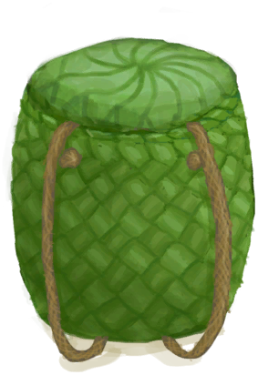
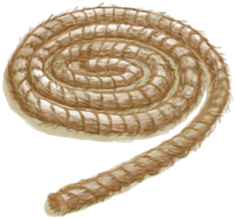

# Woven Backpack  
> I can store things inside. <b>CAN BE EQUIPPED ON EQUIPMENT SLOTS</b>    
  
<table class="table table-bordered" data-toggle="table"  data-show-header="false"><thead style="display:none"><tr ><th  style="width:50%;text-align:left;vertical-align:top;"  >title</th><th  style="width:50%;text-align:left;vertical-align:top;"  ></th></tr></thead><tr ><td  style="width:50%;text-align:left;vertical-align:top;"  >** Cannot Be Trashed **  ** DoseNotPile **  **Weight：**500  **装备时减重：**-250  **Tag：**	[“Bag”](tag_Bag.md), [“Backpack”](tag_Backpack.md)  **Equipped Cards：**[“Back Item”](eTag_Backpack.md)  **Slots：**4  **过滤器：**~~[“Bag”](tag_Bag.md)~~ , ~~[“Large”](tag_Large.md)~~ , ~~[“Fire Source”](tag_FireSource.md)~~ , ~~[“Fire”](tag_Fire.md)~~ , ~~[“Spillable”](tag_Spillable.md)~~  **WeightCapacity：**1000  **WeightRedution：**-1000</td><td  style="width:50%;text-align:left;vertical-align:top;"  >

<a href="BackpackBasket.md" style="color:black">Woven Backpack</a>

A simple basket made of rope and <b>Woven Palm Fronds</b>.  Can be used to carry additional items without getting encumbered and is equippable on your back slot.</td></tr></tbody></table>  
  
## Got From  

Craft BluePrint

[Woven Backpack(BluePrint)](Bp_WovenBackpack.md)

** With：**[Rope](Rope.md)Add Rope

[Basket](Basket.md)

  
  
## Action  

<table><tr><td rowspan="2" style="width:200px;text-align:center;font-size:1.3em;font-weight:bold">

Detach Rope

15m

</td><td></td></tr><tr><td><b>Self：</b>→ [

[Basket](Basket.md)](Basket.md)</td></tr><tr><td colspan="2">[

[Rope](Rope.md)](Rope.md)(<b>+1</b>)</td></tr></table>
  
  
  

