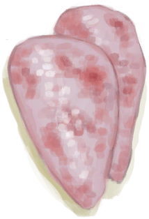
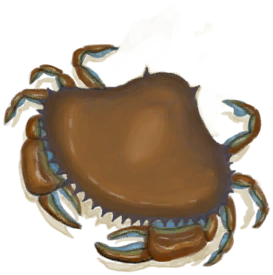
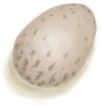
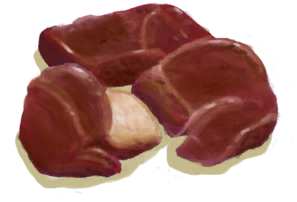

# Bacteria Fever  
> "This status will start once the bacterial levels in your body get too high.  While Fever has the potential to help kill bacteria  
  

<b>Base Value: </b> 0 
  

<b>Value Range: </b> 0 ~ 1500 
  

<b>Base Rate: </b> - 
  
## Statuses  

<table><tr style="height:2em;"><td style="background-color:#F0F0F0;text-align:center;width:180px;font-size:1.4em;font-weight:bold;vertical-align:middle;">
201 ～ 300

13% ～ 20%
</td><td colspan=2 style="font-size:1.1em;vertical-align:middle;background-color:#F9F9F9;">
<b>

low</b>

</td></tr><tr><td colspan=2><b>Effect：</b>[

[Fever](Fever.md)](Fever.md)addition<b>+12</b></td></tr><tr><td colspan=2></td></tr><tr style="height:2em;"><td style="background-color:#F0F0F0;text-align:center;width:180px;font-size:1.4em;font-weight:bold;vertical-align:middle;">
301 ～ 600

20% ～ 40%
</td><td colspan=2 style="font-size:1.1em;vertical-align:middle;background-color:#F9F9F9;">
<b>

low mid</b>

</td></tr><tr><td colspan=2><b>Effect：</b>[

[Fever](Fever.md)](Fever.md)addition<b>+16</b></td></tr><tr><td colspan=2></td></tr><tr style="height:2em;"><td style="background-color:#F0F0F0;text-align:center;width:180px;font-size:1.4em;font-weight:bold;vertical-align:middle;">
601 ～ 900

40% ～ 60%
</td><td colspan=2 style="font-size:1.1em;vertical-align:middle;background-color:#F9F9F9;">
<b>

high mid</b>

</td></tr><tr><td colspan=2><b>Effect：</b>[

[Fever](Fever.md)](Fever.md)addition<b>+24</b></td></tr><tr><td colspan=2></td></tr><tr style="height:2em;"><td style="background-color:#F0F0F0;text-align:center;width:180px;font-size:1.4em;font-weight:bold;vertical-align:middle;">
901 ～ 1500

60% ～ 100%
</td><td colspan=2 style="font-size:1.1em;vertical-align:middle;background-color:#F9F9F9;">
<b>

high</b>

</td></tr><tr><td colspan=2><b>Effect：</b>[

[Fever](Fever.md)](Fever.md)addition<b>+40</b></td></tr><tr><td colspan=2></td></tr></table>
  
## Related Cards  
[Immune System](ImmuneSystem.md)  |  [Weight](Weight.md)  |  [Wetness](Wetness.md)  |  [Surface Bacteria](BacteriaSurface.md)  |  [Hypothermia](Hypothermia.md)  |  [Filth](Filth.md)  |  [Quinine](Quinine.md)  
## Addition Change By  
<table class="table table-bordered" data-toggle="table"  ><thead style=""><tr ><th  style="text-align:left;vertical-align:top;"  >From</th><th  style="text-align:left;vertical-align:top;"  >Operation</th><th  style="text-align:left;vertical-align:top;"  >Value</th></tr></thead><tr ><td  style="text-align:left;vertical-align:top;"  >[Abrasion](W_Abrasion.md)</td><td  style="text-align:left;vertical-align:top;"  >Passive</td><td  style="text-align:left;vertical-align:top;"  >addition+10</td></tr><tr ><td  style="text-align:left;vertical-align:top;"  >[Arm Laceration](W_ArmLacerationL.md)</td><td  style="text-align:left;vertical-align:top;"  >Passive</td><td  style="text-align:left;vertical-align:top;"  >addition+10</td></tr><tr ><td  style="text-align:left;vertical-align:top;"  >[Stitched Arm Laceration](W_ArmLacerationLStitched.md)</td><td  style="text-align:left;vertical-align:top;"  >Passive</td><td  style="text-align:left;vertical-align:top;"  >addition+10</td></tr><tr ><td  style="text-align:left;vertical-align:top;"  >[Arm Laceration](W_ArmLacerationR.md)</td><td  style="text-align:left;vertical-align:top;"  >Passive</td><td  style="text-align:left;vertical-align:top;"  >addition+10</td></tr><tr ><td  style="text-align:left;vertical-align:top;"  >[Arm Laceration](W_ArmLacerationRStitched.md)</td><td  style="text-align:left;vertical-align:top;"  >Passive</td><td  style="text-align:left;vertical-align:top;"  >addition+10</td></tr><tr ><td  style="text-align:left;vertical-align:top;"  >[Dog Bite](W_DogBite.md)</td><td  style="text-align:left;vertical-align:top;"  >Passive</td><td  style="text-align:left;vertical-align:top;"  >addition+10</td></tr><tr ><td  style="text-align:left;vertical-align:top;"  >[Leg Laceration](W_LegLacerationL.md)</td><td  style="text-align:left;vertical-align:top;"  >Passive</td><td  style="text-align:left;vertical-align:top;"  >addition+10</td></tr><tr ><td  style="text-align:left;vertical-align:top;"  >[Leg Laceration](W_LegLacerationLStitched.md)</td><td  style="text-align:left;vertical-align:top;"  >Passive</td><td  style="text-align:left;vertical-align:top;"  >addition+10</td></tr><tr ><td  style="text-align:left;vertical-align:top;"  >[Leg Laceration](W_LegLacerationR.md)</td><td  style="text-align:left;vertical-align:top;"  >Passive</td><td  style="text-align:left;vertical-align:top;"  >addition+10</td></tr><tr ><td  style="text-align:left;vertical-align:top;"  >[Leg Laceration](W_LegLacerationRStitched.md)</td><td  style="text-align:left;vertical-align:top;"  >Passive</td><td  style="text-align:left;vertical-align:top;"  >addition+10</td></tr><tr ><td  style="text-align:left;vertical-align:top;"  >[Macaque Bite](W_MacaqueBite.md)</td><td  style="text-align:left;vertical-align:top;"  >Passive</td><td  style="text-align:left;vertical-align:top;"  >addition+10</td></tr><tr ><td  style="text-align:left;vertical-align:top;"  >[Minor Laceration](W_MinorLaceration.md)</td><td  style="text-align:left;vertical-align:top;"  >Passive</td><td  style="text-align:left;vertical-align:top;"  >addition+10</td></tr><tr ><td  style="text-align:left;vertical-align:top;"  >[Minor Laceration](W_MinorLacerationStitched.md)</td><td  style="text-align:left;vertical-align:top;"  >Passive</td><td  style="text-align:left;vertical-align:top;"  >addition+10</td></tr><tr ><td  style="text-align:left;vertical-align:top;"  >[Lizard Bite](W_MonitorBite.md)</td><td  style="text-align:left;vertical-align:top;"  >Passive</td><td  style="text-align:left;vertical-align:top;"  >addition+10</td></tr><tr ><td  style="text-align:left;vertical-align:top;"  >[Seahound Sting](W_SeahoundSting.md)</td><td  style="text-align:left;vertical-align:top;"  >Passive</td><td  style="text-align:left;vertical-align:top;"  >addition+10</td></tr><tr ><td  style="text-align:left;vertical-align:top;"  >[Shark Bite](W_SharkBite.md)</td><td  style="text-align:left;vertical-align:top;"  >Passive</td><td  style="text-align:left;vertical-align:top;"  >addition+10</td></tr><tr ><td  style="text-align:left;vertical-align:top;"  >[Spider Bite](W_SpiderBite.md)</td><td  style="text-align:left;vertical-align:top;"  >Passive</td><td  style="text-align:left;vertical-align:top;"  >addition+10</td></tr><tr ><td  style="text-align:left;vertical-align:top;"  >[Urchin Wound](W_UrchinWound.md)</td><td  style="text-align:left;vertical-align:top;"  >Passive</td><td  style="text-align:left;vertical-align:top;"  >addition+10</td></tr><tr ><td  style="text-align:left;vertical-align:top;"  >[Urchin Wound](W_UrchinWoundSpines.md)</td><td  style="text-align:left;vertical-align:top;"  >Passive</td><td  style="text-align:left;vertical-align:top;"  >addition+10</td></tr><tr ><td  style="text-align:left;vertical-align:top;"  >[Lizard Bite](W_MonitorBite.md)</td><td  style="text-align:left;vertical-align:top;"  >Passive</td><td  style="text-align:left;vertical-align:top;"  >addition+5</td></tr><tr ><td  style="text-align:left;vertical-align:top;"  >[Seahound Sting](W_SeahoundSting.md)</td><td  style="text-align:left;vertical-align:top;"  >Passive</td><td  style="text-align:left;vertical-align:top;"  >addition+2</td></tr><tr ><td  style="text-align:left;vertical-align:top;"  >[Spider Bite](W_SpiderBite.md)</td><td  style="text-align:left;vertical-align:top;"  >Passive</td><td  style="text-align:left;vertical-align:top;"  >addition+2</td></tr><tr ><td  style="text-align:left;vertical-align:top;"  >

[Permeable Skin](Pk_3_PermeableSkin.md)</td><td  style="text-align:left;vertical-align:top;"  >Perk Effect</td><td  style="text-align:left;vertical-align:top;"  >addition-4</td></tr></tbody></table>  
  
## Change By  
<table class="table table-bordered" data-toggle="table"  ><thead style=""><tr ><th  style="text-align:left;vertical-align:top;"  >From</th><th  style="text-align:left;vertical-align:top;"  >Operation</th><th  style="text-align:left;vertical-align:top;"  data-sortable="true"  >Value</th></tr></thead><tr ><td  style="text-align:left;vertical-align:top;"  >[

[Rotten Remains](RottenRemains.md)](RottenRemains.md)</td><td  style="text-align:left;vertical-align:top;"  >Eat</td><td  style="text-align:left;vertical-align:top;"  >300 ~ 600</td></tr><tr ><td  style="text-align:left;vertical-align:top;"  >[

[Macaque Meat](MacaqueMeat.md)](MacaqueMeat.md)</td><td  style="text-align:left;vertical-align:top;"  >Eat</td><td  style="text-align:left;vertical-align:top;"  >50 ~ 100</td></tr><tr ><td  style="text-align:left;vertical-align:top;"  >[

[Prawns](Prawns.md)](Prawns.md)</td><td  style="text-align:left;vertical-align:top;"  >Eat</td><td  style="text-align:left;vertical-align:top;"  >15</td></tr><tr ><td  style="text-align:left;vertical-align:top;"  >[

[Gastric Pellet](GastricPellet.md)](GastricPellet.md)</td><td  style="text-align:left;vertical-align:top;"  >Harvest</td><td  style="text-align:left;vertical-align:top;"  >10 ~ 50</td></tr><tr ><td  style="text-align:left;vertical-align:top;"  >[

[Dead Bat](Bat.md)](Bat.md)</td><td  style="text-align:left;vertical-align:top;"  >Eat</td><td  style="text-align:left;vertical-align:top;"  >0 ~ 50</td></tr><tr ><td  style="text-align:left;vertical-align:top;"  >[

[Bird Meat](BirdMeat.md)](BirdMeat.md)</td><td  style="text-align:left;vertical-align:top;"  >Eat</td><td  style="text-align:left;vertical-align:top;"  >0 ~ 200</td></tr><tr ><td  style="text-align:left;vertical-align:top;"  >[

[Boar Meat](BoarMeat.md)](BoarMeat.md)</td><td  style="text-align:left;vertical-align:top;"  >Eat</td><td  style="text-align:left;vertical-align:top;"  >0 ~ 50</td></tr><tr ><td  style="text-align:left;vertical-align:top;"  >[

[Drying Boar Meat](BoarMeatSaltedDrying.md)](BoarMeatSaltedDrying.md)</td><td  style="text-align:left;vertical-align:top;"  >Eat</td><td  style="text-align:left;vertical-align:top;"  >0 ~ 10</td></tr><tr ><td  style="text-align:left;vertical-align:top;"  >[

[Bonefish Meat](BonefishMeat.md)](BonefishMeat.md)</td><td  style="text-align:left;vertical-align:top;"  >Eat Fish</td><td  style="text-align:left;vertical-align:top;"  >0 ~ 50</td></tr><tr ><td  style="text-align:left;vertical-align:top;"  >[

[Butter](Butter.md)](Butter.md)</td><td  style="text-align:left;vertical-align:top;"  >Eat</td><td  style="text-align:left;vertical-align:top;"  >0 ~ 10</td></tr><tr ><td  style="text-align:left;vertical-align:top;"  >[

[Conch Meat](ConchMeat.md)](ConchMeat.md)</td><td  style="text-align:left;vertical-align:top;"  >Eat</td><td  style="text-align:left;vertical-align:top;"  >0 ~ 25</td></tr><tr ><td  style="text-align:left;vertical-align:top;"  >[

[Soft Conch Meat](ConchMeatSoft.md)](ConchMeatSoft.md)</td><td  style="text-align:left;vertical-align:top;"  >Eat</td><td  style="text-align:left;vertical-align:top;"  >0 ~ 25</td></tr><tr ><td  style="text-align:left;vertical-align:top;"  >[

[Crab](Crab.md)](Crab.md)</td><td  style="text-align:left;vertical-align:top;"  >Eat Crab</td><td  style="text-align:left;vertical-align:top;"  >0 ~ 50</td></tr><tr ><td  style="text-align:left;vertical-align:top;"  >[

[Egg](Egg.md)](Egg.md)</td><td  style="text-align:left;vertical-align:top;"  >Eat</td><td  style="text-align:left;vertical-align:top;"  >0 ~ 100</td></tr><tr ><td  style="text-align:left;vertical-align:top;"  >[

[Fertilized Egg](EggPartridgeFertilized.md)](EggPartridgeFertilized.md)</td><td  style="text-align:left;vertical-align:top;"  >Eat</td><td  style="text-align:left;vertical-align:top;"  >0 ~ 100</td></tr><tr ><td  style="text-align:left;vertical-align:top;"  >[

[Fat](Fat.md)](Fat.md)</td><td  style="text-align:left;vertical-align:top;"  >Eat</td><td  style="text-align:left;vertical-align:top;"  >0 ~ 10</td></tr><tr ><td  style="text-align:left;vertical-align:top;"  >[

[Drying Salted Fish](FishSaltedDrying.md)](FishSaltedDrying.md)</td><td  style="text-align:left;vertical-align:top;"  >Eat Fish</td><td  style="text-align:left;vertical-align:top;"  >0 ~ 10</td></tr><tr ><td  style="text-align:left;vertical-align:top;"  >[

[Fish Scraps](FishScraps.md)](FishScraps.md)</td><td  style="text-align:left;vertical-align:top;"  >Eat Scraps</td><td  style="text-align:left;vertical-align:top;"  >0 ~ 25</td></tr><tr ><td  style="text-align:left;vertical-align:top;"  >[

[Fish Slices](FishSlices.md)](FishSlices.md)</td><td  style="text-align:left;vertical-align:top;"  >Eat Slices</td><td  style="text-align:left;vertical-align:top;"  >0 ~ 50</td></tr><tr ><td  style="text-align:left;vertical-align:top;"  >[

[Goat Meat](GoatMeat.md)](GoatMeat.md)</td><td  style="text-align:left;vertical-align:top;"  >Eat</td><td  style="text-align:left;vertical-align:top;"  >0 ~ 50</td></tr><tr ><td  style="text-align:left;vertical-align:top;"  >[

[Drying Goat Meat](GoatMeatSaltedDrying.md)](GoatMeatSaltedDrying.md)</td><td  style="text-align:left;vertical-align:top;"  >Eat</td><td  style="text-align:left;vertical-align:top;"  >0 ~ 10</td></tr><tr ><td  style="text-align:left;vertical-align:top;"  >[

[Goatfish](Goatfish.md)](Goatfish.md)</td><td  style="text-align:left;vertical-align:top;"  >Eat Fish</td><td  style="text-align:left;vertical-align:top;"  >0 ~ 100</td></tr><tr ><td  style="text-align:left;vertical-align:top;"  >[

[Grouper Meat](GrouperMeat.md)](GrouperMeat.md)(未实装)</td><td  style="text-align:left;vertical-align:top;"  >Eat Grouper meat</td><td  style="text-align:left;vertical-align:top;"  >0 ~ 25</td></tr><tr ><td  style="text-align:left;vertical-align:top;"  >[

[Herring](Herring.md)](Herring.md)</td><td  style="text-align:left;vertical-align:top;"  >Eat Fish</td><td  style="text-align:left;vertical-align:top;"  >0 ~ 100</td></tr><tr ><td  style="text-align:left;vertical-align:top;"  >[

[Lizard](Lizard.md)](Lizard.md)</td><td  style="text-align:left;vertical-align:top;"  >Eat</td><td  style="text-align:left;vertical-align:top;"  >0 ~ 50</td></tr><tr ><td  style="text-align:left;vertical-align:top;"  >[

[Cooked Macaque Meat](MacaqueMeatCooked.md)](MacaqueMeatCooked.md)</td><td  style="text-align:left;vertical-align:top;"  >Eat</td><td  style="text-align:left;vertical-align:top;"  >0 ~ 25</td></tr><tr ><td  style="text-align:left;vertical-align:top;"  >[

[Dried Macaque Meat](MacaqueMeatDried.md)](MacaqueMeatDried.md)</td><td  style="text-align:left;vertical-align:top;"  >Eat</td><td  style="text-align:left;vertical-align:top;"  >0 ~ 10</td></tr><tr ><td  style="text-align:left;vertical-align:top;"  >[

[Cured Macaque Meat](MacaqueMeatSalted.md)](MacaqueMeatSalted.md)</td><td  style="text-align:left;vertical-align:top;"  >Eat</td><td  style="text-align:left;vertical-align:top;"  >0 ~ 10</td></tr><tr ><td  style="text-align:left;vertical-align:top;"  >[

[Drying Macaque Meat](MacaqueMeatSaltedDrying.md)](MacaqueMeatSaltedDrying.md)</td><td  style="text-align:left;vertical-align:top;"  >Eat</td><td  style="text-align:left;vertical-align:top;"  >0 ~ 10</td></tr><tr ><td  style="text-align:left;vertical-align:top;"  >[

[Drying Macaque Meat](MacaqueMeatSaltedDrying.md)](MacaqueMeatSaltedDrying.md)</td><td  style="text-align:left;vertical-align:top;"  >Eat</td><td  style="text-align:left;vertical-align:top;"  >0 ~ 25</td></tr><tr ><td  style="text-align:left;vertical-align:top;"  >[

[Smoked Macaque Meat](MacaqueMeatSmoked.md)](MacaqueMeatSmoked.md)</td><td  style="text-align:left;vertical-align:top;"  >Eat</td><td  style="text-align:left;vertical-align:top;"  >0 ~ 25</td></tr><tr ><td  style="text-align:left;vertical-align:top;"  >[

[Drying Meat](MeatSaltedDrying.md)](MeatSaltedDrying.md)</td><td  style="text-align:left;vertical-align:top;"  >Eat</td><td  style="text-align:left;vertical-align:top;"  >0 ~ 10</td></tr><tr ><td  style="text-align:left;vertical-align:top;"  >[

[Lizard Meat](MonitorMeat.md)](MonitorMeat.md)</td><td  style="text-align:left;vertical-align:top;"  >Eat</td><td  style="text-align:left;vertical-align:top;"  >0 ~ 50</td></tr><tr ><td  style="text-align:left;vertical-align:top;"  >[

[Drying Lizard Meat](MonitorMeatSaltedDrying.md)](MonitorMeatSaltedDrying.md)(未实装)</td><td  style="text-align:left;vertical-align:top;"  >Eat</td><td  style="text-align:left;vertical-align:top;"  >0 ~ 10</td></tr><tr ><td  style="text-align:left;vertical-align:top;"  >[

[Dead Mouse](Mouse.md)](Mouse.md)</td><td  style="text-align:left;vertical-align:top;"  >Eat</td><td  style="text-align:left;vertical-align:top;"  >0 ~ 50</td></tr><tr ><td  style="text-align:left;vertical-align:top;"  >[

[Skinned Mouse](MouseSkinned.md)](MouseSkinned.md)(未实装)</td><td  style="text-align:left;vertical-align:top;"  >Eat</td><td  style="text-align:left;vertical-align:top;"  >0 ~ 50</td></tr><tr ><td  style="text-align:left;vertical-align:top;"  >[

[Mudskipper](Mudskipper.md)](Mudskipper.md)</td><td  style="text-align:left;vertical-align:top;"  >Eat</td><td  style="text-align:left;vertical-align:top;"  >0 ~ 50</td></tr><tr ><td  style="text-align:left;vertical-align:top;"  >[

[Oyster Meat](OysterMeat.md)](OysterMeat.md)</td><td  style="text-align:left;vertical-align:top;"  >Eat</td><td  style="text-align:left;vertical-align:top;"  >0 ~ 25</td></tr><tr ><td  style="text-align:left;vertical-align:top;"  >[

[Parrot Fish](ParrotFish.md)](ParrotFish.md)</td><td  style="text-align:left;vertical-align:top;"  >Eat Fish</td><td  style="text-align:left;vertical-align:top;"  >0 ~ 100</td></tr><tr ><td  style="text-align:left;vertical-align:top;"  >[

[Dead Chick](PartridgeChickDead.md)](PartridgeChickDead.md)</td><td  style="text-align:left;vertical-align:top;"  >Eat</td><td  style="text-align:left;vertical-align:top;"  >0 ~ 50</td></tr><tr ><td  style="text-align:left;vertical-align:top;"  >[

[Seahound Meat](Seahoundmeat.md)](Seahoundmeat.md)</td><td  style="text-align:left;vertical-align:top;"  >Eat</td><td  style="text-align:left;vertical-align:top;"  >0 ~ 50</td></tr><tr ><td  style="text-align:left;vertical-align:top;"  >[

[Shark Meat](SharkMeat.md)](SharkMeat.md)</td><td  style="text-align:left;vertical-align:top;"  >Eat</td><td  style="text-align:left;vertical-align:top;"  >0 ~ 50</td></tr><tr ><td  style="text-align:left;vertical-align:top;"  >[

[Skinned Snake](SnakeSkinned.md)](SnakeSkinned.md)</td><td  style="text-align:left;vertical-align:top;"  >Eat</td><td  style="text-align:left;vertical-align:top;"  >0 ~ 200</td></tr><tr ><td  style="text-align:left;vertical-align:top;"  >[

[Threadfin Meat](ThreadfinMeat.md)](ThreadfinMeat.md)</td><td  style="text-align:left;vertical-align:top;"  >Eat</td><td  style="text-align:left;vertical-align:top;"  >0 ~ 50</td></tr><tr ><td  style="text-align:left;vertical-align:top;"  >[

[Urchin Meat](UrchinMeat.md)](UrchinMeat.md)</td><td  style="text-align:left;vertical-align:top;"  >Eat</td><td  style="text-align:left;vertical-align:top;"  >0 ~ 25</td></tr><tr ><td  style="text-align:left;vertical-align:top;"  >[

[Unsafe Water](LQ_WaterUnsafe.md)](LQ_WaterUnsafe.md)</td><td  style="text-align:left;vertical-align:top;"  >Drink</td><td  style="text-align:left;vertical-align:top;"  >0 ~ 350</td></tr><tr ><td  style="text-align:left;vertical-align:top;"  >[

[Ground Lemongrass](LemonGrassGround.md)](LemonGrassGround.md)</td><td  style="text-align:left;vertical-align:top;"  >Eat</td><td  style="text-align:left;vertical-align:top;"  >-10</td></tr><tr ><td  style="text-align:left;vertical-align:top;"  >[

[Ground Snake Grass](SnakeGrassGround.md)](SnakeGrassGround.md)</td><td  style="text-align:left;vertical-align:top;"  >Eat</td><td  style="text-align:left;vertical-align:top;"  >-10</td></tr><tr ><td  style="text-align:left;vertical-align:top;"  >[

[Ground Spider Lily](SpiderLilyGround.md)](SpiderLilyGround.md)</td><td  style="text-align:left;vertical-align:top;"  >Eat</td><td  style="text-align:left;vertical-align:top;"  >-50</td></tr><tr ><td  style="text-align:left;vertical-align:top;"  >[

[Spider Lily Leaves](SpiderLilyLeaves.md)](SpiderLilyLeaves.md)</td><td  style="text-align:left;vertical-align:top;"  >Eat</td><td  style="text-align:left;vertical-align:top;"  >-50</td></tr><tr ><td  style="text-align:left;vertical-align:top;"  >[

[Dried Spider Lily Leaves](SpiderLilyLeavesDried.md)](SpiderLilyLeavesDried.md)</td><td  style="text-align:left;vertical-align:top;"  >Eat</td><td  style="text-align:left;vertical-align:top;"  >-50</td></tr></tbody></table>  
  

