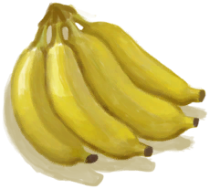

# Hand of Bananas(未实装)  
> Tasty bananas.  
  
<table class="table table-bordered" data-toggle="table"  data-show-header="false"><thead style="display:none"><tr ><th  style="width:50%;text-align:left;vertical-align:top;"  >title</th><th  style="width:50%;text-align:left;vertical-align:top;"  ></th></tr></thead><tr ><td  style="width:50%;text-align:left;vertical-align:top;"  >**Weight：**100  **Tag：**	[“Feed”](tag_Feed.md)  **Usage：**5</td><td  style="width:50%;text-align:left;vertical-align:top;"  >

<a href="BananaHand.md" style="color:black">Hand of Bananas</a>

"This fruit</td></tr></tbody></table>  
  
## Action  

<table><tr><td rowspan="2" style="width:200px;text-align:center;font-size:1.3em;font-weight:bold">

Take Bananas

</td><td></td></tr><tr><td><b>Self：</b>→Dismiss</td></tr><tr><td colspan="2">[

[Banana](Banana.md)](Banana.md)(<b>+5</b>)</td></tr></table>
  
  
  
## Drag To  

[Compost Bin](CompostBin.md)

[Trapped Macaque](CageTrapMacaque.md)

[Macaque Friend](MacaqueFriend.md)

[Wounded Macaque](MacaqueWounded.md)

  
  
## Durability   

<table style="margin-bottom:0px;"><tr><td style="width:30%;text-align:left; background-color:#FEFEFE;font-size:1.3em;font-weight:bold;">Spoilage</td><td style="font-size:1em;background-color:#FEFEFE">Starting：192 -1/TP , Duration ：2d</td></tr><tr style="background-color:#FFFFFF"><td colspan=2>** On Zero： ** Self: → [

[Rotten Remains](RottenRemains.md)](RottenRemains.md)</td></tr></table>
  

<table style="margin-bottom:0px;"><tr><td style="width:30%;text-align:left; background-color:#FEFEFE;font-size:1.3em;font-weight:bold;">Usage</td><td style="font-size:1em;background-color:#FEFEFE">Starting：5 -</td></tr><tr style="background-color:#FFFFFF"><td colspan=2>** On Zero： ** Self: →Dismiss</td></tr></table>
  

