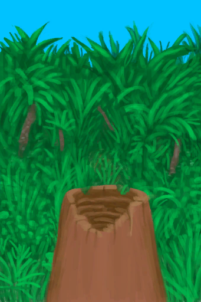

# Banana Tree Stump  
> I can place a water container here it to fill it with water.  
  
<table class="table table-bordered" data-toggle="table"  data-show-header="false"><thead style="display:none"><tr ><th  style="width:50%;text-align:left;vertical-align:top;"  >title</th><th  style="width:50%;text-align:left;vertical-align:top;"  ></th></tr></thead><tr ><td  style="width:50%;text-align:left;vertical-align:top;"  >**Slots：**1  **过滤器：**[“Container Bowl”](tag_ContainerBowl.md)</td><td  style="width:50%;text-align:left;vertical-align:top;"  >

<a href="BananaStump.md" style="color:black">Banana Tree Stump</a>

Banana Trees can be found in the <b>Jungle</b> areas of the island and give very nutritious bananas.   They can also be cut down to get their edible <b>Stem</b> and to extract <b>Water</b> from their still living stumps by using a bowl.</td></tr></tbody></table>  
  
## Got From  

** With：**[Stone Axe](StoneAxe.md)Cut Down Tree

[Cleared Banana Tree](BananaTreeCleared.md)

** With：**[“Axe”](tag_Axe.md)Cut Down Tree

[Cleared Banana Tree](BananaTreeCleared.md)

  
  
## Transform  

<table style="margin-bottom:0px;"><tr><td  colspan=2 style="font-size:1em;font-weight:bold;background-color:#FEFEFE">Continue Filling</td><td style="text-align:right; background-color:#FEFEFE"></td></tr><tr style="background-color:#FFFFFF"><td style="width:30%;font-size:1em;text-align:right;vertical-align:middle;">[“Water for Crops”](tag_WaterFresh.md)</td><td style="text-align:center;width:20%;vertical-align:middle;">
15m

Continue Filling
</td><td style="text-align:left;vertical-align:middle;">LiquidQuantity  <b>+12</b></td></tr></table>
  

<table style="margin-bottom:0px;"><tr><td  colspan=2 style="font-size:1em;font-weight:bold;background-color:#FEFEFE">Start Filling</td><td style="text-align:right; background-color:#FEFEFE"></td></tr><tr style="background-color:#FFFFFF"><td style="width:30%;font-size:1em;text-align:right;vertical-align:middle;">[“Water Container”](tag_WaterContainer.md)</td><td style="text-align:center;width:20%;vertical-align:middle;">
15m

Start Filling
</td><td style="text-align:left;vertical-align:middle;"></td></tr><tr><td colspan="3">[Water](LQ_Water.md)(<b>+0.5</b>)</td></tr></table>
  

<table style="margin-bottom:0px;"><tr><td  colspan=2 style="font-size:1em;font-weight:bold;background-color:#FEFEFE">Cured Leather</td><td style="text-align:right; background-color:#FEFEFE"></td></tr><tr style="background-color:#FFFFFF"><td style="width:30%;font-size:1em;text-align:right;vertical-align:middle;">[

[Fleshed Skin](SkinFleshed.md)](SkinFleshed.md)</td><td style="text-align:center;width:20%;vertical-align:middle;">
15m

Cured Leather
</td><td style="text-align:left;vertical-align:middle;">Spoilage  <b>-1</b></td></tr></table>
  
## Durability   

<table style="margin-bottom:0px;"><tr><td style="width:30%;text-align:left; background-color:#FEFEFE;font-size:1.3em;font-weight:bold;">Spoilage</td><td style="font-size:1em;background-color:#FEFEFE">Starting：188 , Max：188 -1/TP , Duration ：1d23h</td></tr><tr style="background-color:#FFFFFF"><td colspan=2>** On Zero： ** Self: →Dismiss</td></tr></table>
  

