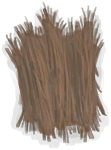

# Dried Cinchona Bark  
> "I could extract quinine from it  
  
<table class="table table-bordered" data-toggle="table"  data-show-header="false"><thead style="display:none"><tr ><th  style="width:50%;text-align:left;vertical-align:top;"  >title</th><th  style="width:50%;text-align:left;vertical-align:top;"  ></th></tr></thead><tr ><td  style="width:50%;text-align:left;vertical-align:top;"  >**Weight：**25  **Tag：**	[“Cookable”](tag_Cookable.md)</td><td  style="width:50%;text-align:left;vertical-align:top;"  >

<a href="BarkCinchonaDried.md" style="color:black">Dried Cinchona Bark</a>

"Cinchona Trees grow in the <b>Jungle</b> and <b>Highland Jungles</b> of the island.  Their dried bark can be used to create <b>Quinine</b></td></tr></tbody></table>  
  
## Got From  

Cinchona Bark

[Cinchona Bark](BarkCinchona.md)

Transform

[Cinchona Bark](BarkCinchona.md)

  
  
## Use In BluePrint  

<a href="Bp_Quinine.md" style="color:black">Cinchona Powder</a>

  
  
  

