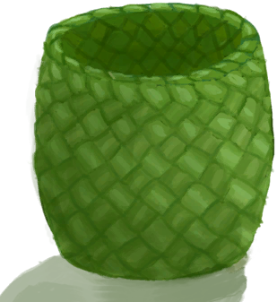

# Basket  
> I can store things inside.  
  
<table class="table table-bordered" data-toggle="table"  data-show-header="false"><thead style="display:none"><tr ><th  style="width:50%;text-align:left;vertical-align:top;"  >title</th><th  style="width:50%;text-align:left;vertical-align:top;"  ></th></tr></thead><tr ><td  style="width:50%;text-align:left;vertical-align:top;"  >** DoseNotPile **  **Weight：**500  **Tag：**	[“Bag”](tag_Bag.md)  **Slots：**4  **过滤器：**~~[“Bag”](tag_Bag.md)~~ , ~~[“Large”](tag_Large.md)~~ , ~~[“Fire Source”](tag_FireSource.md)~~ , ~~[“Fire”](tag_Fire.md)~~ , ~~[“Spillable”](tag_Spillable.md)~~  **WeightCapacity：**1000  **WeightRedution：**-1000</td><td  style="width:50%;text-align:left;vertical-align:top;"  >

<a href="Basket.md" style="color:black">Basket</a>

A basket made of woven palm fronds. It can be used to <b>store and protect</b> items from animals and to more easily transport them between locations.  It can also be placed on the top row to help keep your base tidy.</td></tr></tbody></table>  
  
## Got From  

Craft BluePrint

[Woven Basket(BluePrint)](Bp_WovenBasket.md)

Detach Rope

[Woven Backpack](BackpackBasket.md)

Pick Up

[Basket](BasketPlaced.md)

Pick Up

[Basket](LuggagePlacedReference.md)(未实装)

  
  
## Action  

<table><tr><td rowspan="2" style="width:200px;text-align:center;font-size:1.3em;font-weight:bold">

Place

</td><td></td></tr><tr><td><b>Self：</b>→ [

[Basket](BasketPlaced.md)](BasketPlaced.md)</td></tr></table>
  
  
  
## Drag With  

<table style="margin-bottom:0px;"><tr><td style="width:40%;text-align:left; background-color:#FEFEFE"><b>With：</b>[

[Rope](Rope.md)](Rope.md)</td><td style="width:40%;font-size:1em;font-weight:bold;background-color:#FEFEFE">Add Rope (30m) </td></tr><tr style="background-color:#FFFFFF"><td style=""><b>Receiving：</b>→Dismiss</td><td style=""><b>Self：</b>→ [

[Woven Backpack](BackpackBasket.md)](BackpackBasket.md)</td></tr></table>
  
  

