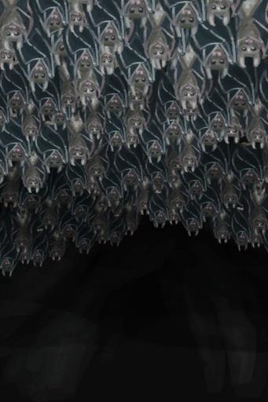

# Bat Colony  
> That's a lot of bats.  
  
<table class="table table-bordered" data-toggle="table"  data-show-header="false"><thead style="display:none"><tr ><th  style="width:50%;text-align:left;vertical-align:top;"  >title</th><th  style="width:50%;text-align:left;vertical-align:top;"  ></th></tr></thead><tr ><td  style="width:50%;text-align:left;vertical-align:top;"  >**Environment：**[Bat Cave(Environment)](Env_CaveBats.md)  **Weight：**500  **Usage：**30  ** Effect: ** [

[Discomfort](Discomfort.md)](Discomfort.md)<b>+2000</b></td><td  style="width:50%;text-align:left;vertical-align:top;"  >

<a href="BatColony.md" style="color:black">Bat Colony</a>

"Bats live in colonies inside <b>Caves</b>.   They produce <b>Guano</b></td></tr></tbody></table>  
  
## Action  

<table><tr><td rowspan="2" style="width:200px;text-align:center;font-size:1.3em;font-weight:bold">

Attack with Bow!

30m

</td><td></td></tr><tr><td><b>Self：</b>Bat Number  <b>-1</b></td></tr><tr><td colspan="2"><b>Require：</b>[

[Rustic Bow](BowRustic.md)](BowRustic.md) On Hand/Equip, [

[Simple Arrow](ArrowSimple.md)](ArrowSimple.md) On Hand</td></tr><tr><td colspan="2"><b>CardChanges：</b>手牌中的一个[Rustic Bow](BowRustic.md)Usage  <b>-1</b>, 手牌中的一个[Simple Arrow](ArrowSimple.md)Usage  <b>-3～-1</b></td></tr><tr><td colspan="2"><b>StatChange：</b>[

[Archery(Skill)](Skill_Archery.md)](Skill_Archery.md)<b>+1</b></td></tr><tr><td colspan="2">

<table style="margin-bottom:3px;"><tr><td rowspan=2 style="text-align:center" width="80px">
Base Weight

0
</td><td style="font-size:0.6em;line-height:0.6em;font-weight:bold">Success</td></tr><tr><td>[

[Dead Bat](Bat.md)](Bat.md)(<b>+1</b>)</td></tr><tr><td colspan=2><li>[

[Archery(Skill)](Skill_Archery.md)](Skill_Archery.md) in <b>0～150</b>, weight <b>+1～+150</b></li><li>[

[Eyesight](Myopia.md)](Myopia.md) in <b>0～3</b>, weight <b>+0～-100</b></li><li>[Hand Modifier](ModifierHand.md) in <b>0～3</b>, weight <b>+0～-125</b></li><li>Bat Numberin<b>1～30</b>, weight<b>-100～+0</b>， Otherwise cancel drop</li></td></tr></table>

<table style="margin-bottom:3px;"><tr><td rowspan=2 style="text-align:center" width="80px">
Base Weight

30
</td><td style="font-size:0.6em;line-height:0.6em;font-weight:bold">Failure</td></tr><tr><td></td></tr></table>
<button class="btn btn-secondary btn-sm" style="" data-toggle="modal" onclick="setCollectionDataBase64('eyJ0aXRsZSI6IlNpbXVsYXRvcjogQXR0YWNrIHdpdGggQm93ISAoQmF0IENvbG9ueSkiLCJjb2xsZWN0aW9ucyI6W3siZHJvcCI6IjxkaXYgc3R5bGU9XCJ3aWR0aDoyNXB4O2Rpc3BsYXk6aW5saW5lLWJsb2NrO3RleHQtYWxpZ246Y2VudGVyXCI+PGltZyBkZWNvZGluZz1cImFzeW5jXCIgc3JjPVwiU3ByaXRlL0JhdC5wbmdcIiBocmVmPVwiYS5tZFwiIHN0eWxlPVwibWF4LXdpZHRoOjI1cHg7bWF4LWhlaWdodDoyNXB4O1wiPjwvZGl2PkRlYWQgQmF0IiwiYmFzZSI6MCwiY29uZGl0aW9uIjpbeyJrZXkiOiJTa2lsbF9BcmNoZXJ5IiwidGl0bGUiOiJBcmNoZXJ5KFNraWxsKSIsInR5cGUiOiJyYW5nZSIsIm1heCI6WzAsMTUwXSwicmFuZ2UiOlswLDE1MF0sIndlaWdodCI6WzEsMTUwXSwiZGVmYXVsdFZhbHVlIjowLCJ3aGVuT3V0T2ZSYW5nZSI6MX0seyJrZXkiOiJNeW9waWEiLCJ0aXRsZSI6IkV5ZXNpZ2h0IiwidHlwZSI6InJhbmdlIiwibWF4IjpbMCwzXSwicmFuZ2UiOlswLDNdLCJ3ZWlnaHQiOlswLC0xMDBdLCJkZWZhdWx0VmFsdWUiOjAsIndoZW5PdXRPZlJhbmdlIjoxfSx7ImtleSI6Ik1vZGlmaWVySGFuZCIsInRpdGxlIjoiSGFuZCBNb2RpZmllciIsInR5cGUiOiJyYW5nZSIsIm1heCI6WzAsM10sInJhbmdlIjpbMCwzXSwid2VpZ2h0IjpbMCwtMTI1XSwiZGVmYXVsdFZhbHVlIjowLCJ3aGVuT3V0T2ZSYW5nZSI6MX0seyJrZXkiOiJVc2FnZSIsInRpdGxlIjoiQmF0IE51bWJlciIsInR5cGUiOiJyYW5nZSIsIm1heCI6WzEsMzBdLCJyYW5nZSI6WzEsMzBdLCJ3ZWlnaHQiOlstMTAwLDBdLCJkZWZhdWx0VmFsdWUiOjEsIndoZW5PdXRPZlJhbmdlIjowfV19LHsiZHJvcCI6Ii0iLCJiYXNlIjozMCwiY29uZGl0aW9uIjpbXX1dfQ==')" data-target="#modelCollectionSimulator">Simulator</button>
</td></tr></table>
  

<table><tr><td rowspan="2" style="width:200px;text-align:center;font-size:1.3em;font-weight:bold">

Use Sling

15m

</td><td></td></tr><tr><td><b>Self：</b>Bat Number  <b>-1</b></td></tr><tr><td colspan="2"><b>Require：</b>[

[Sling](Sling.md)](Sling.md) On Hand</td></tr><tr><td colspan="2"><b>CardChanges：</b>手牌中的一个[Sling](Sling.md)Usage  <b>-1</b></td></tr><tr><td colspan="2"><b>StatChange：</b>[

[Sling(Skill)](Skill_Sling.md)](Skill_Sling.md)<b>+1</b></td></tr><tr><td colspan="2">

<table style="margin-bottom:3px;"><tr><td rowspan=2 style="text-align:center" width="80px">
Base Weight

0
</td><td style="font-size:0.6em;line-height:0.6em;font-weight:bold">Success</td></tr><tr><td>[

[Dead Bat](Bat.md)](Bat.md)(<b>+1</b>)</td></tr><tr><td colspan=2><li>[

[Sling(Skill)](Skill_Sling.md)](Skill_Sling.md) in <b>1～150</b>, weight <b>+0～+150</b></li><li>[

[Eyesight](Myopia.md)](Myopia.md) in <b>0～3</b>, weight <b>+0～-100</b></li><li>[Hand Modifier](ModifierHand.md) in <b>0～3</b>, weight <b>+0～-125</b></li><li>Bat Numberin<b>1～30</b>, weight<b>-100～+0</b>， Otherwise cancel drop</li></td></tr></table>

<table style="margin-bottom:3px;"><tr><td rowspan=2 style="text-align:center" width="80px">
Base Weight

30
</td><td style="font-size:0.6em;line-height:0.6em;font-weight:bold">Failure</td></tr><tr><td></td></tr></table>
<button class="btn btn-secondary btn-sm" style="" data-toggle="modal" onclick="setCollectionDataBase64('eyJ0aXRsZSI6IlNpbXVsYXRvcjogVXNlIFNsaW5nIChCYXQgQ29sb255KSIsImNvbGxlY3Rpb25zIjpbeyJkcm9wIjoiPGRpdiBzdHlsZT1cIndpZHRoOjI1cHg7ZGlzcGxheTppbmxpbmUtYmxvY2s7dGV4dC1hbGlnbjpjZW50ZXJcIj48aW1nIGRlY29kaW5nPVwiYXN5bmNcIiBzcmM9XCJTcHJpdGUvQmF0LnBuZ1wiIGhyZWY9XCJhLm1kXCIgc3R5bGU9XCJtYXgtd2lkdGg6MjVweDttYXgtaGVpZ2h0OjI1cHg7XCI+PC9kaXY+RGVhZCBCYXQiLCJiYXNlIjowLCJjb25kaXRpb24iOlt7ImtleSI6IlNraWxsX1NsaW5nIiwidGl0bGUiOiJTbGluZyhTa2lsbCkiLCJ0eXBlIjoicmFuZ2UiLCJtYXgiOlswLDE1MF0sInJhbmdlIjpbMSwxNTBdLCJ3ZWlnaHQiOlswLDE1MF0sImRlZmF1bHRWYWx1ZSI6MCwid2hlbk91dE9mUmFuZ2UiOjF9LHsia2V5IjoiTXlvcGlhIiwidGl0bGUiOiJFeWVzaWdodCIsInR5cGUiOiJyYW5nZSIsIm1heCI6WzAsM10sInJhbmdlIjpbMCwzXSwid2VpZ2h0IjpbMCwtMTAwXSwiZGVmYXVsdFZhbHVlIjowLCJ3aGVuT3V0T2ZSYW5nZSI6MX0seyJrZXkiOiJNb2RpZmllckhhbmQiLCJ0aXRsZSI6IkhhbmQgTW9kaWZpZXIiLCJ0eXBlIjoicmFuZ2UiLCJtYXgiOlswLDNdLCJyYW5nZSI6WzAsM10sIndlaWdodCI6WzAsLTEyNV0sImRlZmF1bHRWYWx1ZSI6MCwid2hlbk91dE9mUmFuZ2UiOjF9LHsia2V5IjoiVXNhZ2UiLCJ0aXRsZSI6IkJhdCBOdW1iZXIiLCJ0eXBlIjoicmFuZ2UiLCJtYXgiOlsxLDMwXSwicmFuZ2UiOlsxLDMwXSwid2VpZ2h0IjpbLTEwMCwwXSwiZGVmYXVsdFZhbHVlIjoxLCJ3aGVuT3V0T2ZSYW5nZSI6MH1dfSx7ImRyb3AiOiItIiwiYmFzZSI6MzAsImNvbmRpdGlvbiI6W119XX0=')" data-target="#modelCollectionSimulator">Simulator</button>
</td></tr></table>
  

<table><tr><td rowspan="2" style="width:200px;text-align:center;font-size:1.3em;font-weight:bold">

Attack with Gun!

30m

</td><td></td></tr><tr><td><b>Self：</b>Bat Number  <b>-1</b></td></tr><tr><td colspan="2"><b>Require：</b>[

[Gun](Gun.md)](Gun.md) On Hand</td></tr><tr><td colspan="2"><b>CardChanges：</b>手牌中的一个[Gun](Gun.md)Usage  <b>-1</b></td></tr><tr><td colspan="2"><b>StatChange：</b>[

[Handguns(Skill)](Skill_Handguns.md)](Skill_Handguns.md)<b>+1</b></td></tr><tr><td colspan="2">

<table style="margin-bottom:3px;"><tr><td rowspan=2 style="text-align:center" width="80px">
Base Weight

50
</td><td style="font-size:0.6em;line-height:0.6em;font-weight:bold">Success</td></tr><tr><td>[

[Dead Bat](Bat.md)](Bat.md)(<b>+1</b>)</td></tr><tr><td colspan=2><li>[

[Handguns(Skill)](Skill_Handguns.md)](Skill_Handguns.md) in <b>0～150</b>, weight <b>+1～+150</b></li><li>[

[Eyesight](Myopia.md)](Myopia.md) in <b>0～3</b>, weight <b>+0～-100</b></li><li>[Hand Modifier](ModifierHand.md) in <b>0～3</b>, weight <b>+0～-125</b></li><li>Bat Numberin<b>1～30</b>, weight<b>-100～+0</b>， Otherwise cancel drop</li></td></tr></table>

<table style="margin-bottom:3px;"><tr><td rowspan=2 style="text-align:center" width="80px">
Base Weight

25
</td><td style="font-size:0.6em;line-height:0.6em;font-weight:bold">Failure</td></tr><tr><td></td></tr></table>
<button class="btn btn-secondary btn-sm" style="" data-toggle="modal" onclick="setCollectionDataBase64('eyJ0aXRsZSI6IlNpbXVsYXRvcjogQXR0YWNrIHdpdGggR3VuISAoQmF0IENvbG9ueSkiLCJjb2xsZWN0aW9ucyI6W3siZHJvcCI6IjxkaXYgc3R5bGU9XCJ3aWR0aDoyNXB4O2Rpc3BsYXk6aW5saW5lLWJsb2NrO3RleHQtYWxpZ246Y2VudGVyXCI+PGltZyBkZWNvZGluZz1cImFzeW5jXCIgc3JjPVwiU3ByaXRlL0JhdC5wbmdcIiBocmVmPVwiYS5tZFwiIHN0eWxlPVwibWF4LXdpZHRoOjI1cHg7bWF4LWhlaWdodDoyNXB4O1wiPjwvZGl2PkRlYWQgQmF0IiwiYmFzZSI6NTAsImNvbmRpdGlvbiI6W3sia2V5IjoiU2tpbGxfSGFuZGd1bnMiLCJ0aXRsZSI6IkhhbmRndW5zKFNraWxsKSIsInR5cGUiOiJyYW5nZSIsIm1heCI6WzAsMTUwXSwicmFuZ2UiOlswLDE1MF0sIndlaWdodCI6WzEsMTUwXSwiZGVmYXVsdFZhbHVlIjowLCJ3aGVuT3V0T2ZSYW5nZSI6MX0seyJrZXkiOiJNeW9waWEiLCJ0aXRsZSI6IkV5ZXNpZ2h0IiwidHlwZSI6InJhbmdlIiwibWF4IjpbMCwzXSwicmFuZ2UiOlswLDNdLCJ3ZWlnaHQiOlswLC0xMDBdLCJkZWZhdWx0VmFsdWUiOjAsIndoZW5PdXRPZlJhbmdlIjoxfSx7ImtleSI6Ik1vZGlmaWVySGFuZCIsInRpdGxlIjoiSGFuZCBNb2RpZmllciIsInR5cGUiOiJyYW5nZSIsIm1heCI6WzAsM10sInJhbmdlIjpbMCwzXSwid2VpZ2h0IjpbMCwtMTI1XSwiZGVmYXVsdFZhbHVlIjowLCJ3aGVuT3V0T2ZSYW5nZSI6MX0seyJrZXkiOiJVc2FnZSIsInRpdGxlIjoiQmF0IE51bWJlciIsInR5cGUiOiJyYW5nZSIsIm1heCI6WzEsMzBdLCJyYW5nZSI6WzEsMzBdLCJ3ZWlnaHQiOlstMTAwLDBdLCJkZWZhdWx0VmFsdWUiOjEsIndoZW5PdXRPZlJhbmdlIjowfV19LHsiZHJvcCI6Ii0iLCJiYXNlIjoyNSwiY29uZGl0aW9uIjpbXX1dfQ==')" data-target="#modelCollectionSimulator">Simulator</button>
</td></tr></table>
  

<table><tr><td rowspan="2" style="width:200px;text-align:center;font-size:1.3em;font-weight:bold">

Throw Rock at it

15m

</td><td></td></tr><tr><td><b>Self：</b>Bat Number  <b>-1</b></td></tr><tr><td colspan="2"><b>StatChange：</b>[

[Rock Throwing(Skill)](Skill_RockThrowing.md)](Skill_RockThrowing.md)<b>+0.5</b></td></tr><tr><td colspan="2">

<table style="margin-bottom:3px;"><tr><td rowspan=2 style="text-align:center" width="80px">
Base Weight

0
</td><td style="font-size:0.6em;line-height:0.6em;font-weight:bold">Success</td></tr><tr><td>[

[Dead Bat](Bat.md)](Bat.md)(<b>+1</b>)</td></tr><tr><td colspan=2><li>[

[Rock Throwing(Skill)](Skill_RockThrowing.md)](Skill_RockThrowing.md) in <b>1～150</b>, weight <b>+0～+50</b></li><li>[

[Eyesight](Myopia.md)](Myopia.md) in <b>0～3</b>, weight <b>+0～-100</b></li><li>[Hand Modifier](ModifierHand.md) in <b>0～3</b>, weight <b>+0～-125</b></li><li>Bat Numberin<b>1～30</b>, weight<b>-100～+0</b>， Otherwise cancel drop</li></td></tr></table>

<table style="margin-bottom:3px;"><tr><td rowspan=2 style="text-align:center" width="80px">
Base Weight

50
</td><td style="font-size:0.6em;line-height:0.6em;font-weight:bold">Failure</td></tr><tr><td></td></tr></table>
<button class="btn btn-secondary btn-sm" style="" data-toggle="modal" onclick="setCollectionDataBase64('eyJ0aXRsZSI6IlNpbXVsYXRvcjogVGhyb3cgUm9jayBhdCBpdCAoQmF0IENvbG9ueSkiLCJjb2xsZWN0aW9ucyI6W3siZHJvcCI6IjxkaXYgc3R5bGU9XCJ3aWR0aDoyNXB4O2Rpc3BsYXk6aW5saW5lLWJsb2NrO3RleHQtYWxpZ246Y2VudGVyXCI+PGltZyBkZWNvZGluZz1cImFzeW5jXCIgc3JjPVwiU3ByaXRlL0JhdC5wbmdcIiBocmVmPVwiYS5tZFwiIHN0eWxlPVwibWF4LXdpZHRoOjI1cHg7bWF4LWhlaWdodDoyNXB4O1wiPjwvZGl2PkRlYWQgQmF0IiwiYmFzZSI6MCwiY29uZGl0aW9uIjpbeyJrZXkiOiJTa2lsbF9Sb2NrVGhyb3dpbmciLCJ0aXRsZSI6IlJvY2sgVGhyb3dpbmcoU2tpbGwpIiwidHlwZSI6InJhbmdlIiwibWF4IjpbMCwxNTBdLCJyYW5nZSI6WzEsMTUwXSwid2VpZ2h0IjpbMCw1MF0sImRlZmF1bHRWYWx1ZSI6MCwid2hlbk91dE9mUmFuZ2UiOjF9LHsia2V5IjoiTXlvcGlhIiwidGl0bGUiOiJFeWVzaWdodCIsInR5cGUiOiJyYW5nZSIsIm1heCI6WzAsM10sInJhbmdlIjpbMCwzXSwid2VpZ2h0IjpbMCwtMTAwXSwiZGVmYXVsdFZhbHVlIjowLCJ3aGVuT3V0T2ZSYW5nZSI6MX0seyJrZXkiOiJNb2RpZmllckhhbmQiLCJ0aXRsZSI6IkhhbmQgTW9kaWZpZXIiLCJ0eXBlIjoicmFuZ2UiLCJtYXgiOlswLDNdLCJyYW5nZSI6WzAsM10sIndlaWdodCI6WzAsLTEyNV0sImRlZmF1bHRWYWx1ZSI6MCwid2hlbk91dE9mUmFuZ2UiOjF9LHsia2V5IjoiVXNhZ2UiLCJ0aXRsZSI6IkJhdCBOdW1iZXIiLCJ0eXBlIjoicmFuZ2UiLCJtYXgiOlsxLDMwXSwicmFuZ2UiOlsxLDMwXSwid2VpZ2h0IjpbLTEwMCwwXSwiZGVmYXVsdFZhbHVlIjoxLCJ3aGVuT3V0T2ZSYW5nZSI6MH1dfSx7ImRyb3AiOiItIiwiYmFzZSI6NTAsImNvbmRpdGlvbiI6W119XX0=')" data-target="#modelCollectionSimulator">Simulator</button>
</td></tr></table>
  
  
  
## Durability   

<table style="margin-bottom:0px;"><tr><td style="width:30%;text-align:left; background-color:#FEFEFE;font-size:1.3em;font-weight:bold;">Bat Number</td><td style="font-size:1em;background-color:#FEFEFE">Starting：30 -</td></tr><tr style="background-color:#FFFFFF"><td colspan=2>** On Zero： ** Self: →Dismiss</td></tr></table>
  

<table style="margin-bottom:0px;"><tr><td style="width:30%;text-align:left; background-color:#FEFEFE;font-size:1.3em;font-weight:bold;">Breeding</td><td style="font-size:1em;background-color:#FEFEFE">Starting：0 , Max：96 +1/TP , Duration ：1d</td></tr><tr style="background-color:#FFFFFF"><td colspan=2>** On Full： ** Self: Bat Number  <b>+1</b> Breeding  <b>-672(-700%)</b></td></tr></table>
  

<table style="margin-bottom:0px;"><tr><td style="width:30%;text-align:left; background-color:#FEFEFE;font-size:1.3em;font-weight:bold;">Pooping</td><td style="font-size:1em;background-color:#FEFEFE">Starting：0 , Max：480 +1/TP , Duration ：5d</td></tr><tr style="background-color:#FFFFFF"><td colspan=2>** On Full： ** Self: Pooping  <b>-480(-100%)</b> [

[Guano](Guano.md)](Guano.md)(<b>+1</b>)</td></tr></table>
  

<table style="margin-bottom:0px;"><tr><td style="width:30%;text-align:left; background-color:#FEFEFE;font-size:1.3em;font-weight:bold;">Mushrooms</td><td style="font-size:1em;background-color:#FEFEFE">Starting：0 , Max：672 +1/TP , Duration ：7d</td></tr><tr style="background-color:#FFFFFF"><td colspan=2>** On Full： ** Self: Mushrooms  <b>-672(-100%)</b> [

[Assorted Mushrooms](AssortedMushroomsPlant.md)](AssortedMushroomsPlant.md)(<b>+1～+2</b>)</td></tr></table>
  

