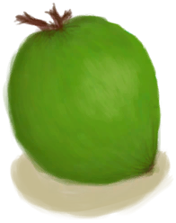

# Bay  
> A long bay.  
  

<a href="Bay.md" style="color:black">Bay</a>

<a href="Beach.md" style="color:black">Beach</a>

<a href="Jungle.md" style="color:black">Jungle</a>

<a href="Mangroves.md" style="color:black">Mangrove Forest</a>

<a href="Sea_Bay.md" style="color:black">Sea</a>

<a href="SandSource.md" style="color:black">Sand</a>

  
  
<table class="table table-bordered" data-toggle="table"  data-show-header="false"><thead style="display:none"><tr ><th  style="width:50%;text-align:left;vertical-align:top;"  >title</th><th  style="width:50%;text-align:left;vertical-align:top;"  ></th></tr></thead><tr ><td  style="width:50%;text-align:left;vertical-align:top;"  >** Unique On Board **  **Environment：**[Bay(Environment)](Env_Bay.md)  ** EnvironmentEffect: ** [

[Light](Light.md)](Light.md)<b>+10</b> [

[Temperature](TemperaturePerceived.md)](TemperaturePerceived.md)<b>-5</b> [

[Land Sickness](LandSickness.md)](LandSickness.md)addition<b>-8</b>  ** Improvements: ** [Path](Imp_Path.md)</td><td  style="width:50%;text-align:left;vertical-align:top;"  >"A beautiful bay in the southern shores of the island. Lots of fish</td></tr></tbody></table>  
  
## Exploration  
<table class="table table-bordered" data-toggle="table"  ><thead style=""><tr ><th  style="text-align:left;vertical-align:top;"  >Progress</th><th  style="text-align:left;vertical-align:top;"  >Target</th></tr></thead><tr ><td  style="text-align:left;vertical-align:top;"  >33%</td><td  style="text-align:left;vertical-align:top;"  >[To Jungle Path(Bay)](Path_BayToJungle.md)</td></tr><tr ><td  style="text-align:left;vertical-align:top;"  >66%</td><td  style="text-align:left;vertical-align:top;"  >[To Beach(Bay)](Path_BayToBeach.md)</td></tr><tr ><td  style="text-align:left;vertical-align:top;"  >100%</td><td  style="text-align:left;vertical-align:top;"  >[Area Explored(Event)(Bay)](Event_BayExplored.md)</td></tr></tbody></table>  
  
## Action  

<table><tr><td rowspan="2" style="width:200px;text-align:center;font-size:1.3em;font-weight:bold">

Go for a Walk

15m

</td><td>[“LegAction(Group)”](LegAction.md)</td></tr><tr><td></td></tr><tr><td colspan="2"><b>Require：</b>[

[Light](Light.md)](Light.md): <b>10-100</b></td></tr><tr><td colspan="2"><b>StatChange：</b>[

[Foot Damage](FootDamage.md)](FootDamage.md)<b>+8</b>, [

[Stamina](Stamina.md)](Stamina.md)<b>-2</b>, [

[Stress](Stress.md)](Stress.md)<b>-10</b>, [Exploration Bay](Exploration_Bay.md)<b>+1</b></td></tr><tr><td colspan="2">

<table style="margin-bottom:3px;"><tr><td rowspan=2 style="text-align:center" width="80px">
Base Weight

200
</td><td style="font-size:0.6em;line-height:0.6em;font-weight:bold">Pretty Seashells</td></tr><tr><td>[

[Pretty Seashells](SeashellsPretty.md)](SeashellsPretty.md)(<b>+1</b>)</td></tr></table>

<table style="margin-bottom:3px;"><tr><td rowspan=2 style="text-align:center" width="80px">
Base Weight

350
</td><td style="font-size:0.6em;line-height:0.6em;font-weight:bold">Palm Fronds</td></tr><tr><td>[

[Palm Fronds](PalmFronds.md)](PalmFronds.md)(<b>+4～+8</b>)</td></tr></table>

<table style="margin-bottom:3px;"><tr><td rowspan=2 style="text-align:center" width="80px">
Base Weight

75
</td><td style="font-size:0.6em;line-height:0.6em;font-weight:bold">Palm Bush</td></tr><tr><td>[

[Palm Bush](PalmBush.md)](PalmBush.md)(<b>+1</b>)</td></tr></table>

<table style="margin-bottom:3px;"><tr><td rowspan=2 style="text-align:center" width="80px">
Base Weight

300
</td><td style="font-size:0.6em;line-height:0.6em;font-weight:bold">Coconut❗5 limit</td></tr><tr><td>[

[Husked Coconut](CoconutHusked.md)](CoconutHusked.md)(<b>+1</b>)</td></tr></table>

<table style="margin-bottom:3px;"><tr><td rowspan=2 style="text-align:center" width="80px">
Base Weight

3000
</td><td style="font-size:0.6em;line-height:0.6em;font-weight:bold">Coconut First❗1 limit</td></tr><tr><td>[

[Husked Coconut](CoconutHusked.md)](CoconutHusked.md)(<b>+1</b>)</td></tr></table>

<table style="margin-bottom:3px;"><tr><td rowspan=2 style="text-align:center" width="80px">
Base Weight

3000
</td><td style="font-size:0.6em;line-height:0.6em;font-weight:bold">Stone First❗1 limit</td></tr><tr><td>[

[Stone](Stone.md)](Stone.md)(<b>+1</b>)</td></tr></table>

<table style="margin-bottom:3px;"><tr><td rowspan=2 style="text-align:center" width="80px">
Base Weight

900
</td><td style="font-size:0.6em;line-height:0.6em;font-weight:bold">Stone❗6 limit</td></tr><tr><td>[

[Stone](Stone.md)](Stone.md)(<b>+1</b>)</td></tr></table>

<table style="margin-bottom:3px;"><tr><td rowspan=2 style="text-align:center" width="80px">
Base Weight

10000
</td><td style="font-size:0.6em;line-height:0.6em;font-weight:bold">Stone Heavy First❗1 limit</td></tr><tr><td>[

[Heavy Stone](StoneHeavy.md)](StoneHeavy.md)(<b>+1</b>)</td></tr></table>

<table style="margin-bottom:3px;"><tr><td rowspan=2 style="text-align:center" width="80px">
Base Weight

150
</td><td style="font-size:0.6em;line-height:0.6em;font-weight:bold">Stone Heavy❗3 limit</td></tr><tr><td>[

[Heavy Stone](StoneHeavy.md)](StoneHeavy.md)(<b>+1</b>)</td></tr></table>

<table style="margin-bottom:3px;"><tr><td rowspan=2 style="text-align:center" width="80px">
Base Weight

0
</td><td style="font-size:0.6em;line-height:0.6em;font-weight:bold">Crab</td></tr><tr><td>[

[Crab](Crab.md)](Crab.md)(<b>+1</b>)[Population Crab](Pop_Crab.md)<b>-1000</b></td></tr><tr><td colspan=2><li>[Population Crab](Pop_Crab.md) in <b>1000～60000</b>, weight<b>+100～+200</b></li><li>[

[Eyesight](Myopia.md)](Myopia.md) in <b>1～3</b>, weight<b>-100～-200</b></li></td></tr></table>

<table style="margin-bottom:3px;"><tr><td rowspan=2 style="text-align:center" width="80px">
Base Weight

0
</td><td style="font-size:0.6em;line-height:0.6em;font-weight:bold">Conch</td></tr><tr><td>[

[Conch](Conch.md)](Conch.md)(<b>+1</b>)[Population Conch](Pop_Conch.md)<b>-1000</b></td></tr><tr><td colspan=2><li>[Population Conch](Pop_Conch.md) in <b>1000～30000</b>, weight<b>+100～+200</b></li></td></tr></table>

<table style="margin-bottom:3px;"><tr><td rowspan=2 style="text-align:center" width="80px">
Base Weight

0
</td><td style="font-size:0.6em;line-height:0.6em;font-weight:bold">Giant Conch❗2 limit</td></tr><tr><td>[

[Giant Conch](GiantConch.md)](GiantConch.md)(<b>+1</b>)</td></tr></table>

<table style="margin-bottom:3px;"><tr><td rowspan=2 style="text-align:center" width="80px">
Base Weight

0
</td><td style="font-size:0.6em;line-height:0.6em;font-weight:bold">Palm Tree</td></tr><tr><td>[

[Palm Tree](PalmTreeNew.md)](PalmTreeNew.md)(<b>+1</b>)[Bay Palm Trees](PalmTree_BayPop.md)<b>-1000</b></td></tr><tr><td colspan=2><li>[Bay Palm Trees](PalmTree_BayPop.md) in <b>1000～30000</b>, weight<b>+5000</b>，否则权重-1000000</li><li>[

[Palm Tree](PalmTreeNew.md)](PalmTreeNew.md) On *Hand/Board*，Weight<b>-5000</b>(Stackable),</li></td></tr></table>

<table style="margin-bottom:3px;"><tr><td rowspan=2 style="text-align:center" width="80px">
Base Weight

9000
</td><td style="font-size:0.6em;line-height:0.6em;font-weight:bold">Small Trees</td></tr><tr><td>[

[Small Tree](SmallTree.md)](SmallTree.md)(<b>+1</b>)</td></tr></table>

<table style="margin-bottom:3px;"><tr><td rowspan=2 style="text-align:center" width="80px">
Base Weight

9000
</td><td style="font-size:0.6em;line-height:0.6em;font-weight:bold">Small Palm</td></tr><tr><td>[

[Small Palm](SmallPalm.md)](SmallPalm.md)(<b>+1</b>)</td></tr></table>

<table style="margin-bottom:3px;"><tr><td rowspan=2 style="text-align:center" width="80px">
Base Weight

1000
</td><td style="font-size:0.6em;line-height:0.6em;font-weight:bold">Sticks First❗2 limit</td></tr><tr><td>[

[Sticks](Sticks.md)](Sticks.md)(<b>+1</b>)</td></tr></table>

<table style="margin-bottom:3px;"><tr><td rowspan=2 style="text-align:center" width="80px">
Base Weight

100
</td><td style="font-size:0.6em;line-height:0.6em;font-weight:bold">Sticks</td></tr><tr><td>[

[Sticks](Sticks.md)](Sticks.md)(<b>+1</b>)</td></tr></table>

<table style="margin-bottom:3px;"><tr><td rowspan=2 style="text-align:center" width="80px">
Base Weight

0
</td><td style="font-size:0.6em;line-height:0.6em;font-weight:bold">Lemon Grass</td></tr><tr><td>[

[Lemongrass](Lemongrass.md)](Lemongrass.md)(<b>+1</b>)[Bay Lemon Grass](LemonGrass_BayPop.md)<b>-1000</b></td></tr><tr><td colspan=2><li>[

[Herbology(Skill)](Skill_Herbology.md)](Skill_Herbology.md) in <b>0～150</b>, weight<b>-100～+100</b></li><li>[Bay Lemon Grass](LemonGrass_BayPop.md) in <b>1000～15000</b>, weight<b>+100～+300</b></li></td></tr></table>

<table style="margin-bottom:3px;"><tr><td rowspan=2 style="text-align:center" width="80px">
Base Weight

500
</td><td style="font-size:0.6em;line-height:0.6em;font-weight:bold">Lemon Grass First❗2 limit</td></tr><tr><td>[

[Lemongrass](Lemongrass.md)](Lemongrass.md)(<b>+1</b>)</td></tr></table>

<table style="margin-bottom:3px;"><tr><td rowspan=2 style="text-align:center" width="80px">
Base Weight

0
</td><td style="font-size:0.6em;line-height:0.6em;font-weight:bold">Aloe Vera</td></tr><tr><td>[

[Aloe Vera](AloeVera.md)](AloeVera.md)(<b>+1</b>)[Bay Aloe Vera](AloeVera_BayPop.md)<b>-1000</b></td></tr><tr><td colspan=2><li>[

[Herbology(Skill)](Skill_Herbology.md)](Skill_Herbology.md) in <b>0～150</b>, weight<b>-200～+0</b></li><li>[Bay Aloe Vera](AloeVera_BayPop.md) in <b>1000～4000</b>, weight<b>+100～+250</b></li></td></tr></table>

<table style="margin-bottom:3px;"><tr><td rowspan=2 style="text-align:center" width="80px">
Base Weight

0
</td><td style="font-size:0.6em;line-height:0.6em;font-weight:bold">Drone Encounter</td></tr><tr><td>[

[Attack Drone!(Event)](Event_DroneFight.md)](Event_DroneFight.md)(<b>+1</b>)</td></tr><tr><td colspan=2><li>[Island Drones](Pop_Drone.md) in <b>1000～4000</b>, weight<b>+10～+100</b></li><li>[

[Eyesight](Myopia.md)](Myopia.md) in <b>1～3</b>, weight<b>+0</b></li><li>[“Fight Event”](tag_FightEvent.md) On *Hand/Board*，Weight<b>-999999</b>(Stackable),</li></td></tr></table>
<button class="btn btn-secondary btn-sm" style="" data-toggle="modal" onclick="setCollectionDataBase64('eyJ0aXRsZSI6IlNpbXVsYXRvcjogR28gZm9yIGEgV2FsayAoQmF5KSIsImNvbGxlY3Rpb25zIjpbeyJkcm9wIjoiPGRpdiBzdHlsZT1cIndpZHRoOjI1cHg7ZGlzcGxheTppbmxpbmUtYmxvY2s7dGV4dC1hbGlnbjpjZW50ZXJcIj48aW1nIGRlY29kaW5nPVwiYXN5bmNcIiBzcmM9XCJTcHJpdGUvUHJldHR5U2Vhc2hlbGxzLnBuZ1wiIGhyZWY9XCJhLm1kXCIgc3R5bGU9XCJtYXgtd2lkdGg6MjVweDttYXgtaGVpZ2h0OjI1cHg7XCI+PC9kaXY+UHJldHR5IFNlYXNoZWxscyIsImJhc2UiOjIwMCwiY29uZGl0aW9uIjpbXX0seyJkcm9wIjoiPGRpdiBzdHlsZT1cIndpZHRoOjI1cHg7ZGlzcGxheTppbmxpbmUtYmxvY2s7dGV4dC1hbGlnbjpjZW50ZXJcIj48aW1nIGRlY29kaW5nPVwiYXN5bmNcIiBzcmM9XCJTcHJpdGUvUGFsbVRyZWVMZWF2ZXMucG5nXCIgaHJlZj1cImEubWRcIiBzdHlsZT1cIm1heC13aWR0aDoyNXB4O21heC1oZWlnaHQ6MjVweDtcIj48L2Rpdj5QYWxtIEZyb25kcyIsImJhc2UiOjM1MCwiY29uZGl0aW9uIjpbXX0seyJkcm9wIjoiPGRpdiBzdHlsZT1cIndpZHRoOjI1cHg7ZGlzcGxheTppbmxpbmUtYmxvY2s7dGV4dC1hbGlnbjpjZW50ZXJcIj48aW1nIGRlY29kaW5nPVwiYXN5bmNcIiBzcmM9XCJTcHJpdGUvUGFsbUJ1c2gucG5nXCIgaHJlZj1cImEubWRcIiBzdHlsZT1cIm1heC13aWR0aDoyNXB4O21heC1oZWlnaHQ6MjVweDtcIj48L2Rpdj5QYWxtIEJ1c2giLCJiYXNlIjo3NSwiY29uZGl0aW9uIjpbXX0seyJkcm9wIjoiPGRpdiBzdHlsZT1cIndpZHRoOjI1cHg7ZGlzcGxheTppbmxpbmUtYmxvY2s7dGV4dC1hbGlnbjpjZW50ZXJcIj48aW1nIGRlY29kaW5nPVwiYXN5bmNcIiBzcmM9XCJTcHJpdGUvQ3JhYi5wbmdcIiBocmVmPVwiYS5tZFwiIHN0eWxlPVwibWF4LXdpZHRoOjI1cHg7bWF4LWhlaWdodDoyNXB4O1wiPjwvZGl2PkNyYWIiLCJiYXNlIjowLCJjb25kaXRpb24iOlt7ImtleSI6IlBvcF9DcmFiIiwidGl0bGUiOiJQb3B1bGF0aW9uIENyYWIiLCJ0eXBlIjoicmFuZ2UiLCJtYXgiOlswLDYwMDAwXSwicmFuZ2UiOlsxMDAwLDYwMDAwXSwid2VpZ2h0IjpbMTAwLDIwMF0sImRlZmF1bHRWYWx1ZSI6NjAwMDAsIndoZW5PdXRPZlJhbmdlIjowfSx7ImtleSI6Ik15b3BpYSIsInRpdGxlIjoiRXllc2lnaHQiLCJ0eXBlIjoicmFuZ2UiLCJtYXgiOlswLDNdLCJyYW5nZSI6WzEsM10sIndlaWdodCI6Wy0xMDAsLTIwMF0sImRlZmF1bHRWYWx1ZSI6MCwid2hlbk91dE9mUmFuZ2UiOjB9XX0seyJkcm9wIjoiPGRpdiBzdHlsZT1cIndpZHRoOjI1cHg7ZGlzcGxheTppbmxpbmUtYmxvY2s7dGV4dC1hbGlnbjpjZW50ZXJcIj48aW1nIGRlY29kaW5nPVwiYXN5bmNcIiBzcmM9XCJTcHJpdGUvQ29uY2gucG5nXCIgaHJlZj1cImEubWRcIiBzdHlsZT1cIm1heC13aWR0aDoyNXB4O21heC1oZWlnaHQ6MjVweDtcIj48L2Rpdj5Db25jaCIsImJhc2UiOjAsImNvbmRpdGlvbiI6W3sia2V5IjoiUG9wX0NvbmNoIiwidGl0bGUiOiJQb3B1bGF0aW9uIENvbmNoIiwidHlwZSI6InJhbmdlIiwibWF4IjpbMCwzMDAwMF0sInJhbmdlIjpbMTAwMCwzMDAwMF0sIndlaWdodCI6WzEwMCwyMDBdLCJkZWZhdWx0VmFsdWUiOjMwMDAwLCJ3aGVuT3V0T2ZSYW5nZSI6MH1dfSx7ImRyb3AiOiI8ZGl2IHN0eWxlPVwid2lkdGg6MjVweDtkaXNwbGF5OmlubGluZS1ibG9jazt0ZXh0LWFsaWduOmNlbnRlclwiPjxpbWcgZGVjb2Rpbmc9XCJhc3luY1wiIHNyYz1cIlNwcml0ZS9QYWxtVHJlZS5wbmdcIiBocmVmPVwiYS5tZFwiIHN0eWxlPVwibWF4LXdpZHRoOjI1cHg7bWF4LWhlaWdodDoyNXB4O1wiPjwvZGl2PlBhbG0gVHJlZSIsImJhc2UiOjAsImNvbmRpdGlvbiI6W3sia2V5IjoiUGFsbVRyZWVfQmF5UG9wIiwidGl0bGUiOiJCYXkgUGFsbSBUcmVlcyIsInR5cGUiOiJyYW5nZSIsIm1heCI6WzAsMzAwMDBdLCJyYW5nZSI6WzEwMDAsMzAwMDBdLCJ3ZWlnaHQiOls1MDAwLDUwMDBdLCJkZWZhdWx0VmFsdWUiOjMwMDAwLCJ3aGVuT3V0T2ZSYW5nZSI6Mn0seyJrZXkiOiJQYWxtVHJlZU5ld19hbW91bnQiLCJ0aXRsZSI6IlBhbG0gVHJlZSIsInR5cGUiOiJyYW5nZSIsInJhbmdlIjpbMCwyMF0sIm1heCI6WzAsMjBdLCJ3ZWlnaHQiOlswLC0xMDAwMDBdLCJkZWZhdWx0VmFsdWUiOjAsIndoZW5PdXRPZlJhbmdlIjowLCJtYXhTdGFja0dyb3VwIjoiIn1dfSx7ImRyb3AiOiI8ZGl2IHN0eWxlPVwid2lkdGg6MjVweDtkaXNwbGF5OmlubGluZS1ibG9jazt0ZXh0LWFsaWduOmNlbnRlclwiPjxpbWcgZGVjb2Rpbmc9XCJhc3luY1wiIHNyYz1cIlNwcml0ZS9TbWFsbFRyZWUucG5nXCIgaHJlZj1cImEubWRcIiBzdHlsZT1cIm1heC13aWR0aDoyNXB4O21heC1oZWlnaHQ6MjVweDtcIj48L2Rpdj5TbWFsbCBUcmVlIiwiYmFzZSI6OTAwMCwiY29uZGl0aW9uIjpbXSwiaXNVbmlxdWUiOnRydWV9LHsiZHJvcCI6IjxkaXYgc3R5bGU9XCJ3aWR0aDoyNXB4O2Rpc3BsYXk6aW5saW5lLWJsb2NrO3RleHQtYWxpZ246Y2VudGVyXCI+PGltZyBkZWNvZGluZz1cImFzeW5jXCIgc3JjPVwiU3ByaXRlL1NtYWxsUGFsbS5wbmdcIiBocmVmPVwiYS5tZFwiIHN0eWxlPVwibWF4LXdpZHRoOjI1cHg7bWF4LWhlaWdodDoyNXB4O1wiPjwvZGl2PlNtYWxsIFBhbG0iLCJiYXNlIjo5MDAwLCJjb25kaXRpb24iOltdLCJpc1VuaXF1ZSI6dHJ1ZX0seyJkcm9wIjoiPGRpdiBzdHlsZT1cIndpZHRoOjI1cHg7ZGlzcGxheTppbmxpbmUtYmxvY2s7dGV4dC1hbGlnbjpjZW50ZXJcIj48aW1nIGRlY29kaW5nPVwiYXN5bmNcIiBzcmM9XCJTcHJpdGUvS2luZGxpbmcucG5nXCIgaHJlZj1cImEubWRcIiBzdHlsZT1cIm1heC13aWR0aDoyNXB4O21heC1oZWlnaHQ6MjVweDtcIj48L2Rpdj5TdGlja3MiLCJiYXNlIjoxMDAsImNvbmRpdGlvbiI6W119LHsiZHJvcCI6IjxkaXYgc3R5bGU9XCJ3aWR0aDoyNXB4O2Rpc3BsYXk6aW5saW5lLWJsb2NrO3RleHQtYWxpZ246Y2VudGVyXCI+PGltZyBkZWNvZGluZz1cImFzeW5jXCIgc3JjPVwiU3ByaXRlL0xlbW9uR3Jhc3MucG5nXCIgaHJlZj1cImEubWRcIiBzdHlsZT1cIm1heC13aWR0aDoyNXB4O21heC1oZWlnaHQ6MjVweDtcIj48L2Rpdj5MZW1vbmdyYXNzIiwiYmFzZSI6MCwiY29uZGl0aW9uIjpbeyJrZXkiOiJTa2lsbF9IZXJib2xvZ3kiLCJ0aXRsZSI6IkhlcmJvbG9neShTa2lsbCkiLCJ0eXBlIjoicmFuZ2UiLCJtYXgiOlswLDE1MF0sInJhbmdlIjpbMCwxNTBdLCJ3ZWlnaHQiOlstMTAwLDEwMF0sImRlZmF1bHRWYWx1ZSI6MCwid2hlbk91dE9mUmFuZ2UiOjB9LHsia2V5IjoiTGVtb25HcmFzc19CYXlQb3AiLCJ0aXRsZSI6IkJheSBMZW1vbiBHcmFzcyIsInR5cGUiOiJyYW5nZSIsIm1heCI6WzAsMTUwMDBdLCJyYW5nZSI6WzEwMDAsMTUwMDBdLCJ3ZWlnaHQiOlsxMDAsMzAwXSwiZGVmYXVsdFZhbHVlIjoxNTAwMCwid2hlbk91dE9mUmFuZ2UiOjB9XX0seyJkcm9wIjoiPGRpdiBzdHlsZT1cIndpZHRoOjI1cHg7ZGlzcGxheTppbmxpbmUtYmxvY2s7dGV4dC1hbGlnbjpjZW50ZXJcIj48aW1nIGRlY29kaW5nPVwiYXN5bmNcIiBzcmM9XCJTcHJpdGUvQWxvZVZlcmEucG5nXCIgaHJlZj1cImEubWRcIiBzdHlsZT1cIm1heC13aWR0aDoyNXB4O21heC1oZWlnaHQ6MjVweDtcIj48L2Rpdj5BbG9lIFZlcmEiLCJiYXNlIjowLCJjb25kaXRpb24iOlt7ImtleSI6IlNraWxsX0hlcmJvbG9neSIsInRpdGxlIjoiSGVyYm9sb2d5KFNraWxsKSIsInR5cGUiOiJyYW5nZSIsIm1heCI6WzAsMTUwXSwicmFuZ2UiOlswLDE1MF0sIndlaWdodCI6Wy0yMDAsMF0sImRlZmF1bHRWYWx1ZSI6MCwid2hlbk91dE9mUmFuZ2UiOjB9LHsia2V5IjoiQWxvZVZlcmFfQmF5UG9wIiwidGl0bGUiOiJCYXkgQWxvZSBWZXJhIiwidHlwZSI6InJhbmdlIiwibWF4IjpbMCw0MDAwXSwicmFuZ2UiOlsxMDAwLDQwMDBdLCJ3ZWlnaHQiOlsxMDAsMjUwXSwiZGVmYXVsdFZhbHVlIjo0MDAwLCJ3aGVuT3V0T2ZSYW5nZSI6MH1dfSx7ImRyb3AiOiI8ZGl2IHN0eWxlPVwid2lkdGg6MjVweDtkaXNwbGF5OmlubGluZS1ibG9jazt0ZXh0LWFsaWduOmNlbnRlclwiPjxpbWcgZGVjb2Rpbmc9XCJhc3luY1wiIHNyYz1cIlNwcml0ZS9Ecm9uZS5wbmdcIiBocmVmPVwiYS5tZFwiIHN0eWxlPVwibWF4LXdpZHRoOjI1cHg7bWF4LWhlaWdodDoyNXB4O1wiPjwvZGl2PkF0dGFjayBEcm9uZSEoRXZlbnQpIiwiYmFzZSI6MCwiY29uZGl0aW9uIjpbeyJrZXkiOiJQb3BfRHJvbmUiLCJ0aXRsZSI6IklzbGFuZCBEcm9uZXMiLCJ0eXBlIjoicmFuZ2UiLCJtYXgiOlswLDQwMDBdLCJyYW5nZSI6WzEwMDAsNDAwMF0sIndlaWdodCI6WzEwLDEwMF0sImRlZmF1bHRWYWx1ZSI6MCwid2hlbk91dE9mUmFuZ2UiOjB9LHsia2V5IjoiTXlvcGlhIiwidGl0bGUiOiJFeWVzaWdodCIsInR5cGUiOiJyYW5nZSIsIm1heCI6WzAsM10sInJhbmdlIjpbMSwzXSwid2VpZ2h0IjpbMCwwXSwiZGVmYXVsdFZhbHVlIjowLCJ3aGVuT3V0T2ZSYW5nZSI6MH0seyJrZXkiOiJ0YWdfRmlnaHRFdmVudF9hbW91bnQiLCJ0aXRsZSI6IuKAnEZpZ2h0IEV2ZW504oCdIiwidHlwZSI6InJhbmdlIiwicmFuZ2UiOlswLDIwXSwibWF4IjpbMCwyMF0sIndlaWdodCI6WzAsLTE5OTk5OTgwXSwiZGVmYXVsdFZhbHVlIjowLCJ3aGVuT3V0T2ZSYW5nZSI6MCwibWF4U3RhY2tHcm91cCI6IiJ9XX0seyJkcm9wIjoiPGRpdiBzdHlsZT1cIndpZHRoOjI1cHg7ZGlzcGxheTppbmxpbmUtYmxvY2s7dGV4dC1hbGlnbjpjZW50ZXJcIj48aW1nIGRlY29kaW5nPVwiYXN5bmNcIiBzcmM9XCJTcHJpdGUvQ29jb251dEh1c2tlZC5wbmdcIiBocmVmPVwiYS5tZFwiIHN0eWxlPVwibWF4LXdpZHRoOjI1cHg7bWF4LWhlaWdodDoyNXB4O1wiPjwvZGl2Pkh1c2tlZCBDb2NvbnV0IiwiYmFzZSI6MzAwLCJjb25kaXRpb24iOltdLCJpc0xpbWl0Ijp0cnVlfSx7ImRyb3AiOiI8ZGl2IHN0eWxlPVwid2lkdGg6MjVweDtkaXNwbGF5OmlubGluZS1ibG9jazt0ZXh0LWFsaWduOmNlbnRlclwiPjxpbWcgZGVjb2Rpbmc9XCJhc3luY1wiIHNyYz1cIlNwcml0ZS9Db2NvbnV0SHVza2VkLnBuZ1wiIGhyZWY9XCJhLm1kXCIgc3R5bGU9XCJtYXgtd2lkdGg6MjVweDttYXgtaGVpZ2h0OjI1cHg7XCI+PC9kaXY+SHVza2VkIENvY29udXQiLCJiYXNlIjozMDAwLCJjb25kaXRpb24iOltdLCJpc0xpbWl0Ijp0cnVlfSx7ImRyb3AiOiI8ZGl2IHN0eWxlPVwid2lkdGg6MjVweDtkaXNwbGF5OmlubGluZS1ibG9jazt0ZXh0LWFsaWduOmNlbnRlclwiPjxpbWcgZGVjb2Rpbmc9XCJhc3luY1wiIHNyYz1cIlNwcml0ZS9TdG9uZS5wbmdcIiBocmVmPVwiYS5tZFwiIHN0eWxlPVwibWF4LXdpZHRoOjI1cHg7bWF4LWhlaWdodDoyNXB4O1wiPjwvZGl2PlN0b25lIiwiYmFzZSI6MzAwMCwiY29uZGl0aW9uIjpbXSwiaXNMaW1pdCI6dHJ1ZX0seyJkcm9wIjoiPGRpdiBzdHlsZT1cIndpZHRoOjI1cHg7ZGlzcGxheTppbmxpbmUtYmxvY2s7dGV4dC1hbGlnbjpjZW50ZXJcIj48aW1nIGRlY29kaW5nPVwiYXN5bmNcIiBzcmM9XCJTcHJpdGUvU3RvbmUucG5nXCIgaHJlZj1cImEubWRcIiBzdHlsZT1cIm1heC13aWR0aDoyNXB4O21heC1oZWlnaHQ6MjVweDtcIj48L2Rpdj5TdG9uZSIsImJhc2UiOjkwMCwiY29uZGl0aW9uIjpbXSwiaXNMaW1pdCI6dHJ1ZX0seyJkcm9wIjoiPGRpdiBzdHlsZT1cIndpZHRoOjI1cHg7ZGlzcGxheTppbmxpbmUtYmxvY2s7dGV4dC1hbGlnbjpjZW50ZXJcIj48aW1nIGRlY29kaW5nPVwiYXN5bmNcIiBzcmM9XCJTcHJpdGUvU2FuZHN0b25lLnBuZ1wiIGhyZWY9XCJhLm1kXCIgc3R5bGU9XCJtYXgtd2lkdGg6MjVweDttYXgtaGVpZ2h0OjI1cHg7XCI+PC9kaXY+SGVhdnkgU3RvbmUiLCJiYXNlIjoxMDAwMCwiY29uZGl0aW9uIjpbXSwiaXNMaW1pdCI6dHJ1ZX0seyJkcm9wIjoiPGRpdiBzdHlsZT1cIndpZHRoOjI1cHg7ZGlzcGxheTppbmxpbmUtYmxvY2s7dGV4dC1hbGlnbjpjZW50ZXJcIj48aW1nIGRlY29kaW5nPVwiYXN5bmNcIiBzcmM9XCJTcHJpdGUvU2FuZHN0b25lLnBuZ1wiIGhyZWY9XCJhLm1kXCIgc3R5bGU9XCJtYXgtd2lkdGg6MjVweDttYXgtaGVpZ2h0OjI1cHg7XCI+PC9kaXY+SGVhdnkgU3RvbmUiLCJiYXNlIjoxNTAsImNvbmRpdGlvbiI6W10sImlzTGltaXQiOnRydWV9LHsiZHJvcCI6IjxkaXYgc3R5bGU9XCJ3aWR0aDoyNXB4O2Rpc3BsYXk6aW5saW5lLWJsb2NrO3RleHQtYWxpZ246Y2VudGVyXCI+PGltZyBkZWNvZGluZz1cImFzeW5jXCIgc3JjPVwiU3ByaXRlL0NvbmNoLnBuZ1wiIGhyZWY9XCJhLm1kXCIgc3R5bGU9XCJtYXgtd2lkdGg6MjVweDttYXgtaGVpZ2h0OjI1cHg7XCI+PC9kaXY+R2lhbnQgQ29uY2giLCJiYXNlIjowLCJjb25kaXRpb24iOltdLCJpc0xpbWl0Ijp0cnVlfSx7ImRyb3AiOiI8ZGl2IHN0eWxlPVwid2lkdGg6MjVweDtkaXNwbGF5OmlubGluZS1ibG9jazt0ZXh0LWFsaWduOmNlbnRlclwiPjxpbWcgZGVjb2Rpbmc9XCJhc3luY1wiIHNyYz1cIlNwcml0ZS9LaW5kbGluZy5wbmdcIiBocmVmPVwiYS5tZFwiIHN0eWxlPVwibWF4LXdpZHRoOjI1cHg7bWF4LWhlaWdodDoyNXB4O1wiPjwvZGl2PlN0aWNrcyIsImJhc2UiOjEwMDAsImNvbmRpdGlvbiI6W10sImlzTGltaXQiOnRydWV9LHsiZHJvcCI6IjxkaXYgc3R5bGU9XCJ3aWR0aDoyNXB4O2Rpc3BsYXk6aW5saW5lLWJsb2NrO3RleHQtYWxpZ246Y2VudGVyXCI+PGltZyBkZWNvZGluZz1cImFzeW5jXCIgc3JjPVwiU3ByaXRlL0xlbW9uR3Jhc3MucG5nXCIgaHJlZj1cImEubWRcIiBzdHlsZT1cIm1heC13aWR0aDoyNXB4O21heC1oZWlnaHQ6MjVweDtcIj48L2Rpdj5MZW1vbmdyYXNzIiwiYmFzZSI6NTAwLCJjb25kaXRpb24iOltdLCJpc0xpbWl0Ijp0cnVlfV19')" data-target="#modelCollectionSimulator">Simulator</button>
</td></tr></table>
  
  
  
## Drag With  

<table style="margin-bottom:0px;"><tr><td style="width:40%;text-align:left; background-color:#FEFEFE"><b>With：</b>[

[Camera](Camera.md)](Camera.md)</td><td style="width:40%;font-size:1em;font-weight:bold;background-color:#FEFEFE">Take Picture! (15m) </td></tr><tr style="background-color:#FFFFFF"><td style=""><b>Receiving：</b></td><td style=""><b>Self：</b></td></tr><tr><td colspan="2"><b>StatChange：</b>[

[Entertainment](Entertainment.md)](Entertainment.md)<b>+1</b></td></tr></table>
  
  

