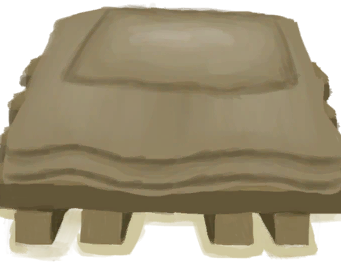

# Dismantled Wooden Bed  
> A nice and comfortable wooden bed. My back will thank me.  
  
<table class="table table-bordered" data-toggle="table"  data-show-header="false"><thead style="display:none"><tr ><th  style="width:50%;text-align:left;vertical-align:top;"  >title</th><th  style="width:50%;text-align:left;vertical-align:top;"  ></th></tr></thead><tr ><td  style="width:50%;text-align:left;vertical-align:top;"  >** Cannot Be Trashed **  **Weight：**2250  ** Unlock Require: ** [Mud Hut(Environment)](Env_MudHut.md)</td><td  style="width:50%;text-align:left;vertical-align:top;"  >

<a href="BedWoodenDismantled.md" style="color:black">Dismantled Wooden Bed</a>

</td></tr></tbody></table>  
  
## Got From  

Take apart and Pick Up

[Wooden Bed](BedWooden.md)

  
  
## Action  

<table><tr><td rowspan="2" style="width:200px;text-align:center;font-size:1.3em;font-weight:bold">

Place

1h30m

</td><td>[“HandAction(Group)”](HandAction.md)</td></tr><tr><td><b>Self：</b>→ [

[Wooden Bed](BedWooden.md)](BedWooden.md)</td></tr><tr><td colspan="2"><b>Require：</b>[

[Sheltered](Sheltered.md)](Sheltered.md): <b>1-1</b>, [

[Light](Light.md)](Light.md): <b>10-100</b>, ~~[

[Wooden Bed](BedWooden.md)](BedWooden.md) On Hand/Board~~, ~~[

[Wooden Bed(BluePrint)](Bp_BedWooden.md)](Bp_BedWooden.md) On Hand/Board~~</td></tr></table>
  
  
  

