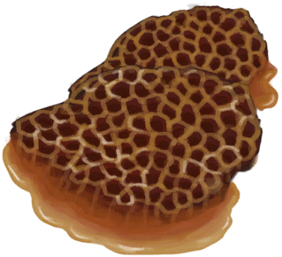
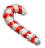
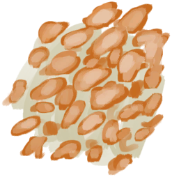

# Honeycomb  
> Tasty and sweet. Could press it on a bowl to separate the wax from the honey.  
  
<table class="table table-bordered" data-toggle="table"  data-show-header="false"><thead style="display:none"><tr ><th  style="width:50%;text-align:left;vertical-align:top;"  >title</th><th  style="width:50%;text-align:left;vertical-align:top;"  ></th></tr></thead><tr ><td  style="width:50%;text-align:left;vertical-align:top;"  >**Weight：**50  **Tag：**	[“Cookable”](tag_Cookable.md), [“Feed”](tag_Feed.md), [“Human Food”](tag_HumanFood.md), [“Rich Sugars”](tag_SugarsRich.md)</td><td  style="width:50%;text-align:left;vertical-align:top;"  >

<a href="BeeHoneycomb.md" style="color:black">Honeycomb</a>

"Honeycombs can be extracted from <b>Beehives or Skeps</b>.   They can be pressed against bowls to separate their sweet edible <b>Honey</b> from their <b>Wax</b></td></tr></tbody></table>  
  
## Got From  

Harvest

[Bee Skep](BeeSkep.md)

Harvest

[Swarming Bee Skep](BeeSkepSwarming.md)

Harvest

[Beehive](Beehive.md)

  
  
## Action  

<table><tr><td rowspan="2" style="width:200px;text-align:center;font-size:1.3em;font-weight:bold">

Eat

15m

</td><td>[“VegetarianAction(Group)”](VegetarianAction.md), [“EatingAction(Group)”](EatingAction.md)</td></tr><tr><td><b>Self：</b>→Dismiss</td></tr><tr><td colspan="2"><b>StatChange：</b>[

[Satiation](Satiation.md)](Satiation.md)<b>+30</b>, [

[Stomach](Stomach.md)](Stomach.md)<b>+30</b>, [

[Stress](Stress.md)](Stress.md)<b>-20</b>, [

[Morale](Morale.md)](Morale.md)<b>+1</b>, [

[Saturation Sugar](SaturationSugar.md)](SaturationSugar.md)<b>+200</b>, [

[Filth](Filth.md)](Filth.md)<b>+2</b></td></tr></table>
  
  
  
## Drag With  

<table style="margin-bottom:0px;"><tr><td style="width:40%;text-align:left; background-color:#FEFEFE"><b>With：</b>[“Container Bowl”](tag_ContainerBowl.md)</td><td style="width:40%;font-size:1em;font-weight:bold;background-color:#FEFEFE">Extract Honey (15m) </td></tr><tr style="background-color:#FFFFFF"><td style=""><b>Receiving：</b> [Honey](LQ_Honey.md)(<b>+150</b>)</td><td style=""><b>Self：</b>→ [

[Beeswax](Beeswax.md)](Beeswax.md)</td></tr></table>
  

<table style="margin-bottom:0px;"><tr><td style="width:40%;text-align:left; background-color:#FEFEFE"><b>With：</b>[“Water for Crops”](tag_WaterFresh.md)</td><td style="width:40%;font-size:1em;font-weight:bold;background-color:#FEFEFE">Soak (15m) </td></tr><tr><td colspan="2"><b>Require：</b>LiquidQuantity: 150</td></tr><tr style="background-color:#FFFFFF"><td style=""><b>Receiving：</b>→ [

[Honey Water](LQ_HoneyWater.md)](LQ_HoneyWater.md)</td><td style=""><b>Self：</b>Spoilage  <b>-336(-50%)</b></td></tr></table>
  
  
## Drag To  

[Boar Feeder](BoarFeeder.md)

[Boar Feeder(Empty)](BoarFeederEmpty.md)

[Compost Bin](CompostBin.md)

[Goat Feeder](GoatFeeder.md)

[Goat Feeder(Empty)](GoatFeederEmpty.md)

[Partridge Feeder](PartridgeFeeder.md)

[Partridge Feeder(Empty)](PartridgeFeederEmpty.md)

[Trapped Macaque](CageTrapMacaque.md)

[Sow](BoarEnclosureFemale.md)

[Boar](BoarEnclosureMale.md)

[Piglet](BoarEnclosurePiglet.md)

[Sow](BoarTiedFemale.md)

[Boar](BoarTiedMale.md)

[Piglet](BoarTiedPiglet.md)

[Goat](GoatEnclosureFemale.md)

[Juvenile Goat](GoatEnclosureKid.md)

[Lactating Goat](GoatEnclosureLactating.md)

[Male Goat](GoatEnclosureMale.md)

[Goat](GoatTiedFemale.md)

[Lactating Goat](GoatTiedFemaleLactating.md)

[Juvenile Goat](GoatTiedKid.md)

[Male Goat](GoatTiedMale.md)

[Grandfather](Grandfather.md)

[Grandfather](GrandfatherHealthy.md)

[Macaque Friend](MacaqueFriend.md)

[Wounded Macaque](MacaqueWounded.md)

[Chick](PartridgeChick.md)

[Partridge](PartridgeFemaleEnclosure.md)

[Partridge](PartridgeFemaleLive.md)

[Male Partridge](PartridgeMaleEnclosure.md)

[Male Partridge](PartridgeMaleLive.md)

  
  
## Use In BluePrint  

<a href="Bp_BeeSkep.md" style="color:black">Bee Skep</a>

<a href="Bp_Honey.md" style="color:black">Honey</a>

  
  
  
## Durability   

<table style="margin-bottom:0px;"><tr><td style="width:30%;text-align:left; background-color:#FEFEFE;font-size:1.3em;font-weight:bold;">Spoilage</td><td style="font-size:1em;background-color:#FEFEFE">Starting：672 , Max：672 -1/TP , Duration ：7d</td></tr><tr style="background-color:#FFFFFF"><td colspan=2>** On Zero： ** Self: →Dismiss</td></tr></table>
  

