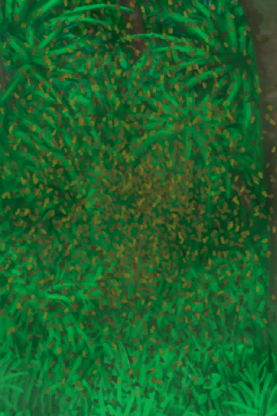

# Swarming Bee Skep  
> "This hive is swarming  
  
<table class="table table-bordered" data-toggle="table"  data-show-header="false"><thead style="display:none"><tr ><th  style="width:50%;text-align:left;vertical-align:top;"  >title</th><th  style="width:50%;text-align:left;vertical-align:top;"  ></th></tr></thead><tr ><td  style="width:50%;text-align:left;vertical-align:top;"  >** DoseNotPile **  **Weight：**500  **Usage：**336</td><td  style="width:50%;text-align:left;vertical-align:top;"  >

<a href="BeeSkepSwarming.md" style="color:black">Swarming Bee Skep</a>

"A <b>Bee Skep</b> is an artificial beehive that requires <b>Woven Palm Fronds</td></tr></tbody></table>  
  
## Got From  

Transform

[Bee Skep](BeeSkep.md)

  
  
## Action  

<table><tr><td rowspan="2" style="width:200px;text-align:center;font-size:1.3em;font-weight:bold">

Harvest

45m

</td><td></td></tr><tr><td><b>Self：</b>Honey

  <b>-500(-50%)</b></td></tr><tr><td colspan="2"><b>Require：</b>Torpor

: <b>0(0%)</b>, Honey

: <b>500～1000(50%～100%)</b>, [

[Light](Light.md)](Light.md): <b>10-100</b></td></tr><tr><td colspan="2"><b>StatChange：</b>[

[Filth](Filth.md)](Filth.md)<b>+20</b>, [

[Bee Stings](BeeStings.md)](BeeStings.md)<b>+4～+16</b></td></tr><tr><td colspan="2">[

[Honeycomb](BeeHoneycomb.md)](BeeHoneycomb.md)(<b>+2</b>), [

[A Bee Swarm!(Event)](Event_BeesSwarming.md)](Event_BeesSwarming.md)(<b>+1</b>)</td></tr></table>
  

<table><tr><td rowspan="2" style="width:200px;text-align:center;font-size:1.3em;font-weight:bold">

Harvest

45m

</td><td></td></tr><tr><td><b>Self：</b>Honey

  <b>-500(-50%)</b></td></tr><tr><td colspan="2"><b>Require：</b>Torpor

: <b>1～6(16.67%～100%)</b>, Honey

: <b>500～1000(50%～100%)</b>, [

[Light](Light.md)](Light.md): <b>10-100</b></td></tr><tr><td colspan="2"><b>StatChange：</b>[

[Filth](Filth.md)](Filth.md)<b>+20</b>, [

[Bee Stings](BeeStings.md)](BeeStings.md)<b>+2～+8</b></td></tr><tr><td colspan="2">[

[Honeycomb](BeeHoneycomb.md)](BeeHoneycomb.md)(<b>+2</b>)</td></tr></table>
  
  
  
## Drag With  

<table style="margin-bottom:0px;"><tr><td style="width:40%;text-align:left; background-color:#FEFEFE"><b>With：</b>[

[Torch(On)](TorchOn.md)](TorchOn.md) | [

[Bee Smoker(On)](BeeSmokerOn.md)](BeeSmokerOn.md)</td><td style="width:40%;font-size:1em;font-weight:bold;background-color:#FEFEFE">Smoke  </td></tr><tr style="background-color:#FFFFFF"><td style=""><b>Receiving：</b></td><td style=""><b>Self：</b>Torpor

  <b>+6(100%)</b></td></tr></table>
  

<table style="margin-bottom:0px;"><tr><td style="width:40%;text-align:left; background-color:#FEFEFE"><b>With：</b>[“Water Container”](tag_WaterContainer.md) ([“Sweet Water(Group)”](GpTag_SweetWater.md) x 1)</td><td style="width:40%;font-size:1em;font-weight:bold;background-color:#FEFEFE">Feed  </td></tr><tr style="background-color:#FFFFFF"><td style=""><b>Receiving：</b></td><td style=""><b>Self：</b>Food Reserves

  <b>+500(173.61%)</b></td></tr></table>
  

<table style="margin-bottom:0px;"><tr><td style="width:40%;text-align:left; background-color:#FEFEFE"><b>With：</b>[

[Sack](Sack.md)](Sack.md)</td><td style="width:40%;font-size:1em;font-weight:bold;background-color:#FEFEFE">Trap Bees (15m) </td></tr><tr style="background-color:#FFFFFF"><td style=""><b>Receiving：</b></td><td style=""><b>Self：</b>→ [

[Bee Skep](BeeSkep.md)](BeeSkep.md), Population

  <b>-672(-50%)</b></td></tr><tr><td colspan="2">

<table style="margin-bottom:3px;"><tr><td rowspan=2 style="text-align:center" width="80px">
Base Weight

0
</td><td style="font-size:0.6em;line-height:0.6em;font-weight:bold">Protected</td></tr><tr><td>[

[Queen Bee](QueenBee.md)](QueenBee.md)(<b>+1</b>), [

[Bees](Bees.md)](Bees.md)(<b>+1</b>)</td></tr><tr><td colspan=2><li>[

[Bee Protection](BeeProtection.md)](BeeProtection.md) in <b>6～10</b>, weight<b>+10</b>，否则权重-1000000</li></td></tr></table>

<table style="margin-bottom:3px;"><tr><td rowspan=2 style="text-align:center" width="80px">
Base Weight

0
</td><td style="font-size:0.6em;line-height:0.6em;font-weight:bold">Protected</td></tr><tr><td>[

[Queen Bee](QueenBee.md)](QueenBee.md)(<b>+1</b>), [

[Bees](Bees.md)](Bees.md)(<b>+1</b>), [

[A Bee Swarm!(Event)](Event_BeesSwarming.md)](Event_BeesSwarming.md)(<b>+1</b>)</td></tr><tr><td colspan=2><li>[

[Bee Protection](BeeProtection.md)](BeeProtection.md) in <b>0</b>, weight<b>+10</b>，否则权重-1000000</li></td></tr></table>
<button class="btn btn-secondary btn-sm" style="" data-toggle="modal" onclick="setCollectionDataBase64('eyJ0aXRsZSI6IlNpbXVsYXRvcjogVHJhcCBCZWVzIChTd2FybWluZyBCZWUgU2tlcCkiLCJjb2xsZWN0aW9ucyI6W3siZHJvcCI6IjxkaXYgc3R5bGU9XCJ3aWR0aDoyNXB4O2Rpc3BsYXk6aW5saW5lLWJsb2NrO3RleHQtYWxpZ246Y2VudGVyXCI+PGltZyBkZWNvZGluZz1cImFzeW5jXCIgc3JjPVwiU3ByaXRlL0JlZVF1ZWVuLnBuZ1wiIGhyZWY9XCJhLm1kXCIgc3R5bGU9XCJtYXgtd2lkdGg6MjVweDttYXgtaGVpZ2h0OjI1cHg7XCI+PC9kaXY+UXVlZW4gQmVlPGRpdiBzdHlsZT1cIndpZHRoOjI1cHg7ZGlzcGxheTppbmxpbmUtYmxvY2s7dGV4dC1hbGlnbjpjZW50ZXJcIj48aW1nIGRlY29kaW5nPVwiYXN5bmNcIiBzcmM9XCJTcHJpdGUvQmVlUGlsZS5wbmdcIiBocmVmPVwiYS5tZFwiIHN0eWxlPVwibWF4LXdpZHRoOjI1cHg7bWF4LWhlaWdodDoyNXB4O1wiPjwvZGl2PkJlZXMiLCJiYXNlIjowLCJjb25kaXRpb24iOlt7ImtleSI6IkJlZVByb3RlY3Rpb24iLCJ0aXRsZSI6IkJlZSBQcm90ZWN0aW9uIiwidHlwZSI6InJhbmdlIiwibWF4IjpbMCwxMF0sInJhbmdlIjpbNiwxMF0sIndlaWdodCI6WzEwLDEwXSwiZGVmYXVsdFZhbHVlIjowLCJ3aGVuT3V0T2ZSYW5nZSI6Mn1dfSx7ImRyb3AiOiI8ZGl2IHN0eWxlPVwid2lkdGg6MjVweDtkaXNwbGF5OmlubGluZS1ibG9jazt0ZXh0LWFsaWduOmNlbnRlclwiPjxpbWcgZGVjb2Rpbmc9XCJhc3luY1wiIHNyYz1cIlNwcml0ZS9CZWVRdWVlbi5wbmdcIiBocmVmPVwiYS5tZFwiIHN0eWxlPVwibWF4LXdpZHRoOjI1cHg7bWF4LWhlaWdodDoyNXB4O1wiPjwvZGl2PlF1ZWVuIEJlZTxkaXYgc3R5bGU9XCJ3aWR0aDoyNXB4O2Rpc3BsYXk6aW5saW5lLWJsb2NrO3RleHQtYWxpZ246Y2VudGVyXCI+PGltZyBkZWNvZGluZz1cImFzeW5jXCIgc3JjPVwiU3ByaXRlL0JlZVBpbGUucG5nXCIgaHJlZj1cImEubWRcIiBzdHlsZT1cIm1heC13aWR0aDoyNXB4O21heC1oZWlnaHQ6MjVweDtcIj48L2Rpdj5CZWVzPGRpdiBzdHlsZT1cIndpZHRoOjI1cHg7ZGlzcGxheTppbmxpbmUtYmxvY2s7dGV4dC1hbGlnbjpjZW50ZXJcIj48aW1nIGRlY29kaW5nPVwiYXN5bmNcIiBzcmM9XCJTcHJpdGUvQmVlU3dhcm0ucG5nXCIgaHJlZj1cImEubWRcIiBzdHlsZT1cIm1heC13aWR0aDoyNXB4O21heC1oZWlnaHQ6MjVweDtcIj48L2Rpdj5BIEJlZSBTd2FybSEoRXZlbnQpIiwiYmFzZSI6MCwiY29uZGl0aW9uIjpbeyJrZXkiOiJCZWVQcm90ZWN0aW9uIiwidGl0bGUiOiJCZWUgUHJvdGVjdGlvbiIsInR5cGUiOiJyYW5nZSIsIm1heCI6WzAsMTBdLCJyYW5nZSI6WzAsMF0sIndlaWdodCI6WzEwLDEwXSwiZGVmYXVsdFZhbHVlIjowLCJ3aGVuT3V0T2ZSYW5nZSI6Mn1dfV19')" data-target="#modelCollectionSimulator">Simulator</button>
</td></tr></table>
  
  
## Durability   

<table style="margin-bottom:0px;"><tr><td style="width:30%;text-align:left; background-color:#FEFEFE;font-size:1.3em;font-weight:bold;">

Torpor</td><td style="font-size:1em;background-color:#FEFEFE">Starting：0 , Max：6 -1/TP , Duration ：1h30m</td></tr><tr style="background-color:#FFFFFF"><td colspan=2></td></tr></table>
  

<table style="margin-bottom:0px;"><tr><td style="width:30%;text-align:left; background-color:#FEFEFE;font-size:1.3em;font-weight:bold;">

Population</td><td style="font-size:1em;background-color:#FEFEFE">Starting：336 , Max：1344 +1/TP , Duration ：14d</td></tr><tr style="background-color:#FFFFFF"><td colspan=2></td></tr></table>
  

<table style="margin-bottom:0px;"><tr><td style="width:30%;text-align:left; background-color:#FEFEFE;font-size:1.3em;font-weight:bold;">

Food Reserves</td><td style="font-size:1em;background-color:#FEFEFE">Starting：0 , Max：288 -1/TP , Duration ：3d</td></tr><tr style="background-color:#FFFFFF"><td colspan=2></td></tr></table>
  

<table style="margin-bottom:0px;"><tr><td style="width:30%;text-align:left; background-color:#FEFEFE;font-size:1.3em;font-weight:bold;">

Honey</td><td style="font-size:1em;background-color:#FEFEFE">Starting：0 , Max：1000 -</td></tr><tr style="background-color:#FFFFFF"><td colspan=2></td></tr></table>
  

<table style="margin-bottom:0px;"><tr><td style="width:30%;text-align:left; background-color:#FEFEFE;font-size:1.3em;font-weight:bold;">Special1</td><td style="font-size:1em;background-color:#FEFEFE">Starting：96 , Max：96 -1/TP , Duration ：1d</td></tr><tr style="background-color:#FFFFFF"><td colspan=2>** On Zero： ** Self: → [

[Bee Skep](BeeSkep.md)](BeeSkep.md) Population

  <b>-672(-50%)</b></td></tr></table>
  
## Passive Effects  
<table class="table table-bordered" data-toggle="table"  ><thead style=""><tr ><th  style="text-align:left;vertical-align:top;"  >Name</th><th  style="text-align:left;vertical-align:top;"  >Condition</th><th  style="text-align:left;vertical-align:top;"  >Change(Each TP)</th><th  style="text-align:left;vertical-align:top;"  data-sortable="true"  >Status</th></tr></thead><tr ><td  style="text-align:left;vertical-align:top;"  >Make Honey</td><td  style="text-align:left;vertical-align:top;"  >** Require Card(可叠加)：** [“Flower”](tag_Flower.md)</td><td  style="text-align:left;vertical-align:top;"  >Honey

+0.1(0.01%)</td><td  style="text-align:left;vertical-align:top;"  ></td></tr><tr ><td  style="text-align:left;vertical-align:top;"  >Eat Honey</td><td  style="text-align:left;vertical-align:top;"  >** Require Durability：** Food Reserves

: <b>0～0.1(0%～0.03%)</b></td><td  style="text-align:left;vertical-align:top;"  >Honey

-1(-0.1%)</td><td  style="text-align:left;vertical-align:top;"  ></td></tr><tr ><td  style="text-align:left;vertical-align:top;"  >Starve</td><td  style="text-align:left;vertical-align:top;"  >** Require Durability：** Food Reserves

: <b>0～0.1(0%～0.03%)</b> Honey

: <b>0～0.1(0%～0.01%)</b></td><td  style="text-align:left;vertical-align:top;"  >Population

 -2(-0.15%)</td><td  style="text-align:left;vertical-align:top;"  ></td></tr><tr ><td  style="text-align:left;vertical-align:top;"  >Hive Competition</td><td  style="text-align:left;vertical-align:top;"  >** Require Card(可叠加)：** [Swarming Bee Skep](BeeSkepSwarming.md)</td><td  style="text-align:left;vertical-align:top;"  >Honey

-0.5(-0.05%)</td><td  style="text-align:left;vertical-align:top;"  ></td></tr><tr ><td  style="text-align:left;vertical-align:top;"  >Breed More</td><td  style="text-align:left;vertical-align:top;"  >** Require Durability：** Food Reserves

: <b>0.5～1(0.17%～0.35%)</b> Honey

: <b>0.5～1(0.05%～0.1%)</b></td><td  style="text-align:left;vertical-align:top;"  >Population

 +1(0.07%)</td><td  style="text-align:left;vertical-align:top;"  ></td></tr></tbody></table>  
  

