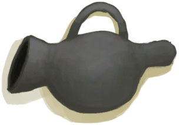

# Bee Smoker  
> A tool for claming bees down.  
  
<table class="table table-bordered" data-toggle="table"  data-show-header="false"><thead style="display:none"><tr ><th  style="width:50%;text-align:left;vertical-align:top;"  >title</th><th  style="width:50%;text-align:left;vertical-align:top;"  ></th></tr></thead><tr ><td  style="width:50%;text-align:left;vertical-align:top;"  >**Weight：**150</td><td  style="width:50%;text-align:left;vertical-align:top;"  >

<a href="BeeSmokerOff.md" style="color:black">Bee Smoker</a>

"This useful tool provides a more efficient way to smoke bees than torches</td></tr></tbody></table>  
  
## Got From  

Fire Bee Smoker

[Unfired Bee Smoker](BeeSmokerUnfired.md)

Fire Bee Smoker

[Unfired Bee Smoker](BeeSmokerUnfired.md)

Extinguish

[Bee Smoker(On)](BeeSmokerOn.md)

Transform

[Bee Smoker(On)](BeeSmokerOn.md)

  
  
## Drag With  

<table style="margin-bottom:0px;"><tr><td style="width:40%;text-align:left; background-color:#FEFEFE"><b>With：</b>[

[Lit Tinder](TinderLit.md)](TinderLit.md)</td><td style="width:40%;font-size:1em;font-weight:bold;background-color:#FEFEFE">Light  </td></tr><tr style="background-color:#FFFFFF"><td style=""><b>Receiving：</b>→Dismiss</td><td style=""><b>Self：</b>→ [

[Bee Smoker(On)](BeeSmokerOn.md)](BeeSmokerOn.md), Fuel  <b>+16(100%)</b></td></tr></table>
  

<table style="margin-bottom:0px;"><tr><td style="width:40%;text-align:left; background-color:#FEFEFE"><b>With：</b>[“Fire Source”](tag_FireSource.md)</td><td style="width:40%;font-size:1em;font-weight:bold;background-color:#FEFEFE">Light  </td></tr><tr style="background-color:#FFFFFF"><td style=""><b>Receiving：</b></td><td style=""><b>Self：</b>→ [

[Bee Smoker(On)](BeeSmokerOn.md)](BeeSmokerOn.md), Fuel  <b>+1(6.25%)</b></td></tr></table>
  

<table style="margin-bottom:0px;"><tr><td style="width:40%;text-align:left; background-color:#FEFEFE"><b>With：</b>[“Tinder”](tag_Tinder.md)</td><td style="width:40%;font-size:1em;font-weight:bold;background-color:#FEFEFE">Fuel  </td></tr><tr style="background-color:#FFFFFF"><td style=""><b>Receiving：</b>→Dismiss</td><td style=""><b>Self：</b>Fuel  <b>+16(100%)</b></td></tr></table>
  
  
## Durability   

<table style="margin-bottom:0px;"><tr><td style="width:30%;text-align:left; background-color:#FEFEFE;font-size:1.3em;font-weight:bold;">Fuel</td><td style="font-size:1em;background-color:#FEFEFE">Starting：0 , Max：16 -</td></tr><tr style="background-color:#FFFFFF"><td colspan=2></td></tr></table>
  

