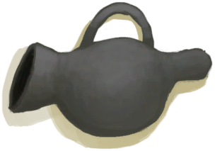

# Bee Smoker  
> A tool for claming bees down.  
  
<table class="table table-bordered" data-toggle="table"  data-show-header="false"><thead style="display:none"><tr ><th  style="width:50%;text-align:left;vertical-align:top;"  >title</th><th  style="width:50%;text-align:left;vertical-align:top;"  ></th></tr></thead><tr ><td  style="width:50%;text-align:left;vertical-align:top;"  >**Weight：**150  **Tag：**	[“Fire Source”](tag_FireSource.md)  ** Effect: ** [

[Light](Light.md)](Light.md)<b>+20</b></td><td  style="width:50%;text-align:left;vertical-align:top;"  >

<a href="BeeSmokerOn.md" style="color:black">Bee Smoker</a>

"This useful tool provides a more efficient way to smoke bees than torches</td></tr></tbody></table>  
  
## Got From  

** With：**[Lit Tinder](TinderLit.md)Light

[Bee Smoker(Off)](BeeSmokerOff.md)

** With：**[“Fire Source”](tag_FireSource.md)Light

[Bee Smoker(Off)](BeeSmokerOff.md)

  
  
## Action  

<table><tr><td rowspan="2" style="width:200px;text-align:center;font-size:1.3em;font-weight:bold">

Extinguish

3m

</td><td></td></tr><tr><td><b>Self：</b>→ [

[Bee Smoker(Off)](BeeSmokerOff.md)](BeeSmokerOff.md), Fuel  <b>-1(-6.25%)</b></td></tr></table>
  
  
  
## Drag To  

[Bee Skep](BeeSkep.md)

[Swarming Bee Skep](BeeSkepSwarming.md)

[Beehive](Beehive.md)

[Feathers](Feathers.md)

[Fibers](Fibers.md)

[Bees](Bees.md)

[Dry Leaves](LeavesDry.md)

[Nest](Nest.md)

[Papers](Papers.md)

[Bee Smoker(Off)](BeeSmokerOff.md)

[Citronella Candle(Off)](CandleCitronellaOff.md)

[Jasmine Candle(Off)](CandleJasmineOff.md)

[Candle(Off)](CandleOff.md)

[Dynamite(Off)](DynamiteOff.md)

[Wood Shavings](WoodShavings.md)

  
  
## Durability   

<table style="margin-bottom:0px;"><tr><td style="width:30%;text-align:left; background-color:#FEFEFE;font-size:1.3em;font-weight:bold;">Fuel</td><td style="font-size:1em;background-color:#FEFEFE">Starting：16 , Max：16 -1/TP , Duration ：4h</td></tr><tr style="background-color:#FFFFFF"><td colspan=2>** On Zero： ** Self: → [

[Bee Smoker(Off)](BeeSmokerOff.md)](BeeSmokerOff.md)</td></tr></table>
  

