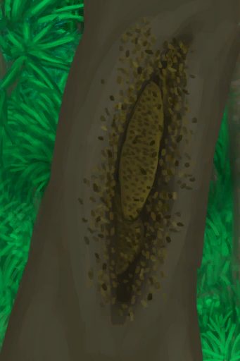

# Bee Stings  
> "Caused by interacting with bees  
> "Caused by interacting with bees  
  

<b>Base Value: </b> 0 
  

<b>Value Range: </b> 0 ~ 192 
  

<b>Base Rate: </b> -1 / /TP 
  
## Statuses  

<table><tr style="height:2em;"><td style="background-color:#F0F0F0;text-align:center;width:180px;font-size:1.4em;font-weight:bold;vertical-align:middle;">
1 ～ 48

0% ～ 25%
</td><td colspan=2 style="font-size:1.1em;vertical-align:middle;background-color:#F9F9F9;">
<b>

Bee Stings</b>

&nbsp;&nbsp;I got stung by a bee.
</td></tr><tr><td colspan=2><b>Effect：</b>[

[Pain](Pain.md)](Pain.md)<b>+50</b></td></tr><tr><td colspan=2></td></tr><tr style="height:2em;"><td style="background-color:#F0F0F0;text-align:center;width:180px;font-size:1.4em;font-weight:bold;vertical-align:middle;">
49 ～ 96

25% ～ 50%
</td><td colspan=2 style="font-size:1.1em;vertical-align:middle;background-color:#F9F9F9;">
<b>

Bee Stings</b>

&nbsp;&nbsp;I got stung by many bees.
</td></tr><tr><td colspan=2><b>Effect：</b>[

[Pain](Pain.md)](Pain.md)<b>+75</b></td></tr><tr><td colspan=2></td></tr><tr style="height:2em;"><td style="background-color:#F0F0F0;text-align:center;width:180px;font-size:1.4em;font-weight:bold;vertical-align:middle;">
97 ～ 144

50% ～ 75%
</td><td colspan=2 style="font-size:1.1em;vertical-align:middle;background-color:#F9F9F9;">
<b>

Bee Stings</b>

&nbsp;&nbsp;I got stung by lots of bees.
</td></tr><tr><td colspan=2><b>Effect：</b>[

[Pain](Pain.md)](Pain.md)<b>+100</b>, [

[Skin Integrity](SkinIntegrity.md)](SkinIntegrity.md)<b>-1</b>, [

[Nausea](Nausea.md)](Nausea.md)addition<b>+2</b>, [

[Headache](Headache.md)](Headache.md)addition<b>+1.5</b></td></tr><tr><td colspan=2></td></tr><tr style="height:2em;"><td style="background-color:#F0F0F0;text-align:center;width:180px;font-size:1.4em;font-weight:bold;vertical-align:middle;">
145 ～ 196

75% ～ 102%
</td><td colspan=2 style="font-size:1.1em;vertical-align:middle;background-color:#F9F9F9;">
<b>

Bee Stings</b>

&nbsp;&nbsp;I got stung by hundreds of bees!
</td></tr><tr><td colspan=2><b>Effect：</b>[

[Pain](Pain.md)](Pain.md)<b>+100</b>, [

[Skin Integrity](SkinIntegrity.md)](SkinIntegrity.md)<b>-2</b>, [

[Nausea](Nausea.md)](Nausea.md)addition<b>+3</b>, [

[Headache](Headache.md)](Headache.md)addition<b>+2</b></td></tr><tr><td colspan=2></td></tr></table>
  
## Related Cards  
[Aloe Gel Protection](AloeVeraGelProtection.md)  
## Change By  
<table class="table table-bordered" data-toggle="table"  ><thead style=""><tr ><th  style="text-align:left;vertical-align:top;"  >From</th><th  style="text-align:left;vertical-align:top;"  >Operation</th><th  style="text-align:left;vertical-align:top;"  data-sortable="true"  >Value</th></tr></thead><tr ><td  style="text-align:left;vertical-align:top;"  >[

[A Bee Swarm!(Event)](Event_BeesSwarming.md)](Event_BeesSwarming.md)</td><td  style="text-align:left;vertical-align:top;"  >Not the Bees!</td><td  style="text-align:left;vertical-align:top;"  >96 ~ 192</td></tr><tr ><td  style="text-align:left;vertical-align:top;"  >[

[A Bee Swarm!(Event)](Event_BeesSwarming.md)](Event_BeesSwarming.md)</td><td  style="text-align:left;vertical-align:top;"  >My clothes partially protected me!</td><td  style="text-align:left;vertical-align:top;"  >48 ~ 96</td></tr><tr ><td  style="text-align:left;vertical-align:top;"  >[

[Bee Skep](BeeSkep.md)](BeeSkep.md)</td><td  style="text-align:left;vertical-align:top;"  >Harvest</td><td  style="text-align:left;vertical-align:top;"  >4 ~ 16</td></tr><tr ><td  style="text-align:left;vertical-align:top;"  >[

[Swarming Bee Skep](BeeSkepSwarming.md)](BeeSkepSwarming.md)</td><td  style="text-align:left;vertical-align:top;"  >Harvest</td><td  style="text-align:left;vertical-align:top;"  >4 ~ 16</td></tr><tr ><td  style="text-align:left;vertical-align:top;"  >[

[Beehive](Beehive.md)](Beehive.md)</td><td  style="text-align:left;vertical-align:top;"  >Harvest</td><td  style="text-align:left;vertical-align:top;"  >4 ~ 16</td></tr><tr ><td  style="text-align:left;vertical-align:top;"  >[

[Bee Skep](BeeSkep.md)](BeeSkep.md)</td><td  style="text-align:left;vertical-align:top;"  >Harvest</td><td  style="text-align:left;vertical-align:top;"  >2 ~ 8</td></tr><tr ><td  style="text-align:left;vertical-align:top;"  >[

[Swarming Bee Skep](BeeSkepSwarming.md)](BeeSkepSwarming.md)</td><td  style="text-align:left;vertical-align:top;"  >Harvest</td><td  style="text-align:left;vertical-align:top;"  >2 ~ 8</td></tr><tr ><td  style="text-align:left;vertical-align:top;"  >[

[Beehive](Beehive.md)](Beehive.md)</td><td  style="text-align:left;vertical-align:top;"  >Harvest</td><td  style="text-align:left;vertical-align:top;"  >2 ~ 8</td></tr><tr ><td  style="text-align:left;vertical-align:top;"  >[

[A Bee Swarm!(Event)](Event_BeesSwarming.md)](Event_BeesSwarming.md)</td><td  style="text-align:left;vertical-align:top;"  >My clothes protected me!</td><td  style="text-align:left;vertical-align:top;"  >0 ~ 16</td></tr></tbody></table>  
  

