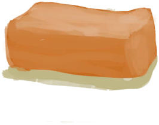

# Beeswax  
> A bit of wax.  
  
<table class="table table-bordered" data-toggle="table"  data-show-header="false"><thead style="display:none"><tr ><th  style="width:50%;text-align:left;vertical-align:top;"  >title</th><th  style="width:50%;text-align:left;vertical-align:top;"  ></th></tr></thead><tr ><td  style="width:50%;text-align:left;vertical-align:top;"  >**Weight：**100</td><td  style="width:50%;text-align:left;vertical-align:top;"  >

<a href="Beeswax.md" style="color:black">Beeswax</a>

Wax can be extracted from <b>Honeycombs</b> by presing them into bowls or coconut shells.  It can then be combined into blocks that can be used to make <b>Candles</b>: a long lasting light source that is relatively cheap to make.</td></tr></tbody></table>  
  
## Got From  

Craft BluePrint

[Honey(BluePrint)](Bp_Honey.md)

** With：**[“Container Bowl”](tag_ContainerBowl.md)Extract Honey

[Honeycomb](BeeHoneycomb.md)

  
  
## Drag With  

<table style="margin-bottom:0px;"><tr><td style="width:40%;text-align:left; background-color:#FEFEFE"><b>With：</b>[

[Beeswax](Beeswax.md)](Beeswax.md)</td><td style="width:40%;font-size:1em;font-weight:bold;background-color:#FEFEFE">Make Block  (15m) </td></tr><tr style="background-color:#FFFFFF"><td style=""><b>Receiving：</b>→Dismiss</td><td style=""><b>Self：</b>→ [

[Beeswax Block](BeeswaxBlock.md)](BeeswaxBlock.md)</td></tr></table>
  
  
## Drag To  

[Beeswax](Beeswax.md)

  
  

