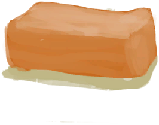

# Beeswax Block  
> Could make candles with this.  
  
<table class="table table-bordered" data-toggle="table"  data-show-header="false"><thead style="display:none"><tr ><th  style="width:50%;text-align:left;vertical-align:top;"  >title</th><th  style="width:50%;text-align:left;vertical-align:top;"  ></th></tr></thead><tr ><td  style="width:50%;text-align:left;vertical-align:top;"  >**Weight：**100</td><td  style="width:50%;text-align:left;vertical-align:top;"  >

<a href="BeeswaxBlock.md" style="color:black">Beeswax Block</a>

Wax can be extracted from <b>Honeycombs</b> by presing them into bowls or coconut shells.  It can then be combined into blocks that can be used to make <b>Candles</b>: a long lasting light source that is relatively cheap to make.</td></tr></tbody></table>  
  
## Got From  

** With：**[Beeswax](Beeswax.md)Make Block 

[Beeswax](Beeswax.md)

  
  
## Use In BluePrint  

<a href="Bp_Candles.md" style="color:black">Candles</a>

<a href="Bp_CandlesCitronella.md" style="color:black">Citronella Candles</a>

<a href="Bp_CandlesJasmine.md" style="color:black">Jasmine Candles</a>

  
  
  

