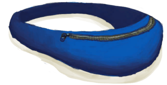

# Belt Bag  
> Comfortable and practical.  
  
<table class="table table-bordered" data-toggle="table"  data-show-header="false"><thead style="display:none"><tr ><th  style="width:50%;text-align:left;vertical-align:top;"  >title</th><th  style="width:50%;text-align:left;vertical-align:top;"  ></th></tr></thead><tr ><td  style="width:50%;text-align:left;vertical-align:top;"  >** Cannot Be Trashed **  ** DoseNotPile **  ** 装备时等效于拿在手上 **  **Weight：**150  **装备时减重：**-150  **Tag：**	[“Bag”](tag_Bag.md), [“Belt”](tag_Belt.md), [“Valuable”](tag_Valuable.md)  **Equipped Cards：**[“Belt Item”](eTag_Belt.md)  **Slots：**2  **Starting Cards：**

[

[Passport](Passport.md)](Passport.md)

[

[Papers](Papers.md)](Papers.md)

  
  
  **WeightCapacity：**350  **WeightRedution：**-350</td><td  style="width:50%;text-align:left;vertical-align:top;"  >

<a href="BeltBag.md" style="color:black">Belt Bag</a>

</td></tr></tbody></table>  
  
## Got From  

Default Characters

[Tourist](Tourist.md)

  
  

