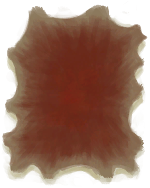

# Piglet Carcass  
  
<table class="table table-bordered" data-toggle="table"  data-show-header="false"><thead style="display:none"><tr ><th  style="width:50%;text-align:left;vertical-align:top;"  >title</th><th  style="width:50%;text-align:left;vertical-align:top;"  ></th></tr></thead><tr ><td  style="width:50%;text-align:left;vertical-align:top;"  >** Cannot Be Trashed **  **Weight：**750  **Tag：**	[“Large”](tag_Large.md)  ** Effect: ** [

[Comfort](Comfort.md)](Comfort.md)<b>-250</b></td><td  style="width:50%;text-align:left;vertical-align:top;"  >

<a href="BoarCarcassPiglet.md" style="color:black">Piglet Carcass</a>

</td></tr></tbody></table>  
  
## Got From  

Transform

[Sow](BoarEnclosureFemale.md)

** With：**[Heavy Stone](StoneHeavy.md) , [“Cutter”](tag_Cutter.md) , [“Axe”](tag_Axe.md) , [“Spear T1”](tag_Spear.md)Kill

[Piglet](BoarEnclosurePiglet.md)

Transform

[Piglet](BoarEnclosurePiglet.md)

Dead of Thirst

[Piglet](BoarEnclosurePiglet.md)

** With：**[Heavy Stone](StoneHeavy.md) , [“Cutter”](tag_Cutter.md) , [“Axe”](tag_Axe.md) , [“Spear T1”](tag_Spear.md)Kill

[Piglet](BoarTiedPiglet.md)

Transform

[Piglet](BoarTiedPiglet.md)

Dead of Thirst

[Piglet](BoarTiedPiglet.md)

  
  
## Drag With  

<table style="margin-bottom:0px;"><tr><td style="width:40%;text-align:left; background-color:#FEFEFE"><b>With：</b>[

[Obsidian Knife](KnifeObsidian.md)](KnifeObsidian.md)</td><td style="width:40%;font-size:1em;font-weight:bold;background-color:#FEFEFE">Skin (45m) [“HandAction(Group)”](HandAction.md), [“CraftAction(Group)”](CraftAction.md)</td></tr><tr><td colspan="2"><b>Require：</b>[

[Light](Light.md)](Light.md): <b>10-100</b></td></tr><tr style="background-color:#FFFFFF"><td style=""><b>Receiving：</b>Usage  <b>-1</b></td><td style=""><b>Self：</b>→ [

[Skinned Piglet](BoarSkinnedPiglet.md)](BoarSkinnedPiglet.md)</td></tr><tr><td colspan="2"><b>StatChange：</b>[

[Filth](Filth.md)](Filth.md)<b>+15</b></td></tr><tr><td colspan="2">[

[Fresh Skin](SkinFresh.md)](SkinFresh.md)(<b>+1</b>)</td></tr></table>
  

<table style="margin-bottom:0px;"><tr><td style="width:40%;text-align:left; background-color:#FEFEFE"><b>With：</b>[“Cutter”](tag_Cutter.md)</td><td style="width:40%;font-size:1em;font-weight:bold;background-color:#FEFEFE">Skin (1h) [“HandAction(Group)”](HandAction.md), [“CraftAction(Group)”](CraftAction.md)</td></tr><tr><td colspan="2"><b>Require：</b>[

[Light](Light.md)](Light.md): <b>10-100</b></td></tr><tr style="background-color:#FFFFFF"><td style=""><b>Receiving：</b>Usage  <b>-1(-0.67%)</b></td><td style=""><b>Self：</b>→ [

[Skinned Piglet](BoarSkinnedPiglet.md)](BoarSkinnedPiglet.md)</td></tr><tr><td colspan="2"><b>StatChange：</b>[

[Filth](Filth.md)](Filth.md)<b>+15</b></td></tr><tr><td colspan="2">[

[Fresh Skin](SkinFresh.md)](SkinFresh.md)(<b>+1</b>)</td></tr></table>
  
  
## Durability   

<table style="margin-bottom:0px;"><tr><td style="width:30%;text-align:left; background-color:#FEFEFE;font-size:1.3em;font-weight:bold;">Spoilage</td><td style="font-size:1em;background-color:#FEFEFE">Starting：192 -1/TP , Duration ：2d</td></tr><tr style="background-color:#FFFFFF"><td colspan=2>** On Zero： ** Self: →Dismiss [

[Bones](Bones.md)](Bones.md)(<b>+3</b>)</td></tr></table>
  

