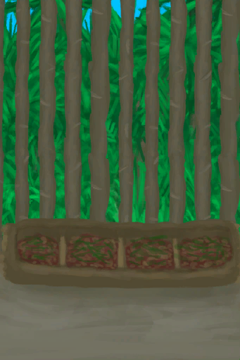

# Boar Feeder  
> A device to feed boars with minimal work.  
  
<table class="table table-bordered" data-toggle="table"  data-show-header="false"><thead style="display:none"><tr ><th  style="width:50%;text-align:left;vertical-align:top;"  >title</th><th  style="width:50%;text-align:left;vertical-align:top;"  ></th></tr></thead><tr ><td  style="width:50%;text-align:left;vertical-align:top;"  >**Weight：**1000</td><td  style="width:50%;text-align:left;vertical-align:top;"  >

<a href="BoarFeederEmpty.md" style="color:black">Boar Feeder</a>

</td></tr></tbody></table>  
  
## Got From  

Transform

[Boar Feeder](BoarFeeder.md)

Craft BluePrint

[Boar Feeder(BluePrint)](Bp_BoarFeeder.md)

  
  
## Action  

<table><tr><td rowspan="2" style="width:200px;text-align:center;font-size:1.3em;font-weight:bold">

Dismantle

2h

</td><td>[“HandAction(Group)”](HandAction.md)</td></tr><tr><td><b>Self：</b>→Dismiss</td></tr><tr><td colspan="2">[

[Wood](Wood.md)](Wood.md)(<b>+6</b>), [

[Fiber Cord](CordFiber.md)](CordFiber.md)(<b>+4</b>)</td></tr></table>
  
  
  
## Drag With  

<table style="margin-bottom:0px;"><tr><td style="width:40%;text-align:left; background-color:#FEFEFE"><b>With：</b>[

[Boar Feed](FeedBoar.md)](FeedBoar.md)</td><td style="width:40%;font-size:1em;font-weight:bold;background-color:#FEFEFE">Feed  </td></tr><tr style="background-color:#FFFFFF"><td style=""><b>Receiving：</b>→Dismiss</td><td style=""><b>Self：</b>→ [

[Boar Feeder](BoarFeeder.md)](BoarFeeder.md), 

  <b>+1344(16.67%)</b></td></tr></table>
  

<table style="margin-bottom:0px;"><tr><td style="width:40%;text-align:left; background-color:#FEFEFE"><b>With：</b>[“Poor Sugars”](tag_SugarsPoor.md) | [“Poor Proteins”](tag_ProteinsPoor.md) | [“Poor Processed”](tag_ProcessedPoor.md)</td><td style="width:40%;font-size:1em;font-weight:bold;background-color:#FEFEFE">Feed  </td></tr><tr style="background-color:#FFFFFF"><td style=""><b>Receiving：</b>→Dismiss</td><td style=""><b>Self：</b>→ [

[Boar Feeder](BoarFeeder.md)](BoarFeeder.md), 

  <b>+48(0.6%)</b></td></tr></table>
  

<table style="margin-bottom:0px;"><tr><td style="width:40%;text-align:left; background-color:#FEFEFE"><b>With：</b>[“Rich Sugars”](tag_SugarsRich.md) | [“Rich Proteins”](tag_ProteinsRich.md) | [“Rich Processed”](tag_ProcessedRich.md)</td><td style="width:40%;font-size:1em;font-weight:bold;background-color:#FEFEFE">Feed  </td></tr><tr style="background-color:#FFFFFF"><td style=""><b>Receiving：</b>→Dismiss</td><td style=""><b>Self：</b>→ [

[Boar Feeder](BoarFeeder.md)](BoarFeeder.md), 

  <b>+384(4.76%)</b></td></tr></table>
  

<table style="margin-bottom:0px;"><tr><td style="width:40%;text-align:left; background-color:#FEFEFE"><b>With：</b>[“Medium Sugars”](tag_SugarsMedium.md) | [“Medium Proteins”](tag_ProteinsMedium.md) | [“Medium Processed”](tag_ProcessedMedium.md)</td><td style="width:40%;font-size:1em;font-weight:bold;background-color:#FEFEFE">Feed  </td></tr><tr style="background-color:#FFFFFF"><td style=""><b>Receiving：</b>→Dismiss</td><td style=""><b>Self：</b>→ [

[Boar Feeder](BoarFeeder.md)](BoarFeeder.md), 

  <b>+192(2.38%)</b></td></tr></table>
  
  
## Durability   

<table style="margin-bottom:0px;"><tr><td style="width:30%;text-align:left; background-color:#FEFEFE;font-size:1.3em;font-weight:bold;">

</td><td style="font-size:1em;background-color:#FEFEFE">Starting：0 , Max：8064 -1/TP , Duration ：84d</td></tr><tr style="background-color:#FFFFFF"><td colspan=2></td></tr></table>
  

