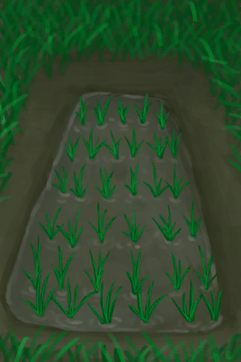

# Bonemeal  
> Useful as fertilizer.  
  
<table class="table table-bordered" data-toggle="table"  data-show-header="false"><thead style="display:none"><tr ><th  style="width:50%;text-align:left;vertical-align:top;"  >title</th><th  style="width:50%;text-align:left;vertical-align:top;"  ></th></tr></thead><tr ><td  style="width:50%;text-align:left;vertical-align:top;"  >**Weight：**75  **Tag：**	[“Weak Fertilizer”](tag_FertilizerWeak.md)</td><td  style="width:50%;text-align:left;vertical-align:top;"  >

<a href="Bonemeal.md" style="color:black">Bonemeal</a>

Created by grinding <b>Bone Splinters</b>.  It can be used as a cheap <b>Fertilizer</b> for crops.</td></tr></tbody></table>  
  
## Got From  

** With：**[“Hammer”](tag_Hammer.md)Ground

[Bone Splinters](BoneSplinters.md)

  
  
## Drag To  

[Compost Bin](CompostBin.md)

[Almond Tree Crop Plot](CropPlotAlmondTree.md)

[Aloe Vera Crop Plot](CropPlotAloeVera.md)

[Banana Crop Plot](CropPlotBananaTree.md)

[Chili Crop Plot](CropPlotChilies.md)

[China Rose Crop Plot](CropPlotChinaRose.md)

[Cinchona Crop Plot](CropPlotCinchonaTree.md)

[Coffee Crop Plot](CropPlotCoffee.md)

[Dry Crop Plot](CropPlotDry.md)

[Empty Crop Plot(Empty)](CropPlotEmpty.md)

[Ginger Crop Plot](CropPlotGinger.md)

[Jasmine Crop Plot](CropPlotJasmine.md)

[Kava Crop Plot](CropPlotKava.md)

[Lemon Grass Crop Plot](CropPlotLemonGrass.md)

[Mango Crop Plot](CropPlotMangoTree.md)

[Nipa Palm Crop Plot](CropPlotNipaPalm.md)

[Palm Bush Crop Plot](CropPlotPalmBush.md)

[Palm Tree Crop Plot](CropPlotPalmTree.md)

[Rice Crop Plot](CropPlotRice.md)

[Ruined Crop Plot](CropPlotRuined.md)

[Sago Palm Crop Plot](CropPlotSagoPalm.md)

[Snake Grass Crop Plot](CropPlotSnakeGrass.md)

[Spider Lily Crop Plot](CropPlotSpiderLily.md)

[Weevil Lily Crop Plot](CropPlotWeevilLily.md)

[Wild Jujube Crop Plot](CropPlotWildJujube.md)

[Yam Crop Plot](CropPlotYam.md)

[Assorted Mushrooms Bed](MushroomBedAssorted.md)

[Dry Mushroom Bed](MushroomBedDry.md)

[Empty Mushroom Bed(Empty)](MushroomBedEmpty.md)

[Magic Mushroom Bed](MushroomBedMagic.md)

[Puffball Bed](MushroomBedPuffballs.md)

  
  
## Use In BluePrint  

<a href="Bp_CropPlot.md" style="color:black">Crop Plot</a>

<a href="Bp_RicePaddy.md" style="color:black">Rice Paddy</a>

  
  
  

