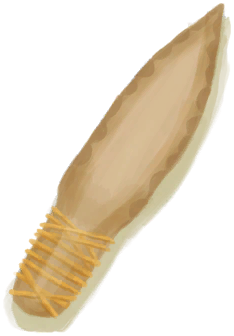

# Bones  
> "Creepy  
  
<table class="table table-bordered" data-toggle="table"  data-show-header="false"><thead style="display:none"><tr ><th  style="width:50%;text-align:left;vertical-align:top;"  >title</th><th  style="width:50%;text-align:left;vertical-align:top;"  ></th></tr></thead><tr ><td  style="width:50%;text-align:left;vertical-align:top;"  >**Environment：**[Macaque Den(Environment)](Env_MacaqueDen.md)  **Weight：**150</td><td  style="width:50%;text-align:left;vertical-align:top;"  >

<a href="Bones.md" style="color:black">Bones</a>

"Bones can be harvested from the carcasses of animals or sometimes found in the gastric pellets of monitor lizards.  Large bones can be used for certain crafts or broken into <b>Splinters</b></td></tr></tbody></table>  
  
## Got From  

Transform

[Boar Carcass](BoarCarcass.md)

Transform

[Piglet Carcass](BoarCarcassPiglet.md)

Transform

[Skinned Boar](BoarSkinned.md)

Transform

[Skinned Piglet](BoarSkinnedPiglet.md)

Transform

[Goat Carcass](GoatCarcassFemale.md)

Transform

[Juvenile Goat Carcass](GoatCarcassKid.md)

Transform

[Goat Carcass](GoatCarcassMale.md)

Transform

[Skinned Goat](GoatSkinned.md)

Transform

[Skinned Kid](GoatSkinnedKid.md)

** With：**[Obsidian Knife](KnifeObsidian.md)Butcher

[Macaque Carcass](MacaqueCarcass.md)

** With：**[“Cutter”](tag_Cutter.md)Butcher

[Macaque Carcass](MacaqueCarcass.md)

Harvest

[Gastric Pellet](GastricPellet.md)

Transform

[Lizard Carcass](MonitorCarcass.md)

Transform

[Skinned Lizard](MonitorSkinned.md)

Harvest

[Skeleton(Hole)](Skeleton.md)

  
  
## Drag With  

<table style="margin-bottom:0px;"><tr><td style="width:40%;text-align:left; background-color:#FEFEFE"><b>With：</b>[“Hammer”](tag_Hammer.md)</td><td style="width:40%;font-size:1em;font-weight:bold;background-color:#FEFEFE">Break (30m) [“HandAction(Group)”](HandAction.md)</td></tr><tr style="background-color:#FFFFFF"><td style=""><b>Receiving：</b></td><td style=""><b>Self：</b>→Dismiss</td></tr><tr><td colspan="2">[

[Bone Splinters](BoneSplinters.md)](BoneSplinters.md)(<b>+2</b>)</td></tr></table>
  
  
## Drag To  

[Dog Friend](DogFriend.md)

  
  
## Use In BluePrint  

<a href="Bp_BoneKnife.md" style="color:black">Bone Knife</a>

<a href="Bp_Drum.md" style="color:black">Drum</a>

<a href="Bp_FluteBone.md" style="color:black">Bone Flute</a>

<a href="Bp_Harpoon.md" style="color:black">Harpoon</a>

<a href="Bp_BoneBroth.md" style="color:black">Bone Broth</a>

  
  
  

