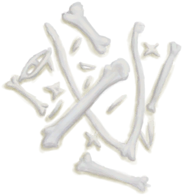
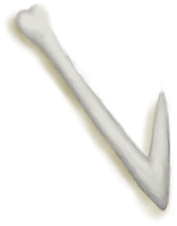
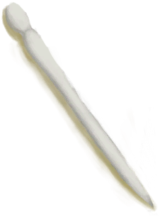

# Bird Bones  
> Useful to craft hooks or needles.  
  
<table class="table table-bordered" data-toggle="table"  data-show-header="false"><thead style="display:none"><tr ><th  style="width:50%;text-align:left;vertical-align:top;"  >title</th><th  style="width:50%;text-align:left;vertical-align:top;"  ></th></tr></thead><tr ><td  style="width:50%;text-align:left;vertical-align:top;"  >**Environment：**[Macaque Den(Environment)](Env_MacaqueDen.md)  **Weight：**25</td><td  style="width:50%;text-align:left;vertical-align:top;"  >

<a href="BonesBird.md" style="color:black">Bird Bones</a>

"Bones can be harvested from the carcasses of animals or sometimes found in the gastric pellets of monitor lizards.  Large bones can be used for certain crafts or broken into <b>Splinters</b></td></tr></tbody></table>  
  
## Got From  

Continue

[A partridge nest!(Event)](Event_PartridgeNest.md)

Continue

[You made it!(Event)](Event_SeagullNest.md)

Transform

[Seagull Charm](SeagullCharm.md)

Harvest

[Partridge Carcass](PartridgeCarcass.md)

** With：**[Obsidian Knife](KnifeObsidian.md)Cut Open

[Dead Partridge](PartridgeDead.md)

** With：**[“Cutter”](tag_Cutter.md)Cut Open

[Dead Partridge](PartridgeDead.md)

** With：**[“Cutter”](tag_Cutter.md)Cut Open

[Partridge](PartridgeFemaleEnclosure.md)

** With：**[“Cutter”](tag_Cutter.md)Cut Open

[Partridge](PartridgeFemaleLive.md)

** With：**[“Cutter”](tag_Cutter.md)Cut Open

[Male Partridge](PartridgeMaleEnclosure.md)

** With：**[“Cutter”](tag_Cutter.md)Cut Open

[Male Partridge](PartridgeMaleLive.md)

Harvest

[Seagull Carcass](SeagullCarcass.md)

** With：**[Obsidian Knife](KnifeObsidian.md)Cut Open

[Dead Seagull](SeagullDead.md)

** With：**[“Cutter”](tag_Cutter.md)Cut Open

[Dead Seagull](SeagullDead.md)

  
  
## Action  

<table><tr><td rowspan="2" style="width:200px;text-align:center;font-size:1.3em;font-weight:bold">

Craft Hook

15m

</td><td>[“HandAction(Group)”](HandAction.md)</td></tr><tr><td><b>Self：</b>→ [

[Bone Hook](HookBone.md)](HookBone.md)</td></tr><tr><td colspan="2"><b>Require：</b>[

[Light](Light.md)](Light.md): <b>10-100</b></td></tr><tr><td colspan="2"><b>StatChange：</b>[

[Crafting(Skill)](Skill_Crafting.md)](Skill_Crafting.md)<b>+0.5</b></td></tr></table>
  

<table><tr><td rowspan="2" style="width:200px;text-align:center;font-size:1.3em;font-weight:bold">

Craft Needle

15m

</td><td>[“HandAction(Group)”](HandAction.md)</td></tr><tr><td><b>Self：</b>→ [

[Bone Needle](BoneNeedle.md)](BoneNeedle.md)</td></tr><tr><td colspan="2"><b>Require：</b>[

[Light](Light.md)](Light.md): <b>10-100</b></td></tr><tr><td colspan="2"><b>StatChange：</b>[

[Crafting(Skill)](Skill_Crafting.md)](Skill_Crafting.md)<b>+0.5</b></td></tr></table>
  
  
  
## Use In BluePrint  

<a href="Bp_SeagullCharm.md" style="color:black">Seagull Charm</a>

  
  
  

