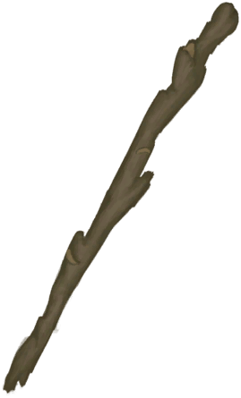

# Rustic Bow  
> "A rustic  
  
<table class="table table-bordered" data-toggle="table"  data-show-header="false"><thead style="display:none"><tr ><th  style="width:50%;text-align:left;vertical-align:top;"  >title</th><th  style="width:50%;text-align:left;vertical-align:top;"  ></th></tr></thead><tr ><td  style="width:50%;text-align:left;vertical-align:top;"  >** Cannot Be Trashed **  ** 装备时等效于拿在手上 **  **Weight：**250  **装备时减重：**-150  **Tag：**	[“Large”](tag_Large.md)  **Equipped Cards：**[“Back Item”](eTag_Backpack.md)  **Usage：**75</td><td  style="width:50%;text-align:left;vertical-align:top;"  >

<a href="BowRustic.md" style="color:black">Rustic Bow</a>

"Archery is the skill required for using <b>Bows and Arrows</b> successfully. Hunting with ranged weapons like this is <b>safer</b> than going with a Spear but it does require a bit more skill to make it effective. In addition to this</td></tr></tbody></table>  
  
## Got From  

Craft BluePrint

[Bow(BluePrint)](Bp_Bow.md)

Transform

[Loaded Rustic Bow](BowRustic_Copper.md)(未实装)

Transform

[Loaded Rustic Bow](BowRustic_Simple.md)(未实装)

  
  
## Action  

<table><tr><td rowspan="2" style="width:200px;text-align:center;font-size:1.3em;font-weight:bold">

Train

1h

</td><td>[“HandAction(Group)”](HandAction.md)</td></tr><tr><td><b>Self：</b>Usage  <b>-1(-1.33%)</b></td></tr><tr><td colspan="2"><b>Require：</b>[Hand Modifier](ModifierHand.md): <b>0-2</b>, [

[Light](Light.md)](Light.md): <b>10-100</b>, [

[Simple Arrow](ArrowSimple.md)](ArrowSimple.md) On Hand</td></tr><tr><td colspan="2"><b>CardChanges：</b>手牌中的一个[Simple Arrow](ArrowSimple.md)Usage  <b>-1</b></td></tr><tr><td colspan="2"><b>StatChange：</b>[

[Archery(Skill)](Skill_Archery.md)](Skill_Archery.md)<b>+1</b></td></tr></table>
  

<table><tr><td rowspan="2" style="width:200px;text-align:center;font-size:1.3em;font-weight:bold">

Dismantle

30m

</td><td></td></tr><tr><td><b>Self：</b>→Dismiss</td></tr><tr><td colspan="2">[

[Long Stick](StickLong.md)](StickLong.md)(<b>+1</b>), [

[Fiber Cord](CordFiber.md)](CordFiber.md)(<b>+2</b>)</td></tr></table>
  
  
  
## Durability   

<table style="margin-bottom:0px;"><tr><td style="width:30%;text-align:left; background-color:#FEFEFE;font-size:1.3em;font-weight:bold;">Usage</td><td style="font-size:1em;background-color:#FEFEFE">Starting：75 , Max：75 -</td></tr><tr style="background-color:#FFFFFF"><td colspan=2>** On Zero： ** Self: →Dismiss [

[Sticks](Sticks.md)](Sticks.md)(<b>+1</b>), [

[Fiber Cord](CordFiber.md)](CordFiber.md)(<b>+2</b>)</td></tr></table>
  

