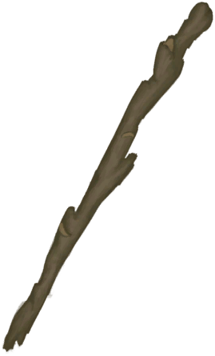
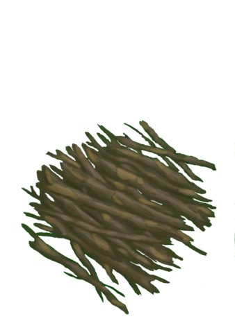

# Loaded Rustic Bow(未实装)  
> "A rustic  
  
<table class="table table-bordered" data-toggle="table"  data-show-header="false"><thead style="display:none"><tr ><th  style="width:50%;text-align:left;vertical-align:top;"  >title</th><th  style="width:50%;text-align:left;vertical-align:top;"  ></th></tr></thead><tr ><td  style="width:50%;text-align:left;vertical-align:top;"  >** Cannot Be Trashed **  **Tag：**	[“Large”](tag_Large.md)  **Usage：**75</td><td  style="width:50%;text-align:left;vertical-align:top;"  >

<a href="BowRustic_Copper.md" style="color:black">Loaded Rustic Bow</a>

</td></tr></tbody></table>  
  
## Action  

<table><tr><td rowspan="2" style="width:200px;text-align:center;font-size:1.3em;font-weight:bold">

Practice

1h

</td><td></td></tr><tr><td><b>Self：</b>Usage  <b>-8(-10.67%)</b>, Fuel  <b>-1(-100%)</b></td></tr><tr><td colspan="2"><b>StatChange：</b>[

[Archery(Skill)](Skill_Archery.md)](Skill_Archery.md)<b>+1</b></td></tr></table>
  
  
  
## Durability   

<table style="margin-bottom:0px;"><tr><td style="width:30%;text-align:left; background-color:#FEFEFE;font-size:1.3em;font-weight:bold;">Usage</td><td style="font-size:1em;background-color:#FEFEFE">Starting：75 , Max：75 -</td></tr><tr style="background-color:#FFFFFF"><td colspan=2>** On Zero： ** Self: →Dismiss [

[Sticks](Sticks.md)](Sticks.md)(<b>+1</b>)</td></tr></table>
  

<table style="margin-bottom:0px;"><tr><td style="width:30%;text-align:left; background-color:#FEFEFE;font-size:1.3em;font-weight:bold;">Fuel</td><td style="font-size:1em;background-color:#FEFEFE">Starting：1 , Max：1 -</td></tr><tr style="background-color:#FFFFFF"><td colspan=2>** On Zero： ** Self: → [

[Rustic Bow](BowRustic.md)](BowRustic.md) [Copper Arrow](ArrowCopper.md)(<b>+1</b>)</td></tr></table>
  

