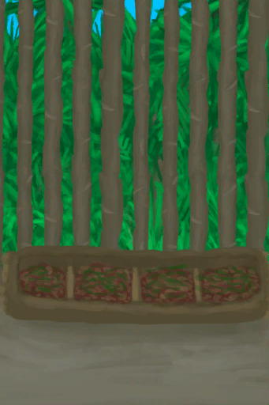
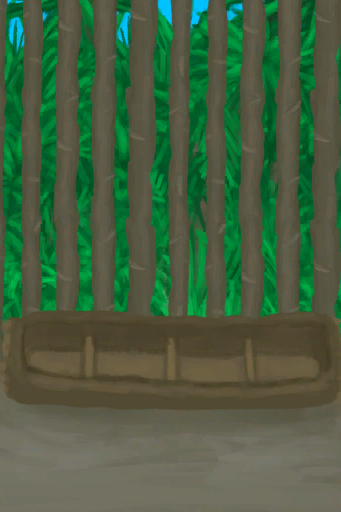

# Boar Feeder  
> A device to feed boars with minimal work.  
  
<table class="table table-bordered" data-toggle="table"  data-show-header="false"><thead style="display:none"><tr ><th  style="width:50%;text-align:left;vertical-align:top;"  >title</th><th  style="width:50%;text-align:left;vertical-align:top;"  ></th></tr></thead><tr ><td  style="width:50%;text-align:left;vertical-align:top;"  >** Unlock Require: ** [Sow](BoarEnclosureFemale.md) [Boar](BoarEnclosureMale.md)  ** ResearchTime: ** 12h  ** Action Tag: ** [“HandAction(Group)”](HandAction.md)  ** Blueprint Condition: ** In [

[Enclosure(Environment)](Env_Enclosure.md)](Env_Enclosure.md) ~~[

[Boar Feeder](BoarFeeder.md)](BoarFeeder.md) On Hand/Board~~ ~~[

[Boar Feeder(Empty)](BoarFeederEmpty.md)](BoarFeederEmpty.md) On Hand/Board~~ ~~[

[Boar Feeder(BluePrint)](Bp_BoarFeeder.md)](Bp_BoarFeeder.md) On Hand/Board~~</td><td  style="width:50%;text-align:left;vertical-align:top;"  >

<a href="Bp_BoarFeeder.md" style="color:black">Boar Feeder</a>

</td></tr></tbody></table>  
  
## Craft  

<table><tr><td style="width:100px;"><b>Total：</b></td><td>[

[Log](Log.md)](Log.md) x 1 , [“Axe(Group)”](GpTag_Axe.md) x 1(Usage-8) , [

[Sticks](Sticks.md)](Sticks.md) x 3</td></tr><tr><td><b>TimeCost：</b></td><td>2h/Stage , Total：4h</td></tr><tr><td><b>Require：</b></td><td>[

[Light](Light.md)](Light.md): <b>10-100</b></td></tr><tr><td><b>StatChange：</b></td><td>[

[Crafting(Skill)](Skill_Crafting.md)](Skill_Crafting.md)<b>+1</b>, [

[Woodworking(Skill)](Skill_Woodworking.md)](Skill_Woodworking.md)<b>+2</b>, [

[Stress](Stress.md)](Stress.md)<b>-10</b>, [

[Morale](Morale.md)](Morale.md)<b>+5</b></td></tr><tr><td colspan=2><b>Stage：</b></td></tr><tr><td style="text-align:right"><b>1.</b></td><td>[

[Log](Log.md)](Log.md) x 1 + [“Axe(Group)”](GpTag_Axe.md) x 1(Usage-4)</td></tr><tr><td style="text-align:right"><b>2.</b></td><td>[“Axe(Group)”](GpTag_Axe.md) x 1(Usage-4) + [

[Sticks](Sticks.md)](Sticks.md) x 3</td></tr><tr style="background-color:#fff;font-size:1.2em;"><td></td><td style="text-align:right"><b>Production：</b>[

[Boar Feeder(Empty)](BoarFeederEmpty.md)](BoarFeederEmpty.md)(<b>+1</b>)</td></tr></table>
  
  

