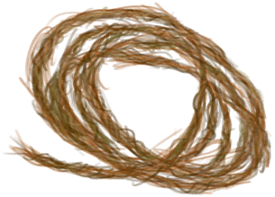

# Copper Jar  
  
<table class="table table-bordered" data-toggle="table"  data-show-header="false"><thead style="display:none"><tr ><th  style="width:50%;text-align:left;vertical-align:top;"  >title</th><th  style="width:50%;text-align:left;vertical-align:top;"  ></th></tr></thead><tr ><td  style="width:50%;text-align:left;vertical-align:top;"  >** Unlock Require: ** [Copper Sheet](CopperSheet.md)  ** ResearchTime: ** 18h  ** Action Tag: ** [“HandAction(Group)”](HandAction.md) [“CraftAction(Group)”](CraftAction.md)</td><td  style="width:50%;text-align:left;vertical-align:top;"  >

<a href="Bp_CopperJar.md" style="color:black">Copper Jar</a>

</td></tr></tbody></table>  
  
## Craft  

<table><tr><td style="width:100px;"><b>Total：</b></td><td>[

[Copper Sheet](CopperSheet.md)](CopperSheet.md) x 2 , [“Hammering Tool(Group)”](GpTag_Hammer.md) x 1(Usage-1) , [

[Fiber Cord](CordFiber.md)](CordFiber.md) x 2</td></tr><tr><td><b>TimeCost：</b></td><td>2h</td></tr><tr><td><b>Require：</b></td><td>[

[Light](Light.md)](Light.md): <b>10-100</b></td></tr><tr><td><b>StatChange：</b></td><td>[

[Metalworking(Skill)](Skill_Metalworking.md)](Skill_Metalworking.md)<b>+1</b>, [

[Stress](Stress.md)](Stress.md)<b>-10</b>, [

[Morale](Morale.md)](Morale.md)<b>+10</b></td></tr><tr><td colspan=2><b>Stage：</b></td></tr><tr><td style="text-align:right"><b>1.</b></td><td>[

[Copper Sheet](CopperSheet.md)](CopperSheet.md) x 2 + [“Hammering Tool(Group)”](GpTag_Hammer.md) x 1(Usage-1) + [

[Fiber Cord](CordFiber.md)](CordFiber.md) x 2</td></tr><tr style="background-color:#fff;font-size:1.2em;"><td></td><td style="text-align:right"><b>Production：</b>[

[Copper Jar](CopperJar.md)](CopperJar.md)(<b>+1</b>)</td></tr></table>
  
  

