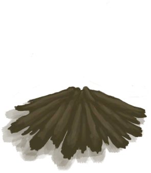

# Fire  
> A simple temprorary fire to provide me with warmth and light.  
  
<table class="table table-bordered" data-toggle="table"  data-show-header="false"><thead style="display:none"><tr ><th  style="width:50%;text-align:left;vertical-align:top;"  >title</th><th  style="width:50%;text-align:left;vertical-align:top;"  ></th></tr></thead><tr ><td  style="width:50%;text-align:left;vertical-align:top;"  >** Unlock By: ** [Counter](Counter.md): <b>0-9000</b>  ** Action Tag: ** [“HandAction(Group)”](HandAction.md)  ** Blueprint Condition: ** ~~In [

[Raft(Environment)](Env_Raft.md)](Env_Raft.md)~~</td><td  style="width:50%;text-align:left;vertical-align:top;"  >

<a href="Bp_Fire.md" style="color:black">Fire</a>

</td></tr></tbody></table>  
  
## Craft  

<table><tr><td style="width:100px;"><b>Total：</b></td><td>[

[Wood](Wood.md)](Wood.md) x 1 , [

[Sticks](Sticks.md)](Sticks.md) x 1</td></tr><tr><td><b>TimeCost：</b></td><td>15m</td></tr><tr><td><b>StatChange：</b></td><td>[

[Crafting(Skill)](Skill_Crafting.md)](Skill_Crafting.md)<b>+0.5</b>, [

[Stress](Stress.md)](Stress.md)<b>-5</b></td></tr><tr><td colspan=2><b>Stage：</b></td></tr><tr><td style="text-align:right"><b>1.</b></td><td>[

[Wood](Wood.md)](Wood.md) x 1 + [

[Sticks](Sticks.md)](Sticks.md) x 1</td></tr><tr style="background-color:#fff;font-size:1.2em;"><td></td><td style="text-align:right"><b>Production：</b>[

[Fire(Off)](FireExtinguished.md)](FireExtinguished.md)(<b>+1</b>)</td></tr></table>
  
  

