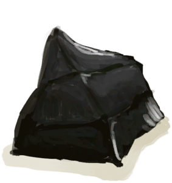

# Flint Axe  
> An axe made with flint.  
  
<table class="table table-bordered" data-toggle="table"  data-show-header="false"><thead style="display:none"><tr ><th  style="width:50%;text-align:left;vertical-align:top;"  >title</th><th  style="width:50%;text-align:left;vertical-align:top;"  ></th></tr></thead><tr ><td  style="width:50%;text-align:left;vertical-align:top;"  >** Unlock By: ** [

[Knapping(Skill)](Skill_Knapping.md)](Skill_Knapping.md): <b>30-150</b>  ** ResearchTime: ** 12h  ** Action Tag: ** [“HandAction(Group)”](HandAction.md) [“CraftAction(Group)”](CraftAction.md)</td><td  style="width:50%;text-align:left;vertical-align:top;"  >

<a href="Bp_FlintAxe.md" style="color:black">Flint Axe</a>

</td></tr></tbody></table>  
  
## Got From  

Perk Effect

[Knapper](Pk_5_Knapper.md)

  
  
## Craft  

<table><tr><td style="width:100px;"><b>Total：</b></td><td>[

[Wood](Wood.md)](Wood.md) x 1 , [“Cutting Tool(Group)”](GpTag_Cutter.md) x 1(Usage-5) , [

[Flint Slab](FlintSlab.md)](FlintSlab.md) x 1 , [

[Fiber Cord](CordFiber.md)](CordFiber.md) x 2 , [

[Stone](Stone.md)](Stone.md) x 1(Usage-1)</td></tr><tr><td><b>TimeCost：</b></td><td>1h30m/Stage , Total：3h</td></tr><tr><td><b>Require：</b></td><td>[

[Light](Light.md)](Light.md): <b>10-100</b></td></tr><tr><td><b>StatChange：</b></td><td>[

[Knapping(Skill)](Skill_Knapping.md)](Skill_Knapping.md)<b>+4</b>, [

[Stress](Stress.md)](Stress.md)<b>-10</b>, [

[Morale](Morale.md)](Morale.md)<b>+5</b></td></tr><tr><td colspan=2><b>Stage：</b></td></tr><tr><td style="text-align:right"><b>1.</b></td><td>[

[Wood](Wood.md)](Wood.md) x 1 + [“Cutting Tool(Group)”](GpTag_Cutter.md) x 1(Usage-5)</td></tr><tr><td style="text-align:right"><b>2.</b></td><td>[

[Flint Slab](FlintSlab.md)](FlintSlab.md) x 1 + [

[Fiber Cord](CordFiber.md)](CordFiber.md) x 2 + [

[Stone](Stone.md)](Stone.md) x 1(Usage-1)</td></tr><tr style="background-color:#fff;font-size:1.2em;"><td></td><td style="text-align:right"><b>Production：</b>[

[Flint Axe](AxeFlint.md)](AxeFlint.md)(<b>+1</b>)</td></tr></table>
  
  

