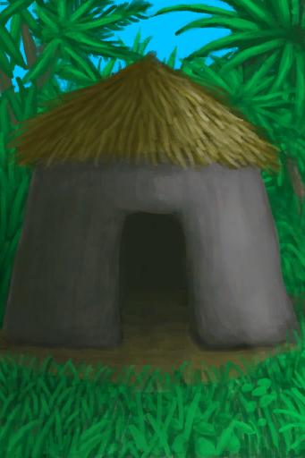
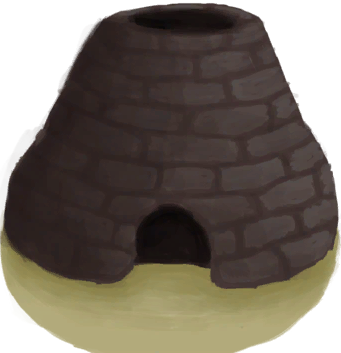
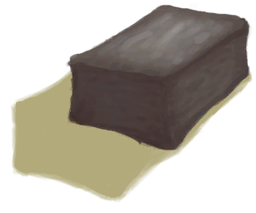

# Mud Hut  
> A place to call home. It should protect me from bugs and the weather.  
  
<table class="table table-bordered" data-toggle="table"  data-show-header="false"><thead style="display:none"><tr ><th  style="width:50%;text-align:left;vertical-align:top;"  >title</th><th  style="width:50%;text-align:left;vertical-align:top;"  ></th></tr></thead><tr ><td  style="width:50%;text-align:left;vertical-align:top;"  >** Unlock Require: ** [Log](Log.md)  ** ResearchTime: ** 2d  ** Action Tag: ** [“HandAction(Group)”](HandAction.md)  ** Blueprint Condition: ** ~~In [

[Raft(Environment)](Env_Raft.md)](Env_Raft.md)~~ ~~In [

[Enclosure(Environment)](Env_Enclosure.md)](Env_Enclosure.md)~~ ~~In [

[Rocks(Environment)](Env_Rocks.md)](Env_Rocks.md)~~ ~~In [Cave(Environment)](Env_CaveSea.md)~~ ~~In [

[Mud Hut(Environment)](Env_MudHut.md)](Env_MudHut.md)~~  ** Blueprint Condition: ** [

[Sheltered](Sheltered.md)](Sheltered.md): <b>0-0</b></td><td  style="width:50%;text-align:left;vertical-align:top;"  >

<a href="Bp_MudHut.md" style="color:black">Mud Hut</a>

</td></tr></tbody></table>  
  
## Craft  

<table><tr><td style="width:100px;"><b>Total：</b></td><td>[

[Log](Log.md)](Log.md) x 5 , [

[Long Stick](StickLong.md)](StickLong.md) x 17 , [

[Fiber Cord](CordFiber.md)](CordFiber.md) x 22 , [

[Mud Brick](MudBrick.md)](MudBrick.md) x 28 , [

[Sticks](Sticks.md)](Sticks.md) x 35 , [

[Palm Fronds](PalmFronds.md)](PalmFronds.md) x 60</td></tr><tr><td><b>TimeCost：</b></td><td>1h30m/Stage , Total：13h30m</td></tr><tr><td><b>Require：</b></td><td>[

[Light](Light.md)](Light.md): <b>10-100</b></td></tr><tr><td><b>StatChange：</b></td><td>[

[Crafting(Skill)](Skill_Crafting.md)](Skill_Crafting.md)<b>+10</b>, [

[Stress](Stress.md)](Stress.md)<b>-10</b>, [

[Morale](Morale.md)](Morale.md)<b>+50</b>, [

[Determination](Determination.md)](Determination.md)<b>+250</b></td></tr><tr><td colspan=2><b>Stage：</b></td></tr><tr><td style="text-align:right"><b>1.</b></td><td>[

[Log](Log.md)](Log.md) x 5 + [

[Long Stick](StickLong.md)](StickLong.md) x 5</td></tr><tr><td style="text-align:right"><b>2.</b></td><td>[

[Long Stick](StickLong.md)](StickLong.md) x 8 + [

[Fiber Cord](CordFiber.md)](CordFiber.md) x 8</td></tr><tr><td style="text-align:right"><b>3.</b></td><td>[

[Mud Brick](MudBrick.md)](MudBrick.md) x 8 + [

[Sticks](Sticks.md)](Sticks.md) x 10</td></tr><tr><td style="text-align:right"><b>4.</b></td><td>[

[Mud Brick](MudBrick.md)](MudBrick.md) x 8 + [

[Sticks](Sticks.md)](Sticks.md) x 10</td></tr><tr><td style="text-align:right"><b>5.</b></td><td>[

[Mud Brick](MudBrick.md)](MudBrick.md) x 8 + [

[Sticks](Sticks.md)](Sticks.md) x 10</td></tr><tr><td style="text-align:right"><b>6.</b></td><td>[

[Mud Brick](MudBrick.md)](MudBrick.md) x 4 + [

[Sticks](Sticks.md)](Sticks.md) x 5</td></tr><tr><td style="text-align:right"><b>7.</b></td><td>[

[Long Stick](StickLong.md)](StickLong.md) x 4 + [

[Fiber Cord](CordFiber.md)](CordFiber.md) x 5</td></tr><tr><td style="text-align:right"><b>8.</b></td><td>[

[Palm Fronds](PalmFronds.md)](PalmFronds.md) x 30 + [

[Fiber Cord](CordFiber.md)](CordFiber.md) x 6</td></tr><tr><td style="text-align:right"><b>9.</b></td><td>[

[Palm Fronds](PalmFronds.md)](PalmFronds.md) x 30 + [

[Fiber Cord](CordFiber.md)](CordFiber.md) x 3</td></tr><tr style="background-color:#fff;font-size:1.2em;"><td></td><td style="text-align:right"><b>Production：</b>[

[Mud Hut](MudHutEntrance.md)](MudHutEntrance.md)(<b>+1</b>)</td></tr></table>
  
  

