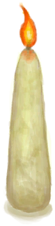

# Bug Population  
> The amount of bugs (including mosquitoes) that can be found in a given area.  
> "The amount of bugs (including mosquitoes) that can be found in a given area. Generally speaking  
  

<b>Base Value: </b> 0 
  

<b>Value Range: </b> 0 ~ 5 
  

<b>Base Rate: </b> - 
  
## Statuses  

<table><tr style="height:2em;"><td style="background-color:#F0F0F0;text-align:center;width:180px;font-size:1.4em;font-weight:bold;vertical-align:middle;">
1

20%
</td><td colspan=2 style="font-size:1.1em;vertical-align:middle;background-color:#F9F9F9;">
<b>

Moderate Bug Population</b>

</td></tr><tr><td colspan=2><b>Effect：</b>[

[Bug Damage](BugDamage.md)](BugDamage.md)<b>+1</b></td></tr><tr><td colspan=2></td></tr><tr style="height:2em;"><td style="background-color:#F0F0F0;text-align:center;width:180px;font-size:1.4em;font-weight:bold;vertical-align:middle;">
2 ～ 3

40% ～ 60%
</td><td colspan=2 style="font-size:1.1em;vertical-align:middle;background-color:#F9F9F9;">
<b>

High Bug Population</b>

</td></tr><tr><td colspan=2><b>Effect：</b>[

[Bug Damage](BugDamage.md)](BugDamage.md)<b>+2</b></td></tr><tr><td colspan=2></td></tr><tr style="height:2em;"><td style="background-color:#F0F0F0;text-align:center;width:180px;font-size:1.4em;font-weight:bold;vertical-align:middle;">
4

80%
</td><td colspan=2 style="font-size:1.1em;vertical-align:middle;background-color:#F9F9F9;">
<b>

Very High Bug Population</b>

</td></tr><tr><td colspan=2><b>Effect：</b>[

[Bug Damage](BugDamage.md)](BugDamage.md)<b>+4</b></td></tr><tr><td colspan=2></td></tr><tr style="height:2em;"><td style="background-color:#F0F0F0;text-align:center;width:180px;font-size:1.4em;font-weight:bold;vertical-align:middle;">
5

100%
</td><td colspan=2 style="font-size:1.1em;vertical-align:middle;background-color:#F9F9F9;">
<b>

Extreme Bug Population</b>

</td></tr><tr><td colspan=2><b>Effect：</b>[

[Bug Damage](BugDamage.md)](BugDamage.md)<b>+5</b></td></tr><tr><td colspan=2></td></tr></table>
  
## Related Cards  
[Mud Protection](MudProtection.md)  |  [Rain Value](RainValue.md)  |  [Sun Screen](SunScreenApplied.md)  
## Addition Change By  
<table class="table table-bordered" data-toggle="table"  ><thead style=""><tr ><th  style="text-align:left;vertical-align:top;"  >From</th><th  style="text-align:left;vertical-align:top;"  >Operation</th><th  style="text-align:left;vertical-align:top;"  >Value</th></tr></thead><tr ><td  style="text-align:left;vertical-align:top;"  >[Crashed Plane(Environment)](Env_CrashedPlane.md)</td><td  style="text-align:left;vertical-align:top;"  >Passive Effects</td><td  style="text-align:left;vertical-align:top;"  >addition+0</td></tr></tbody></table>  
  
## Change By  
<table class="table table-bordered" data-toggle="table"  ><thead style=""><tr ><th  style="text-align:left;vertical-align:top;"  >From</th><th  style="text-align:left;vertical-align:top;"  >Operation</th><th  style="text-align:left;vertical-align:top;"  data-sortable="true"  >Value</th></tr></thead><tr ><td  style="text-align:left;vertical-align:top;"  >[

[Dark Cave(Environment)](Env_CaveDark.md)](Env_CaveDark.md)</td><td  style="text-align:left;vertical-align:top;"  >Passive Effects</td><td  style="text-align:left;vertical-align:top;"  >5</td></tr><tr ><td  style="text-align:left;vertical-align:top;"  >[

[Wetlands(Environment)](Env_Wetlands.md)](Env_Wetlands.md)</td><td  style="text-align:left;vertical-align:top;"  >Passive Effects</td><td  style="text-align:left;vertical-align:top;"  >4</td></tr><tr ><td  style="text-align:left;vertical-align:top;"  >[

[Damp Chamber(Environment)](Env_DampChamber.md)](Env_DampChamber.md)</td><td  style="text-align:left;vertical-align:top;"  >Passive Effects</td><td  style="text-align:left;vertical-align:top;"  >3</td></tr><tr ><td  style="text-align:left;vertical-align:top;"  >[

[Jungle(Environment)](Env_DeepJungle.md)](Env_DeepJungle.md)</td><td  style="text-align:left;vertical-align:top;"  >Passive Effects</td><td  style="text-align:left;vertical-align:top;"  >3</td></tr><tr ><td  style="text-align:left;vertical-align:top;"  >[

[Jungle(Environment)](Env_Jungle.md)](Env_Jungle.md)</td><td  style="text-align:left;vertical-align:top;"  >Passive Effects</td><td  style="text-align:left;vertical-align:top;"  >3</td></tr><tr ><td  style="text-align:left;vertical-align:top;"  >[

[Jungle Highlands(Environment)](Env_JungleHighlands.md)](Env_JungleHighlands.md)</td><td  style="text-align:left;vertical-align:top;"  >Passive Effects</td><td  style="text-align:left;vertical-align:top;"  >3</td></tr><tr ><td  style="text-align:left;vertical-align:top;"  >[

[Western Highlands(Environment)](Env_HighlandsWestern.md)](Env_HighlandsWestern.md)</td><td  style="text-align:left;vertical-align:top;"  >Passive Effects</td><td  style="text-align:left;vertical-align:top;"  >2</td></tr><tr ><td  style="text-align:left;vertical-align:top;"  >[

[Mangrove Forest(Environment)](Env_Mangroves.md)](Env_Mangroves.md)</td><td  style="text-align:left;vertical-align:top;"  >Passive Effects</td><td  style="text-align:left;vertical-align:top;"  >2</td></tr><tr ><td  style="text-align:left;vertical-align:top;"  >[

[Eastern Grasslands(Environment)](Env_GrasslandsE.md)](Env_GrasslandsE.md)</td><td  style="text-align:left;vertical-align:top;"  >Passive Effects</td><td  style="text-align:left;vertical-align:top;"  >1</td></tr><tr ><td  style="text-align:left;vertical-align:top;"  >[

[Western Grasslands(Environment)](Env_GrasslandsW.md)](Env_GrasslandsW.md)</td><td  style="text-align:left;vertical-align:top;"  >Passive Effects</td><td  style="text-align:left;vertical-align:top;"  >1</td></tr><tr ><td  style="text-align:left;vertical-align:top;"  >[

[Eastern Highlands(Environment)](Env_HighlandsEastern.md)](Env_HighlandsEastern.md)</td><td  style="text-align:left;vertical-align:top;"  >Passive Effects</td><td  style="text-align:left;vertical-align:top;"  >1</td></tr><tr ><td  style="text-align:left;vertical-align:top;"  >[

[Outskirts(Environment)](Env_Outskirts.md)](Env_Outskirts.md)</td><td  style="text-align:left;vertical-align:top;"  >Passive Effects</td><td  style="text-align:left;vertical-align:top;"  >1</td></tr><tr ><td  style="text-align:left;vertical-align:top;"  >[

[Secret Valley(Environment)](Env_SecretValley.md)](Env_SecretValley.md)</td><td  style="text-align:left;vertical-align:top;"  >Passive Effects</td><td  style="text-align:left;vertical-align:top;"  >1</td></tr><tr ><td  style="text-align:left;vertical-align:top;"  >[

[Dry Puddle(Wetlands)](Puddle.md)](Puddle.md)</td><td  style="text-align:left;vertical-align:top;"  >Passive</td><td  style="text-align:left;vertical-align:top;"  >1</td></tr><tr ><td  style="text-align:left;vertical-align:top;"  >[

[Rain Catcher](RainCatcher.md)](RainCatcher.md)</td><td  style="text-align:left;vertical-align:top;"  >Passive</td><td  style="text-align:left;vertical-align:top;"  >1</td></tr><tr ><td  style="text-align:left;vertical-align:top;"  >[

[Reservoir](WaterReservoir.md)](WaterReservoir.md)</td><td  style="text-align:left;vertical-align:top;"  >Passive</td><td  style="text-align:left;vertical-align:top;"  >1</td></tr><tr ><td  style="text-align:left;vertical-align:top;"  >[

[Reservoir(Full)](WaterReservoirFull.md)](WaterReservoirFull.md)</td><td  style="text-align:left;vertical-align:top;"  >Passive</td><td  style="text-align:left;vertical-align:top;"  >1</td></tr><tr ><td  style="text-align:left;vertical-align:top;"  >[

[Reservoir (irrigating)](WaterReservoirIrrigating.md)](WaterReservoirIrrigating.md)</td><td  style="text-align:left;vertical-align:top;"  >Passive</td><td  style="text-align:left;vertical-align:top;"  >1</td></tr><tr ><td  style="text-align:left;vertical-align:top;"  >[

[Tent](TentDeployed.md)](TentDeployed.md)</td><td  style="text-align:left;vertical-align:top;"  >Passive Effects</td><td  style="text-align:left;vertical-align:top;"  >-1</td></tr><tr ><td  style="text-align:left;vertical-align:top;"  >[

[Campfire](Campfire.md)](Campfire.md)</td><td  style="text-align:left;vertical-align:top;"  >Passive Effects</td><td  style="text-align:left;vertical-align:top;"  >-1</td></tr><tr ><td  style="text-align:left;vertical-align:top;"  >[

[Clay Fire Pit](ClayFirePit.md)](ClayFirePit.md)</td><td  style="text-align:left;vertical-align:top;"  >Passive Effects</td><td  style="text-align:left;vertical-align:top;"  >-1</td></tr><tr ><td  style="text-align:left;vertical-align:top;"  >[

[Fire](Fire.md)](Fire.md)</td><td  style="text-align:left;vertical-align:top;"  >Passive Effects</td><td  style="text-align:left;vertical-align:top;"  >-1</td></tr><tr ><td  style="text-align:left;vertical-align:top;"  >[

[Gas Cooker(On)](GasCookerOn.md)](GasCookerOn.md)</td><td  style="text-align:left;vertical-align:top;"  >Passive Effects</td><td  style="text-align:left;vertical-align:top;"  >-1</td></tr><tr ><td  style="text-align:left;vertical-align:top;"  >[

[Smoker](Smoker.md)](Smoker.md)</td><td  style="text-align:left;vertical-align:top;"  >Passive Effects</td><td  style="text-align:left;vertical-align:top;"  >-1</td></tr><tr ><td  style="text-align:left;vertical-align:top;"  >[

[Citronella Candle(On)](CandleCitronellaOn.md)](CandleCitronellaOn.md)</td><td  style="text-align:left;vertical-align:top;"  >Passive Effects</td><td  style="text-align:left;vertical-align:top;"  >-1</td></tr><tr ><td  style="text-align:left;vertical-align:top;"  >[

[Dry Puddle(Wetlands)](Puddle.md)](Puddle.md)</td><td  style="text-align:left;vertical-align:top;"  >Passive</td><td  style="text-align:left;vertical-align:top;"  >-1</td></tr><tr ><td  style="text-align:left;vertical-align:top;"  >[

[Reservoir](WaterReservoir.md)](WaterReservoir.md)</td><td  style="text-align:left;vertical-align:top;"  >Passive</td><td  style="text-align:left;vertical-align:top;"  >-1</td></tr><tr ><td  style="text-align:left;vertical-align:top;"  >[

[Reservoir(Full)](WaterReservoirFull.md)](WaterReservoirFull.md)</td><td  style="text-align:left;vertical-align:top;"  >Passive</td><td  style="text-align:left;vertical-align:top;"  >-1</td></tr><tr ><td  style="text-align:left;vertical-align:top;"  >[

[Reservoir (irrigating)](WaterReservoirIrrigating.md)](WaterReservoirIrrigating.md)</td><td  style="text-align:left;vertical-align:top;"  >Passive</td><td  style="text-align:left;vertical-align:top;"  >-1</td></tr><tr ><td  style="text-align:left;vertical-align:top;"  >[

[Heavy Rain](TropicalIsland_HeavyRain.md)](TropicalIsland_HeavyRain.md)</td><td  style="text-align:left;vertical-align:top;"  >Passive Effects</td><td  style="text-align:left;vertical-align:top;"  >-3</td></tr><tr ><td  style="text-align:left;vertical-align:top;"  >[

[Heavy Rain](TropicalIsland_HeavyRainInfinite.md)](TropicalIsland_HeavyRainInfinite.md)</td><td  style="text-align:left;vertical-align:top;"  >Passive Effects</td><td  style="text-align:left;vertical-align:top;"  >-3</td></tr><tr ><td  style="text-align:left;vertical-align:top;"  >[

[Heavy Rain](TropicalIsland_HeavyRainLong.md)](TropicalIsland_HeavyRainLong.md)(未实装)</td><td  style="text-align:left;vertical-align:top;"  >Passive Effects</td><td  style="text-align:left;vertical-align:top;"  >-3</td></tr><tr ><td  style="text-align:left;vertical-align:top;"  >[

[Heavy Rain](TropicalIsland_HeavyRainStart.md)](TropicalIsland_HeavyRainStart.md)(未实装)</td><td  style="text-align:left;vertical-align:top;"  >Passive Effects</td><td  style="text-align:left;vertical-align:top;"  >-3</td></tr><tr ><td  style="text-align:left;vertical-align:top;"  >[

[Light Rain](TropicalIsland_LightRain.md)](TropicalIsland_LightRain.md)</td><td  style="text-align:left;vertical-align:top;"  >Passive Effects</td><td  style="text-align:left;vertical-align:top;"  >-3</td></tr><tr ><td  style="text-align:left;vertical-align:top;"  >[

[Storm](TropicalIsland_Storm.md)](TropicalIsland_Storm.md)</td><td  style="text-align:left;vertical-align:top;"  >Passive Effects</td><td  style="text-align:left;vertical-align:top;"  >-3</td></tr><tr ><td  style="text-align:left;vertical-align:top;"  >[

[Storm](TropicalIsland_StormInfinite.md)](TropicalIsland_StormInfinite.md)</td><td  style="text-align:left;vertical-align:top;"  >Passive Effects</td><td  style="text-align:left;vertical-align:top;"  >-3</td></tr><tr ><td  style="text-align:left;vertical-align:top;"  >[

[Storm](TropicalIsland_StormStart.md)](TropicalIsland_StormStart.md)(未实装)</td><td  style="text-align:left;vertical-align:top;"  >Passive Effects</td><td  style="text-align:left;vertical-align:top;"  >-3</td></tr></tbody></table>  
  

