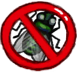

# Bug Repellent  
> It should help treat bug bites and keep insects away.  
  
<table class="table table-bordered" data-toggle="table"  data-show-header="false"><thead style="display:none"><tr ><th  style="width:50%;text-align:left;vertical-align:top;"  >title</th><th  style="width:50%;text-align:left;vertical-align:top;"  ></th></tr></thead><tr ><td  style="width:50%;text-align:left;vertical-align:top;"  >**Weight：**25</td><td  style="width:50%;text-align:left;vertical-align:top;"  >

<a href="BugRepellent.md" style="color:black">Bug Repellent</a>

This gel can be applied to your body to increase your bug protection and help avoid bug bites.  It can be made with <b>Aloe Vera Gel</b> and <b>ground Snakegrass</b> once your <b>Herbology</b> is high enough.</td></tr></tbody></table>  
  
## Got From  

Craft BluePrint

[Bug Repellant(BluePrint)](Bp_BugRepellent.md)

  
  
## Action  

<table><tr><td rowspan="2" style="width:200px;text-align:center;font-size:1.3em;font-weight:bold">

Apply

3m

</td><td>[“HandAction(Group)”](HandAction.md)</td></tr><tr><td><b>Self：</b>→Dismiss</td></tr><tr><td colspan="2"><b>StatChange：</b>[

[Bug Repellent](BugRepellentApplied.md)](BugRepellentApplied.md)<b>+96</b></td></tr></table>
  
  
  
## Durability   

<table style="margin-bottom:0px;"><tr><td style="width:30%;text-align:left; background-color:#FEFEFE;font-size:1.3em;font-weight:bold;">Spoilage</td><td style="font-size:1em;background-color:#FEFEFE">Starting：336 -1/TP , Duration ：3d12h</td></tr><tr style="background-color:#FFFFFF"><td colspan=2>** On Zero： ** Self: →Dismiss</td></tr></table>
  

