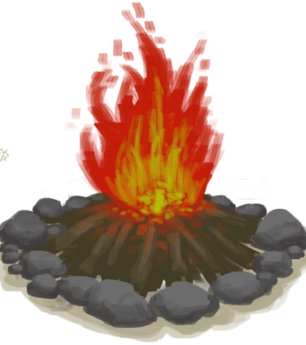
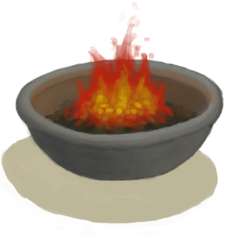
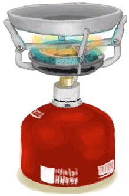
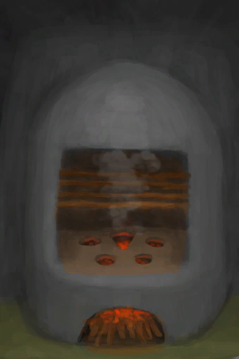

# Uncooked Oysters  
> I need to cook it now.  
  
<table class="table table-bordered" data-toggle="table"  data-show-header="false"><thead style="display:none"><tr ><th  style="width:50%;text-align:left;vertical-align:top;"  >title</th><th  style="width:50%;text-align:left;vertical-align:top;"  ></th></tr></thead><tr ><td  style="width:50%;text-align:left;vertical-align:top;"  >**Weight：**350  **Tag：**	[“Cookable”](tag_Cookable.md)</td><td  style="width:50%;text-align:left;vertical-align:top;"  >

<a href="ButterBakedOystersUncooked.md" style="color:black">Uncooked Oysters</a>

"A very tasty gourmet meal cooked with <b>Oysters</td></tr></tbody></table>  
  
## Got From  

Craft BluePrint

[Butter Baked Oysters(BluePrint)](Bp_ButterBakedOysters.md)

  
  
## Use To Transform  
<table class="table table-bordered" data-toggle="table"  ><thead style=""><tr ><th  style="text-align:left;vertical-align:top;"  >Transform to</th><th  style="text-align:left;vertical-align:top;"  >Container</th></tr></thead><tr ><td  style="text-align:left;vertical-align:top;"  >[

[Butter Baked Oysters](ButterBakedOystersCooked.md)](ButterBakedOystersCooked.md)</td><td  style="text-align:left;vertical-align:top;"  >[

[Campfire](Campfire.md)](Campfire.md)</td></tr><tr ><td  style="text-align:left;vertical-align:top;"  >[

[Butter Baked Oysters](ButterBakedOystersCooked.md)](ButterBakedOystersCooked.md)</td><td  style="text-align:left;vertical-align:top;"  >[

[Clay Fire Pit](ClayFirePit.md)](ClayFirePit.md)</td></tr><tr ><td  style="text-align:left;vertical-align:top;"  >[

[Butter Baked Oysters](ButterBakedOystersCooked.md)](ButterBakedOystersCooked.md)</td><td  style="text-align:left;vertical-align:top;"  >[

[Fire](Fire.md)](Fire.md)</td></tr><tr ><td  style="text-align:left;vertical-align:top;"  >[

[Butter Baked Oysters](ButterBakedOystersCooked.md)](ButterBakedOystersCooked.md)</td><td  style="text-align:left;vertical-align:top;"  >[

[Gas Cooker(On)](GasCookerOn.md)](GasCookerOn.md)</td></tr><tr ><td  style="text-align:left;vertical-align:top;"  >[

[Butter Baked Oysters](ButterBakedOystersCooked.md)](ButterBakedOystersCooked.md)</td><td  style="text-align:left;vertical-align:top;"  >[

[Stove](Stove.md)](Stove.md)</td></tr></tbody></table>  
  
## Durability   

<table style="margin-bottom:0px;"><tr><td style="width:30%;text-align:left; background-color:#FEFEFE;font-size:1.3em;font-weight:bold;">Spoilage</td><td style="font-size:1em;background-color:#FEFEFE">Starting：192 -1/TP , Duration ：2d</td></tr><tr style="background-color:#FFFFFF"><td colspan=2>** On Zero： ** Self: → [

[Cooking Pot](CookingPot.md)](CookingPot.md) [

[Rotten Remains](RottenRemains.md)](RottenRemains.md)(<b>+1</b>)</td></tr></table>
  

