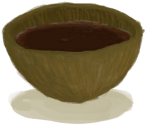

# Caffeine  
> Keeps you awake but increases your stress and dehydration.  
> Caffeine is a stimulant that will help you stay awake at the cost of some stress and dehydration. It can be ingested from Coffee Berries and any of their derivatives.  Coffee can be made by roasting Coffee Berry seeds and applying them to boiling water.   
  

<b>Base Value: </b> 0 
  

<b>Value Range: </b> 0 ~ 24 
  

<b>Base Rate: </b> -1 / /TP 
  
## Statuses  

<table><tr style="height:2em;"><td style="background-color:#F0F0F0;text-align:center;width:180px;font-size:1.4em;font-weight:bold;vertical-align:middle;">
1 ～ 12

4% ～ 50%
</td><td colspan=2 style="font-size:1.1em;vertical-align:middle;background-color:#F9F9F9;">
<b>

Caffeine</b>

</td></tr><tr><td colspan=2><b>Effect：</b>[

[Pain](Pain.md)](Pain.md)<b>-50</b>, [

[Wakefulness](Wakefulness.md)](Wakefulness.md)addition<b>+2.5</b>, [

[Stool Liquidity](Diarrhoea.md)](Diarrhoea.md)addition<b>+0.75</b>, [

[Hydration ](Hydration.md)](Hydration.md)addition<b>-0.5</b>, [

[Stress](Stress.md)](Stress.md)addition<b>+0.75</b>, [

[Mental Structure](Structure.md)](Structure.md)addition<b>-1</b></td></tr><tr><td colspan=2></td></tr><tr style="height:2em;"><td style="background-color:#F0F0F0;text-align:center;width:180px;font-size:1.4em;font-weight:bold;vertical-align:middle;">
13 ～ 24

54% ～ 100%
</td><td colspan=2 style="font-size:1.1em;vertical-align:middle;background-color:#F9F9F9;">
<b>

Caffeine</b>

</td></tr><tr><td colspan=2><b>Effect：</b>[

[Pain](Pain.md)](Pain.md)<b>-100</b>, [

[Wakefulness](Wakefulness.md)](Wakefulness.md)addition<b>+5</b>, [

[Stool Liquidity](Diarrhoea.md)](Diarrhoea.md)addition<b>+1.5</b>, [

[Hydration ](Hydration.md)](Hydration.md)addition<b>-1</b>, [

[Stress](Stress.md)](Stress.md)addition<b>+1.5</b>, [

[Mental Structure](Structure.md)](Structure.md)addition<b>-2</b></td></tr><tr><td colspan=2></td></tr></table>
  
## Change By  
<table class="table table-bordered" data-toggle="table"  ><thead style=""><tr ><th  style="text-align:left;vertical-align:top;"  >From</th><th  style="text-align:left;vertical-align:top;"  >Operation</th><th  style="text-align:left;vertical-align:top;"  data-sortable="true"  >Value</th></tr></thead><tr ><td  style="text-align:left;vertical-align:top;"  >[

[Coffee](LQ_Coffee.md)](LQ_Coffee.md)</td><td  style="text-align:left;vertical-align:top;"  >Drink</td><td  style="text-align:left;vertical-align:top;"  >12</td></tr><tr ><td  style="text-align:left;vertical-align:top;"  >[

[Coffee Berries](CoffeeBerries.md)](CoffeeBerries.md)</td><td  style="text-align:left;vertical-align:top;"  >Eat</td><td  style="text-align:left;vertical-align:top;"  >2</td></tr><tr ><td  style="text-align:left;vertical-align:top;"  >[

[Coffee Berry Pulp](CoffeeBerryPulp.md)](CoffeeBerryPulp.md)</td><td  style="text-align:left;vertical-align:top;"  >Eat</td><td  style="text-align:left;vertical-align:top;"  >2</td></tr></tbody></table>  
  

