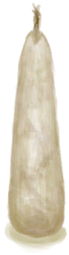

# Candle  
> A portable source of light.  
  
<table class="table table-bordered" data-toggle="table"  data-show-header="false"><thead style="display:none"><tr ><th  style="width:50%;text-align:left;vertical-align:top;"  >title</th><th  style="width:50%;text-align:left;vertical-align:top;"  ></th></tr></thead><tr ><td  style="width:50%;text-align:left;vertical-align:top;"  >**Weight：**25</td><td  style="width:50%;text-align:left;vertical-align:top;"  >

<a href="CandleOff.md" style="color:black">Candle</a>

Candles are a very efficient and long lasting light source that can be made from Fat and Beeswax. Their small size and long duration makes them an ideal tool to carry with you at all times in case you get caught in the jungle when it's dark.  More advanced scented candles can also be crafted with some special oils. These candles can help you with their bug repelling and relaxing properties.</td></tr></tbody></table>  
  
## Got From  

Craft BluePrint

[Candles(BluePrint)](Bp_Candles.md)

Extinguish

[Candle(On)](CandleOn.md)

  
  
## Drag With  

<table style="margin-bottom:0px;"><tr><td style="width:40%;text-align:left; background-color:#FEFEFE"><b>With：</b>[“Fire Source”](tag_FireSource.md)</td><td style="width:40%;font-size:1em;font-weight:bold;background-color:#FEFEFE">Light  </td></tr><tr style="background-color:#FFFFFF"><td style=""><b>Receiving：</b></td><td style=""><b>Self：</b>→ [

[Candle(On)](CandleOn.md)](CandleOn.md)</td></tr></table>
  
  
## Durability   

<table style="margin-bottom:0px;"><tr><td style="width:30%;text-align:left; background-color:#FEFEFE;font-size:1.3em;font-weight:bold;">Fuel</td><td style="font-size:1em;background-color:#FEFEFE">Starting：40 , Max：40 -</td></tr><tr style="background-color:#FFFFFF"><td colspan=2>** On Zero： ** Self: →Dismiss</td></tr></table>
  

