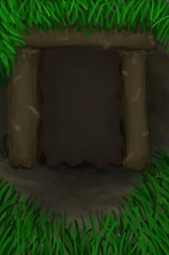
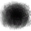

# Cellar  
> "An underground room  
  

<a href="Cellar.md" style="color:black">Cellar</a>

  
  
<table class="table table-bordered" data-toggle="table"  data-show-header="false"><thead style="display:none"><tr ><th  style="width:50%;text-align:left;vertical-align:top;"  >title</th><th  style="width:50%;text-align:left;vertical-align:top;"  ></th></tr></thead><tr ><td  style="width:50%;text-align:left;vertical-align:top;"  >** Unique On Board **  **Environment：**[Cellar(Environment)](Env_Cellar.md)  **Tag：**	[“Indoors”](tag_EnvIndoors.md)  ** EnvironmentEffect: ** [

[Rain Protection](RainProtection.md)](RainProtection.md)<b>+5</b> [

[Heat Insulation](InsulationHeat.md)](InsulationHeat.md)<b>+6</b> [

[Temperature](TemperaturePerceived.md)](TemperaturePerceived.md)<b>-4</b> [

[Sun Protection](SunProtection.md)](SunProtection.md)<b>+6</b> [

[Sheltered](Sheltered.md)](Sheltered.md)<b>+1</b>  ** WeightCapacity： **30000  ** Improvements: ** [Door](Imp_Door.md) , [Stitched-Hide Floor](Imp_StitchedHideFloor.md) , [White Washed Walls](Imp_WhiteWashedWalls.md) , [Sea Trophy](Imp_SeaTrophy.md) , [Home Sign](Imp_HomeSign.md)</td><td  style="width:50%;text-align:left;vertical-align:top;"  >"A cool underground room that is specially good for storing perishable goods.  Food items stored here will take longer to expire.  To build it you'll need a shovel</td></tr></tbody></table>  
  
## Got From  

Enter

[Cellar](CellarEntrance.md)

  
  
## Drag With  

<table style="margin-bottom:0px;"><tr><td style="width:40%;text-align:left; background-color:#FEFEFE"><b>With：</b>[

[Broom](Broom.md)](Broom.md)</td><td style="width:40%;font-size:1em;font-weight:bold;background-color:#FEFEFE">Clean (30m) [“HandAction(Group)”](HandAction.md)</td></tr><tr><td colspan="2"><b>Require：</b>[

[Light](Light.md)](Light.md): <b>5-100</b></td></tr><tr style="background-color:#FFFFFF"><td style=""><b>Receiving：</b>Usage  <b>-1(-2.5%)</b></td><td style=""><b>Self：</b>Filthiness

  <b>-250(-25%)</b></td></tr><tr><td colspan="2"><b>StatChange：</b>[

[Stress](Stress.md)](Stress.md)<b>-10</b>, [

[Morale](Morale.md)](Morale.md)<b>+5</b></td></tr></table>
  
  
## Durability   

<table style="margin-bottom:0px;"><tr><td style="width:30%;text-align:left; background-color:#FEFEFE;font-size:1.3em;font-weight:bold;">

Filthiness</td><td style="font-size:1em;background-color:#FEFEFE">Starting：0 , Max：1000 +1/TP , Duration ：10d10h</td></tr><tr style="background-color:#FFFFFF"><td colspan=2></td></tr></table>
  
## Passive Effects  
<table class="table table-bordered" data-toggle="table"  ><thead style=""><tr ><th  style="text-align:left;vertical-align:top;"  >Name</th><th  style="text-align:left;vertical-align:top;"  >Condition</th><th  style="text-align:left;vertical-align:top;"  data-sortable="true"  >Change(Each TP)</th><th  style="text-align:left;vertical-align:top;"  >Status</th></tr></thead><tr ><td  style="text-align:left;vertical-align:top;"  >Minimal Filth</td><td  style="text-align:left;vertical-align:top;"  >** Require Durability：** Filthiness

: <b>100～250(10%～25%)</b></td><td  style="text-align:left;vertical-align:top;"  ></td><td  style="text-align:left;vertical-align:top;"  >[

[Discomfort](Discomfort.md)](Discomfort.md)<b>+175</b></td></tr><tr ><td  style="text-align:left;vertical-align:top;"  >Low Filth</td><td  style="text-align:left;vertical-align:top;"  >** Require Durability：** Filthiness

: <b>251～500(25.1%～50%)</b></td><td  style="text-align:left;vertical-align:top;"  ></td><td  style="text-align:left;vertical-align:top;"  >[

[Discomfort](Discomfort.md)](Discomfort.md)<b>+375</b></td></tr><tr ><td  style="text-align:left;vertical-align:top;"  >Moderate Filth</td><td  style="text-align:left;vertical-align:top;"  >** Require Durability：** Filthiness

: <b>501～750(50.1%～75%)</b></td><td  style="text-align:left;vertical-align:top;"  ></td><td  style="text-align:left;vertical-align:top;"  >[

[Discomfort](Discomfort.md)](Discomfort.md)<b>+625</b></td></tr><tr ><td  style="text-align:left;vertical-align:top;"  >Extreme Filth</td><td  style="text-align:left;vertical-align:top;"  >** Require Durability：** Filthiness

: <b>751～1000(75.1%～100%)</b></td><td  style="text-align:left;vertical-align:top;"  ></td><td  style="text-align:left;vertical-align:top;"  >[

[Discomfort](Discomfort.md)](Discomfort.md)<b>+875</b></td></tr></tbody></table>  
  
## Other Effects  
<table class="table table-bordered" data-toggle="table"  ><thead style=""><tr ><th  style="text-align:left;vertical-align:top;"  >Name</th><th  style="text-align:left;vertical-align:top;"  data-sortable="true"  >Condition</th><th  style="text-align:left;vertical-align:top;"  >Change</th><th  style="text-align:left;vertical-align:top;"  data-sortable="true"  >Status</th></tr></thead><tr ><td  style="text-align:left;vertical-align:top;"  >Preserve</td><td  style="text-align:left;vertical-align:top;"  ></td><td  style="text-align:left;vertical-align:top;"  >[“Feed”](tag_Feed.md) [“Cookable”](tag_MealCookingpot.md) [“Organic”](tag_Organic.md) [“Cookable”](tag_Cookable.md) Spoilage +0.25(0.08%)</td><td  style="text-align:left;vertical-align:top;"  ></td></tr></tbody></table>  
  

