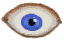

# Chair  
> A chair to sit on.  
  
<table class="table table-bordered" data-toggle="table"  data-show-header="false"><thead style="display:none"><tr ><th  style="width:50%;text-align:left;vertical-align:top;"  >title</th><th  style="width:50%;text-align:left;vertical-align:top;"  ></th></tr></thead><tr ><td  style="width:50%;text-align:left;vertical-align:top;"  >** Cannot Be Trashed **  **Weight：**500  ** Effect: ** [

[Comfort](Comfort.md)](Comfort.md)<b>+75</b> [

[Workplace](Workplace.md)](Workplace.md)<b>+100</b>  ** Unlock Require: ** [Mud Hut(Environment)](Env_MudHut.md)</td><td  style="width:50%;text-align:left;vertical-align:top;"  >

<a href="ChairPlaced.md" style="color:black">Chair</a>

"A useful piece of furniture that</td></tr></tbody></table>  
  
## Got From  

Place

[Chair](Chair.md)

Craft BluePrint

[Chair(BluePrint)](Bp_Chair.md)

  
  
## Action  

<table><tr><td rowspan="2" style="width:200px;text-align:center;font-size:1.3em;font-weight:bold">

Rest

15m

</td><td></td></tr><tr><td></td></tr><tr><td colspan="2"><b>StatChange：</b>[

[Stamina](Stamina.md)](Stamina.md)<b>+15</b>, [

[Stress](Stress.md)](Stress.md)<b>-12</b></td></tr></table>
  

<table><tr><td rowspan="2" style="width:200px;text-align:center;font-size:1.3em;font-weight:bold">

Meditate

1h

</td><td></td></tr><tr><td></td></tr><tr><td colspan="2"><b>Require：</b>[

[Altered Mind State](MindState.md)](MindState.md): <b>0-99</b></td></tr><tr><td colspan="2"><b>StatChange：</b>[

[Stamina](Stamina.md)](Stamina.md)<b>+40</b>, [

[Stress](Stress.md)](Stress.md)<b>-48</b>, [

[Wakefulness](Wakefulness.md)](Wakefulness.md)<b>+4</b>, [

[Thought Depth](ThoughtDepth.md)](ThoughtDepth.md)<b>+0.25</b>, [

[Altered Mind State](MindState.md)](MindState.md)<b>+1</b> (/TP)</td></tr></table>
  

<table><tr><td rowspan="2" style="width:200px;text-align:center;font-size:1.3em;font-weight:bold">

Meditate

1h

</td><td></td></tr><tr><td></td></tr><tr><td colspan="2"><b>Require：</b>[

[Altered Mind State](MindState.md)](MindState.md): <b>100-300</b></td></tr><tr><td colspan="2"><b>StatChange：</b>[

[Stamina](Stamina.md)](Stamina.md)<b>+40</b>, [

[Stress](Stress.md)](Stress.md)<b>-48</b>, [

[Wakefulness](Wakefulness.md)](Wakefulness.md)<b>+4</b>, [

[Thought Depth](ThoughtDepth.md)](ThoughtDepth.md)<b>+0.5</b>, [

[Altered Mind State](MindState.md)](MindState.md)<b>+1</b> (/TP)</td></tr></table>
  

<table><tr><td rowspan="2" style="width:200px;text-align:center;font-size:1.3em;font-weight:bold">

Pick Up

</td><td>[“HandAction(Group)”](HandAction.md)</td></tr><tr><td><b>Self：</b>→ [

[Chair](Chair.md)](Chair.md)</td></tr></table>
  
  
  

